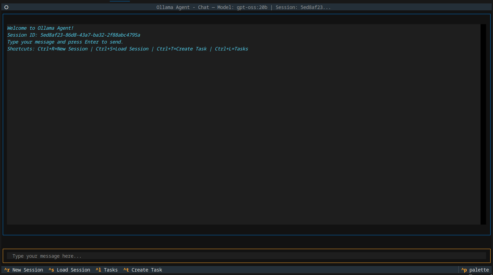

# Ollama Agent

Ollama Agent is a powerful command-line tool and Textual TUI (Terminal User Interface) that allows you to interact with local AI models through an Ollama-compatible API. It provides a persistent chat experience, session management, and the ability to execute local shell commands, turning your local models into helpful assistants for your daily tasks.



## Features

- **Interactive Chat TUI**: A terminal-based chat interface for a seamless conversation experience.
- **Non-Interactive CLI**: Execute single prompts directly from your command line for quick queries.
- **Ollama Integration**: Connects to any Ollama-compatible API endpoint.
- **Tool-Powered**: The agent can execute shell commands, allowing it to interact with your local environment to perform tasks.
- **Session Management**: Conversations are automatically saved and can be reloaded, deleted, or switched between.
- **Task Management**: Save frequently used prompts as "tasks" and execute them with a simple command.
- **Configurable**: Easily configure the model, API endpoint, and agent reasoning effort.

## Installation

Before you begin, ensure you have a running instance of [Ollama](https://ollama.com/) or another compatible API server.

For end-users, the recommended way to install `ollama-agent` is using `pipx`, which installs the application in an isolated environment.

```bash
# Install from the local project directory
pipx install git+https://github.com/arrase/ollama-agent.git
```

## Usage

### Interactive Mode (TUI)

To start the chat interface, simply run:

```bash
ollama-agent
```

The TUI provides a rich, interactive experience with the following keybindings:

- `Ctrl+C`: Quit the application.
- `Ctrl+R`: Start a new chat session.
- `Ctrl+S`: List and load a previous session.
- `Ctrl+L`: List, run, or delete saved tasks.
- `Ctrl+T`: Create a new task.

### Non-Interactive Mode

You can run a single prompt directly from the command line:

```bash
ollama-agent --prompt "List all files in the current directory as a json."
# Or using the short form:
ollama-agent -p "List all files in the current directory as a json."
```

You can also override the configured model, reasoning effort, or built-in tool execution timeout:

```bash
ollama-agent --model "gpt-oss:20b" --effort "high" --prompt "What is the current date?"
# Or using short forms:
ollama-agent -m "gpt-oss:20b" -e "high" -p "What is the current date?"
```

```bash
ollama-agent --builtin-tool-timeout 60 --prompt "Run a long-running task"
# Or using short forms:
ollama-agent -t 60 -p "Run a long-running task"
```

**Available Parameters:**

- `-m`, `--model`: Specify the AI model to use
- `-p`, `--prompt`: Provide a prompt for non-interactive mode
- `-e`, `--effort`: Set reasoning effort level (low, medium, high)
- `-t`, `--builtin-tool-timeout`: Set built-in tool execution timeout in seconds

### Task Management

Tasks are saved prompts that can be executed repeatedly.

**List Tasks:**

```bash
ollama-agent task-list
```

**Run a Task:**

Use the task ID (or a unique prefix) from the list to run it.

```bash
ollama-agent task-run <task_id>
```

**Delete a Task:**

```bash
ollama-agent task-delete <task_id>
```

### Configuration

On the first run, the application will create a default configuration file at `~/.ollama-agent/config.ini`. You can edit this file to permanently change the default model, API URL, and other settings.

**Configuration Options:**

- `model`: The default AI model to use (default: `gpt-oss:20b`)
- `base_url`: The Ollama API endpoint (default: `http://localhost:11434/v1/`)
- `api_key`: API key for authentication (default: `ollama`)
- `reasoning_effort`: Agent reasoning effort level - `low`, `medium`, or `high` (default: `medium`)
- `database_path`: Path to the SQLite session database (default: `~/.ollama-agent/sessions.db`)
- `builtin_tool_timeout`: Built-in tool execution timeout in seconds (default: `30`)

**Example `config.ini`:**

```ini
[default]
model = gpt-oss:20b
base_url = http://localhost:11434/v1/
api_key = ollama
reasoning_effort = medium
database_path = /home/user/.ollama-agent/sessions.db
builtin_tool_timeout = 30
```

## For Developers

Interested in contributing? Great! Here’s how to get started.

### Project Setup

1. **Clone the repository:**

    ```bash
    git clone https://github.com/your-username/ollama-agent.git
    cd ollama-agent
    ```

2. **Create a virtual environment:**

    ```bash
    python -m venv .venv
    source .venv/bin/activate
    ```

3. **Install in editable mode:**

    This will install the project and its dependencies. The `-e` flag allows you to make changes to the source code and have them immediately reflected.

    ```bash
    pip install -e .
    ```

4. **Install development tools (optional):**

    For a better development experience with Textual, you can install its development tools:

    ```bash
    pip install "textual[dev]"
    ```

### Project Structure

- `ollama_agent/main.py`: Main entry point, handles CLI arguments and starts the TUI or non-interactive mode.
- `ollama_agent/agent.py`: Core `OllamaAgent` class that manages the agent, client, and sessions.
- `ollama_agent/tui.py`: Contains all the Textual components for the Terminal User Interface.
- `ollama_agent/tasks.py`: `TaskManager` class for saving, loading, and managing tasks.
- `ollama_agent/config.py`: Manages loading and creating the application's configuration file.
- `ollama_agent/tools.py`: Defines the built-in tools available to the agent, such as `execute_command`.
- `pyproject.toml`: Project metadata and dependencies.

### Contributions

Contributions are welcome! Please follow these steps:

1. Fork the repository.
2. Create a new branch for your feature or bug fix.
3. Make your changes.
4. Add tests for your changes if applicable (currently, the project needs more tests!).
5. Submit a pull request with a clear description of your changes.
