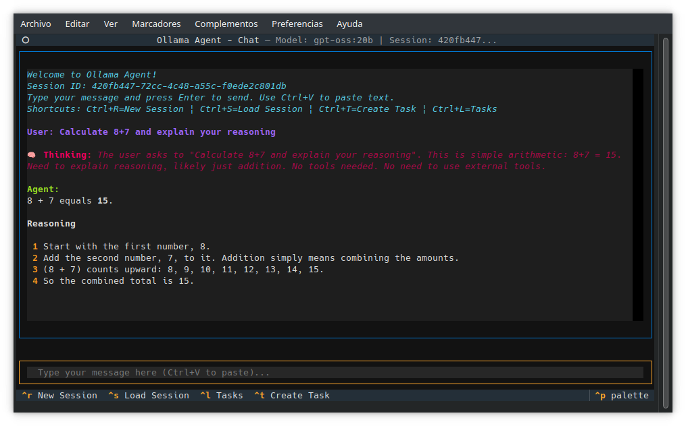
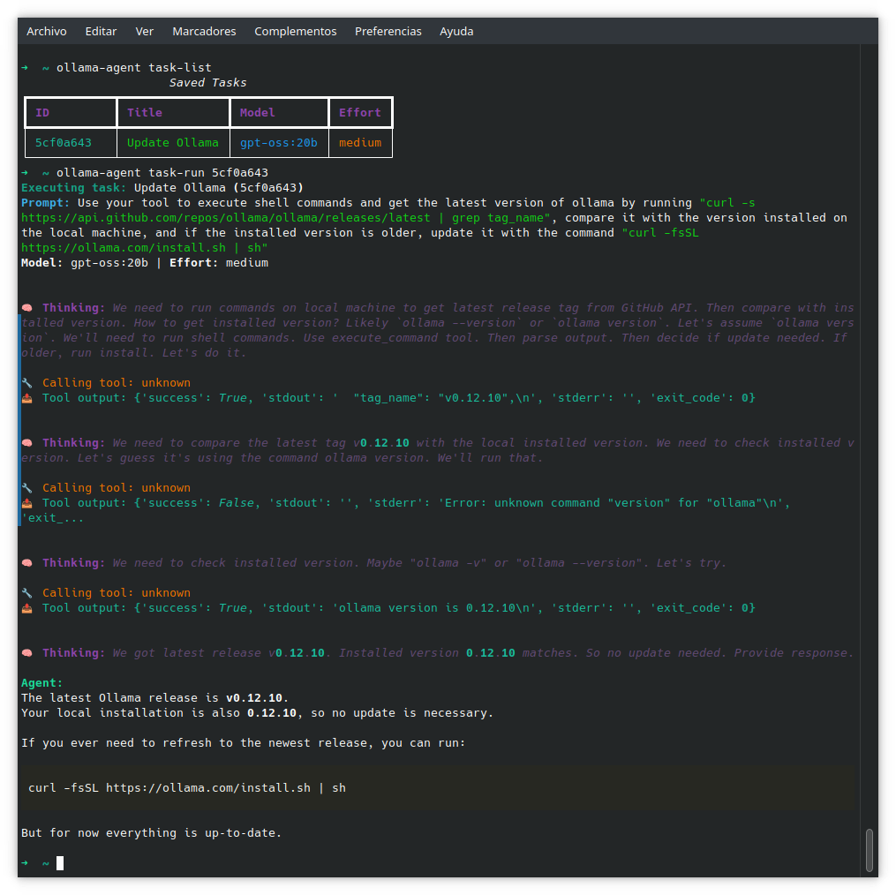

# Ollama Agent

Ollama Agent is a powerful command-line tool and Textual TUI (Terminal User Interface) that allows you to interact with local AI models through an Ollama-compatible API. It provides a persistent chat experience, session management, and the ability to execute local shell commands, turning your local models into helpful assistants for your daily tasks.

## Features

- **Interactive Chat TUI**: A terminal-based chat interface for a seamless conversation experience.
- **Non-Interactive CLI**: Execute single prompts directly from your command line for quick queries.
- **Ollama Integration**: Connects to any Ollama-compatible API endpoint.
- **Tool-Powered**: The agent can execute shell commands, allowing it to interact with your local environment to perform tasks.
- **Delegated MCP Agents**: Each configured MCP server can run through its own lightweight agent with custom model and instructions.
- **Session Management**: Conversations are automatically saved and can be reloaded, deleted, or switched between.
- **Task Management**: Save frequently used prompts as "tasks" and execute them with a simple command.
- **Configurable**: Easily configure the model, API endpoint, and agent reasoning effort.
- **Mem0 Memory Layer**: Persistent memory backed by Mem0 + Qdrant, exposed through function-calling tools.

## Installation

Before you begin, ensure you have a running instance of [Ollama](https://ollama.com/) or another compatible API server.

For end-users, the recommended way to install `ollama-agent` is using `pipx`, which installs the application in an isolated environment.

```bash
# Install from the local project directory
pipx install git+https://github.com/arrase/ollama-agent.git
```

## Usage

### Interactive Mode (TUI)



To start the chat interface, simply run:

```bash
ollama-agent
```

The TUI provides a rich, interactive experience with the following keybindings:

- `Ctrl+C`: Quit the application.
- `Ctrl+R`: Start a new chat session.
- `Ctrl+S`: List and load a previous session.
- `Ctrl+L`: List, run, or delete saved tasks.
- `Ctrl+T`: Create a new task.

### Non-Interactive Mode


You can run a single prompt directly from the command line:

```bash
ollama-agent --prompt "List all files in the current directory as a json."
# Or using the short form:
ollama-agent -p "List all files in the current directory as a json."
```

You can also override the configured model, reasoning effort, or built-in tool execution timeout:

```bash
ollama-agent --model "gpt-oss:20b" --effort "high" --prompt "What is the current date?"
# Or using short forms:
ollama-agent -m "gpt-oss:20b" -e "high" -p "What is the current date?"
```

```bash
ollama-agent --builtin-tool-timeout 60 --prompt "Run a long-running task"
# Or using short forms:
ollama-agent -t 60 -p "Run a long-running task"
```

**Available Parameters:**

- `-m`, `--model`: Specify the AI model to use
- `-p`, `--prompt`: Provide a prompt for non-interactive mode
- `-e`, `--effort`: Set reasoning effort level (low, medium, high, disabled)
- `-t`, `--builtin-tool-timeout`: Set built-in tool execution timeout in seconds


### Task Management



Tasks are saved prompts that can be executed repeatedly.

**List Tasks:**

```bash
ollama-agent task-list
```

**Run a Task:**

Use the task ID (or a unique prefix) from the list to run it.

```bash
ollama-agent task-run <task_id>
```

**Delete a Task:**

```bash
ollama-agent task-delete <task_id>
```

### Configuration

On the first run, the application will create a default configuration file at `~/.ollama-agent/config.ini`. You can edit this file to permanently change the default model, API URL, and other settings.

**Configuration Options:**

- `model`: The default AI model to use (default: `gpt-oss:20b`)
- `base_url`: The Ollama API endpoint (default: `http://localhost:11434/v1/`)
- `api_key`: API key for authentication (default: `ollama`)
- `reasoning_effort`: Agent reasoning effort level - `low`, `medium`, or `high` (default: `medium`)
- `database_path`: Path to the SQLite session database (default: `~/.ollama-agent/sessions.db`)
- `builtin_tool_timeout`: Built-in tool execution timeout in seconds (default: `30`)
- `mcp_config_path`: Path to MCP servers configuration file (default: `~/.ollama-agent/mcp_servers.json`)
- `mem0.*`: Persistent memory configuration (adjust host/ports to match your setup)

**Example `config.ini`:**

```ini
[default]
model = gpt-oss:20b
base_url = http://localhost:11434/v1/
api_key = ollama
reasoning_effort = medium
database_path = /home/user/.ollama-agent/sessions.db
builtin_tool_timeout = 30
mcp_config_path = /home/user/.ollama-agent/mcp_servers.json

[mem0]
collection_name = ollama-agent
host = localhost
port = 63333
embedding_model_dims = 768
llm_model = llama3.1:latest
llm_temperature = 0
llm_max_tokens = 2000
ollama_base_url = http://localhost:11434
embedder_model = nomic-embed-text:latest
embedder_base_url = http://localhost:11434
user_id = default
```

### Persistent Memory with Mem0


The agent can remember long-term facts by delegating storage and retrieval to [Mem0](https://github.com/mem0ai/mem0) running locally, backed by a Qdrant vector store that the agent automatically manages via Docker.

#### Docker and automatic Qdrant startup

- You need **Docker installed and the daemon running** on your system.
- When the agent starts (or when Mem0 settings are updated), it will look for a Qdrant container. If none exists, it will **pull `qdrant/qdrant:latest` and start a background container** named `ollama-agent-qdrant-<PORT>` (fixed prefix + configured port) with restart policy `unless-stopped`.
- The published port is taken from `mem0.port` (`63333` by default in the code). If you already have an external Qdrant instance, set `mem0.host` and `mem0.port` to point to it; the agent will still attempt to create a local container if it doesn't detect one exposing that port.
- Check status with:

  ```bash
  docker ps --filter name=ollama-agent-qdrant
  docker logs ollama-agent-qdrant-63333 | head -n 40
  ```

- To update the image: `docker rm -f ollama-agent-qdrant-63333` and start the agent again; it will re-create the container with the latest image.

Summary: you only need Docker running; the agent will pull and start Qdrant in the background for you.

To use Mem0:

1. Pull an Ollama embed model:

  ```bash
  ollama pull nomic-embed-text:latest
  ```

1. Adjust the `[mem0]` section in `~/.ollama-agent/config.ini` to match your environment.

Once dependencies are installed, the agent exposes two tools via function calling:

- `mem0_add_memory(memory: str)` – stores a new memory for the single local user.
- `mem0_search_memory(query: str, limit: int | None = None)` – retrieves relevant memories to augment the reply.

Because these tools are part of the normal tool list, both the CLI and TUI flows gain persistent recall without additional configuration.

### Agent Instructions

You can customize the agent's behavior by editing the instructions file at `~/.ollama-agent/instructions.md`. This file is automatically created on first use with default instructions.

Simply edit the file to:

- Change the agent's personality and tone
- Add specific guidelines for responses
- Include domain-specific knowledge
- Customize tool usage behavior

**Example instructions file:**

```markdown
You are a helpful AI assistant specialized in software development tasks.

You have access to a tool that allows you to execute operating system commands.
When executing commands, always:
1. Explain what you're about to do
2. Show the command before execution
3. Summarize the results

Be concise, clear, and security-conscious. Never execute destructive commands without explicit user confirmation.
```

### MCP Servers (Optional)

Ollama Agent supports the Model Context Protocol (MCP) to extend the agent's capabilities with additional tools and context. MCP servers are **optional** and can provide features like filesystem access, Git operations, and custom APIs.

To configure MCP servers, create a `mcp_servers.json` file at `~/.ollama-agent/mcp_servers.json`. See [MCP_SERVERS.md](./MCP_SERVERS.md) for detailed configuration instructions and examples.

Each MCP entry may include an `agent` block. This spawns a dedicated helper agent whose tool is exposed to the main assistant, letting you pick an appropriate model, tone, or handoff description per server.

**Quick Example:**

```json
{
  "mcpServers": {
    "filesystem": {
      "command": "npx",
      "args": ["-y", "@modelcontextprotocol/server-filesystem", "/home/user/documents"],
      "agent": {
        "name": "filesystem_helper",
        "model": "gpt-oss:20b",
        "instructions": "You broker requests to the filesystem MCP server and return results verbatim.",
        "tool_name": "use_filesystem",
        "tool_description": "Delegate file operations to the filesystem MCP agent"
      }
    },
    "context7": {
      "httpUrl": "https://mcp.context7.com/mcp",
      "headers": {
        "CONTEXT7_API_KEY": "your-api-key-here",
        "Accept": "application/json, text/event-stream"
      },
      "agent": {
        "model": "gpt-oss:8b",
        "instructions": "You query the Context7 MCP service, summarising findings concisely.",
        "tool_description": "Ask the Context7 MCP agent to gather structured knowledge"
      }
    }
  }
}
```

## For Developers

Interested in contributing? Great! Here’s how to get started.

### Project Setup

1. **Clone the repository:**

    ```bash
    git clone https://github.com/your-username/ollama-agent.git
    cd ollama-agent
    ```

2. **Create a virtual environment:**

    ```bash
    python -m venv .venv
    source .venv/bin/activate
    ```

3. **Install in editable mode:**

    This will install the project and its dependencies. The `-e` flag allows you to make changes to the source code and have them immediately reflected.

    ```bash
    pip install -e .
    ```

4. **Install development tools (optional):**

    For a better development experience with Textual, you can install its development tools:

    ```bash
    pip install "textual[dev]"
    ```

### Project Structure

- `ollama_agent/main.py`: Main entry point, handles CLI arguments and starts the TUI or non-interactive mode.
- `ollama_agent/agent.py`: Core `OllamaAgent` class that manages the agent, client, and sessions using `openai-agents` library.
- `ollama_agent/tasks.py`: `TaskManager` class for saving, loading, and managing tasks (stored as YAML files).
- `ollama_agent/tools.py`: Defines the built-in tools available to the agent, such as `execute_command`.
- `ollama_agent/memory.py`: Wraps Mem0 configuration and exposes helper functions for the persistent memory tools.
- `ollama_agent/utils.py`: Utility functions and helper methods.
- `ollama_agent/settings/configini.py`: Manages loading and creating the application's configuration file.
- `ollama_agent/settings/mcp.py`: MCP servers configuration and initialization.
- `ollama_agent/tui/app.py`: Main `ChatInterface` Textual app with keybindings.
- `ollama_agent/tui/session_list_screen.py`: Modal screen for session selection.
- `ollama_agent/tui/task_list_screen.py`: Modal screen for task management.
- `ollama_agent/tui/create_task_screen.py`: Modal form for creating new tasks.
- `pyproject.toml`: Project metadata and dependencies.

### Contributions

Contributions are welcome! Please follow these steps:

1. Fork the repository.
2. Create a new branch for your feature or bug fix.
3. Make your changes.
4. Add tests for your changes if applicable (currently, the project needs more tests!).
5. Submit a pull request with a clear description of your changes.
