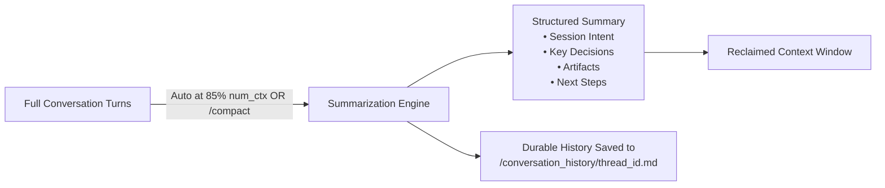
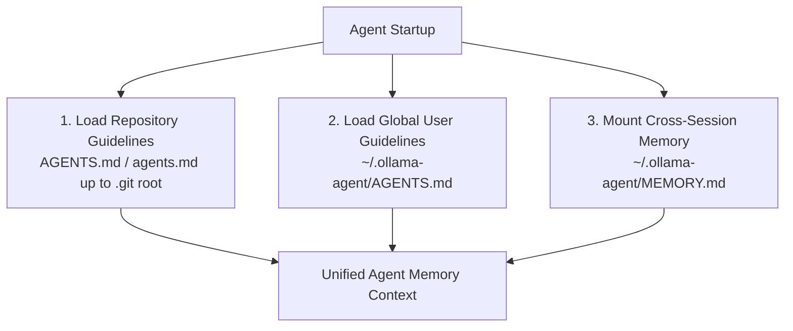
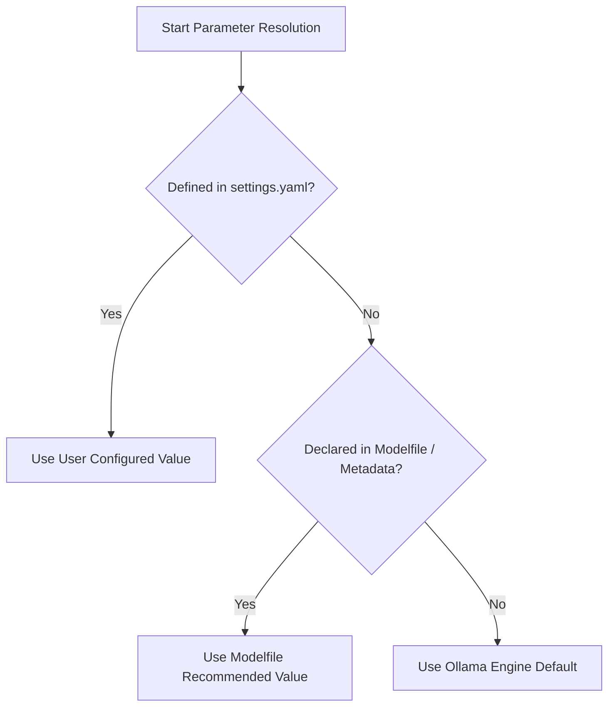

# Ollama Agent

[](https://opensource.org/licenses/MIT)
[](https://www.python.org/downloads/)
[](https://github.com/langchain-ai/langchain)
[](https://ollama.com/)

**Ollama Agent** is an autonomous command-line AI assistant (interactive REPL and non-interactive CLI) designed to interact directly with local AI models. Built on top of [DeepAgents](https://docs.langchain.com/oss/python/deepagents/overview), [LangChain](https://github.com/langchain-ai/langchain), and [LangGraph](https://github.com/langchain-ai/langgraph), it delivers stateful multi-turn chat sessions, native tool execution with human-in-the-loop safety, automated context window management, Model Context Protocol (MCP) extensibility, project guidelines discovery (`AGENTS.md`), local RAG, and agent skills.

---

## Table of Contents

- [Features](#features)
- [Prerequisites & Installation](#prerequisites--installation)
  - [Prerequisites](#prerequisites)
  - [Installation](#installation)
- [Quick Start](#quick-start)
- [Interactive REPL Interface](#interactive-repl-interface)
  - [Multiline Input & Navigation](#multiline-input--navigation)
  - [Slash Commands](#slash-commands)
  - [Live Context Usage & Token Gauge](#live-context-usage--token-gauge)
  - [Human-in-the-Loop (HITL) & YOLO Mode](#human-in-the-loop-hitl--yolo-mode)
  - [File & Directory Context (`@-mentions`)](#file--directory-context--mentions)
  - [Context Compression & Compaction (`/compact`)](#context-compression--compaction-compact)
- [CLI Reference & Automation](#cli-reference--automation)
  - [Global Options & Flags](#global-options--flags)
  - [Non-Interactive Mode](#non-interactive-mode)
  - [CLI Subcommands Summary](#cli-subcommands-summary)
  - [Thinking / Reasoning Effort Mapping](#thinking--reasoning-effort-mapping)
- [Memory, Sessions & Guidelines](#memory-sessions--guidelines)
  - [1. Repository Project Guidelines (`AGENTS.md`)](#1-repository-project-guidelines-agentsmd)
  - [2. Global Agent Guidelines (`~/.ollama-agent/AGENTS.md`)](#2-global-agent-guidelines-ollama-agentagentsmd)
  - [3. Cross-Session Memory (`~/.ollama-agent/MEMORY.md`)](#3-cross-session-memory-ollama-agentmemorymd)
  - [4. Session History & Resumption (`history.db`)](#4-session-history--resumption-historydb)
  - [5. Episodic Memory & Conversation Recall](#5-episodic-memory--conversation-recall)
- [Productivity & Knowledge Tools](#productivity--knowledge-tools)
  - [Saved Tasks](#saved-tasks)
  - [Agent Skills Standard](#agent-skills-standard)
  - [Local RAG (Retrieval Augmented Generation)](#local-rag-retrieval-augmented-generation)
- [Extensibility: MCP & Custom Subagents](#extensibility-mcp--custom-subagents)
  - [MCP Servers (Main Agent)](#mcp-servers-main-agent)
  - [Custom Subagents](#custom-subagents)
- [Configuration & Customization](#configuration--customization)
  - [Configuration File (`settings.yaml`)](#configuration-file-settingsyaml)
  - [Settings Reference](#settings-reference)
  - [Context Window Resolution](#context-window-resolution)
  - [Agent System Prompts](#agent-system-prompts)
  - [Configuration Reset (`--config-reset`)](#configuration-reset---config-reset)
  - [LangSmith Tracing](#langsmith-tracing)
- [Developer Guide](#developer-guide)
  - [Project Setup](#project-setup)
  - [Project Structure](#project-structure)
- [License](#license)

---

## Features

- 🖥️ **Interactive Terminal REPL**: Modern Textual-powered TUI featuring rich Markdown rendering, multiline editing (`\ + Enter`), slash command autocompletion, and live session status.
- ⚡ **Non-Interactive CLI**: Execute single prompts directly from your shell for automation, scripting, and quick queries.
- 🦙 **Native Ollama Integration**: Direct communication via Ollama's native API (`langchain-ollama`) — no OpenAI compatibility proxy required.
- 🧠 **Native Thinking / Reasoning Traces**: Harnesses Ollama's native reasoning support. Configurable effort levels (`low`, `medium`, `high`, `xhigh`, `disabled`, `hide`, `enabled`) per model and session.
- 📊 **Automatic Context Resolution & Live Monitor**: Dynamically inspects model context limits (`num_ctx`) and displays real-time token consumption with color-coded gauge alerts in the TUI header.
- 🗜️ **Context Compression & Compaction**: Automatic background summarization and history offloading at 85% context capacity, plus on-demand context compaction anytime via `/compact` or `/compress`.
- 🔄 **Per-Session Model Switching**: Change models mid-conversation (`/model set <name>`) while preserving the conversation context for the active session.
- 🛡️ **Human-in-the-Loop (HITL) & YOLO Mode**: Interactive terminal approval widget before executing shell commands or editing files, with full bypass available via YOLO mode (`-y` or `/yolo`).
- 📁 **Interactive `@-mentions`**: Reference local files or entire directory trees directly in prompts (e.g. `@src/main.py`, `@"data folder"`, `@.`) with path autocompletion, multimodal encoding, and binary safety.
- 💾 **SQLite-Backed Sessions**: Durable conversation checkpoints in `~/.ollama-agent/history.db` with instant resumption (`/session resume <id>`), markdown export (`/session export`), and history management.
- 📋 **Saved Tasks**: Save reusable prompts as YAML templates and execute them on demand via CLI (`task-run`) or interactive REPL modals (`/task run`).
- 🧩 **Agent Skills Standard**: Extend the agent with modular skills following the [Agent Skills specification](https://agentskills.io/specification) using progressive disclosure.
- 📚 **Local RAG Engine**: Embed and index documents into local Qdrant vector collections with automated semantic retrieval via the agent's `rag_search` tool.
- 🧠 **Persistent Memory & Guidelines**: Cross-session user memory (`MEMORY.md`), automatic discovery of project-level guidelines (`AGENTS.md`), and **Episodic Memory** to search past conversations and solutions (`search_past_conversations` tool and `/session search`).
- 🔌 **Model Context Protocol (MCP)**: Attach MCP servers (`mcp_servers.json`) directly to the main agent across `stdio` and `http` transports.
- 🤖 **Specialized Subagents**: Configure isolated subagents in `settings.yaml` with their own model, system prompt, and dedicated MCP tool servers.

---

## Prerequisites & Installation

### Prerequisites

Before running Ollama Agent, ensure the following dependencies are available on your system:

1. **Python 3.11+**: Ensure Python 3.11 or newer is installed.
2. **Ollama**: Installed and running locally (or reachable at your configured host).
3. **Tool-Calling Model**: A local model with tool/function-calling capabilities (e.g. `qwen3.8:27b`, `qwen2.5:14b`, `llama3.1:8b`). If the selected model lacks tool support, the agent will report an error and exit. If no model is configured or the configured model is missing, the agent will prompt you to select one interactively from your downloaded Ollama models.
4. **Embeddings Model (for RAG)**: If using RAG features, download the default embedding model in Ollama:
   ```bash
   ollama pull nomic-embed-text:latest
   ```

### Installation

For end-users, the recommended installation method is using **`pipx`**, which installs the application in an isolated environment and adds the `ollama-agent` executable to your system PATH:

```bash
# Install directly from GitHub
pipx install git+https://github.com/arrase/ollama-agent.git
```

To upgrade an existing installation:

```bash
pipx upgrade ollama-agent
```

---

## Quick Start

### 1. Launch the Interactive REPL
Start the interactive terminal interface:

```bash
ollama-agent
```

### 2. Run a One-Off Prompt (Non-Interactive)
Execute a single query directly from your command line:

```bash
ollama-agent -p "Summarize the git commits made in the last 7 days."
```

### 3. Run with Specific Model, Effort, and YOLO Mode
```bash
ollama-agent -m "gemma4:26b" -e "high" -y -p "Refactor src/utils.py to follow PEP 8."
```

---

## Interactive REPL Interface

The interactive REPL is a full-featured terminal UI built on Textual and Rich, providing a persistent chat session with markdown rendering, status gauges, and modal workflows.

```text
● ollama-agent │ Model: gemma4:26b │ Context: 2.1k/10.0k (21%) │ Effort: medium │ YOLO: OFF
```

```text
❯ /help
```

---

### Multiline Input & Navigation

The REPL prompt input supports convenient multiline editing, history recall, and tab completion:

- **Insert Newline**: End the current line with a backslash `\` and press `Enter` (`\ + Enter`). The trailing backslash is automatically stripped, inserting a clean newline. The input box dynamically expands up to 8 lines.
- **Submit Prompt**: Press `Enter` without a trailing backslash to send your message.
- **Cursor Navigation**: Use `↑` and `↓` arrow keys to move freely across lines in multiline prompts.
- **Command History**: Pressing `↑` at the top-left `(row 0, col 0)` navigates to previous prompts; pressing `↓` at the end of the text navigates forward.
- **Tab Autocompletion**: Press `Tab` to autocomplete slash commands, subcommands, entity IDs (sessions, tasks, skills, RAG databases), and `@-mention` file paths.

---

### Slash Commands

The REPL provides built-in slash commands for managing models, sessions, tasks, skills, and memory. Commands and entities support **3-level tab autocompletion**:

| Command | Subcommands / Syntax | Description |
| :--- | :--- | :--- |
| `/help` | `/help` | Display the interactive help panel with command categories. |
| `/model` | `/model [list \| set <model>]` | List available Ollama models (with tool support indicators) or switch the active model for the current session. |
| `/params` | `/params [list \| set <parameter> <value>]` | Inspect active sampling parameters and resolution sources, or dynamically update parameter values for the active session. |
| `/session` | `/session [list \| search <query> \| resume <id> \| new \| export [path] \| delete <id>]` | Manage persistent chat sessions. Search past conversations, resume previous threads, export to Markdown, or delete history. |
| `/compact` | `/compact` (alias: `/compress`) | Manually compact conversation history into a structured summary to reclaim context window tokens. |
| `/task` | `/task [list \| create <id> \| run <id> [-y] \| delete <id>]` | Manage saved prompt tasks. Opens interactive modal dialogs for task creation. |
| `/skill` | `/skill [list \| show <id> \| create <id> \| delete <id>]` | Manage agent skills. Opens interactive modal dialogs for skill creation. |
| `/rag` | `/rag [status \| list \| create <name> \| load <name> \| unload \| add <path> [--dir] \| delete <name>]` | Manage local RAG vector databases, index files/directories, and toggle active knowledge bases. |
| `/yolo` | `/yolo [on \| off]` | Toggle YOLO mode or explicitly enable/disable it to bypass tool confirmations. |
| `/new` | `/new` | Start a clean new session with fresh context (alias for `/session new`). |
| `/clear` | `/clear` | Clear rendered message cards from the active chat scroll viewport. |
| `/exit` | `/exit` (alias: `/quit`) | Exit the application cleanly. |

---

### Live Context Usage & Token Gauge

The dynamic header bar monitors token consumption and model parameters in real-time:

```text
● ollama-agent │ Model: gemma4:26b │ Context: 3.4k/10.0k (34%) │ Effort: medium │ RAG: my-docs │ YOLO: OFF
```

- **Metrics**: Displays consumed tokens vs. effective context window limit (`num_ctx`), formatted with `k` suffixes.
- **Visual Alert Thresholds**:
  - 🔵 **Cyan / Sky Blue (`#38bdf8`)**: Healthy context utilization (`≤ 75%`).
  - 🟡 **Yellow / Amber (`#fbbf24`)**: Elevated context warning (`76% – 90%`).
  - 🔴 **Red (`#f87171`)**: Critical limit proximity (`> 90%`).
- **Dynamic Indicators**: Displays active RAG database in purple (`#a78bfa`) when loaded, reasoning effort level, and highlighted YOLO status.

---

### Human-in-the-Loop (HITL) & YOLO Mode

To ensure safety when interacting with your local system, Ollama Agent enforces a Human-in-the-Loop confirmation policy before executing potentially sensitive operations (such as running shell commands via `execute` or modifying files via `write_file` and `edit_file`).

```text
╭─ Tool Execution Approval ───────────────────────────────────────────────────╮
│ Tool: execute                                                               │
│ Command: rm -rf ./temp_cache                                                │
╰─────────────────────────────────────────────────────────────────────────────╯
 [y] Approve    [n] Reject    [a] Allow Session    [esc] Cancel
```

- **Approve (`y`)**: Authorize this single tool execution.
- **Reject (`n`)**: Block the execution and provide feedback to the agent so it can select an alternative approach.
- **Allow Session (`a`)**: Approve this call and automatically authorize all subsequent calls for this specific tool for the remainder of the active session.
- **Cancel (`esc` / `c`)**: Halts execution immediately, aborts the tool call, and returns focus to the prompt input.

#### YOLO Mode

When you want autonomous execution without confirmation pauses:
- **CLI Flag**: Start the agent with `-y` or `--yolo` (e.g. `ollama-agent -y`).
- **REPL Slash Command**: Toggle dynamically with `/yolo` or set explicitly via `/yolo on` and `/yolo off`.

When YOLO mode is active:
1. Tool approval prompts are bypassed automatically.
2. The header displays `YOLO: ON` with a red highlight badge.
3. The prompt chevron (`❯ `) and input box border change color to **red** for clear visual status.

---

### File & Directory Context (`@-mentions`)

Reference files or entire folder trees directly inside your prompts using `@` syntax. The agent resolves the paths and injects the contents into the model's context.

- **Single Files**: `@filename.txt`, `@src/main.py`
- **Quoted Paths (with spaces)**: `@"my notes/todo.txt"` or `@'my notes/todo.txt'`
- **Directory Traversal**: `@src` or `@.` (recursively reads all supported text files within the directory).
- **Interactive Autocompletion**: Type `@` and press `Tab` in the REPL to interactively search and insert file paths.

#### Supported Content Types
- **Text Files**: Read as UTF-8 and attached as structured `<context_file path="...">...</context_file>` blocks.
- **Multimodal Attachments**: Images (`.png`, `.jpg`, `.webp`, `.gif`, `.svg`), audio (`.mp3`, `.wav`, `.ogg`, `.flac`), video (`.mp4`, `.mov`, `.webm`), and documents (`.pdf`, `.pptx`) are base64-encoded and attached as native multimodal inputs.
- **Binary Safety**: Non-multimodal binaries (e.g. `.zip`, `.exe`, `.pyc`) are skipped during directory traversal.

#### Safety Limits & Configuration
Configurable under the `mentions` section in `~/.ollama-agent/settings.yaml`:

```yaml
mentions:
  max_file_size: 1048576      # Max single file size (default: 1 MB)
  max_files: 100               # Max files loaded in directory traversal (default: 100)
  max_total_size: 10485760     # Max total attached context size (default: 10 MB)
  max_completions: 200         # Max autocompletion candidates (default: 200)
```

#### Decorator & Syntax Safety
Common programming decorators (e.g. `@staticmethod`, `@property`, `@decorator`) that do not exist as files on disk are recognized and treated as literal text. If a missing path contains directory separators (e.g. `@src/missing.py`) or a file extension (e.g. `@app.py`), the agent immediately halts and reports a clear `File or directory not found` error.

---

### Context Compression & Compaction (`/compact`)

To prevent conversation degradation and context overflow errors, Ollama Agent features both automatic context compression and on-demand compaction.


```mermaid
flowchart LR
    A[Full Conversation Turns] -->|Auto at 85% num_ctx OR /compact| B[Summarization Engine]
    B --> C[Structured Summary\n• Session Intent\n• Key Decisions\n• Artifacts\n• Next Steps]
    B --> D[Durable History Saved to\n/conversation_history/thread_id.md]
    C --> E[Reclaimed Context Window]
```

1. **Automatic Background Summarization**:
   - **Threshold**: Triggers automatically when conversation tokens reach **85%** of the model's configured context window (`num_ctx`).
   - **Retention**: Compresses older turns into a structured summary while keeping the most recent **10%** of tokens intact.
   - **Tool Argument Pruning**: Older tool arguments (e.g. large file contents in `write_file` / `edit_file`) are truncated to 2,000 characters to reclaim space.
   - **History Preservation**: Evicted turns are saved to `<cwd>/conversation_history/{thread_id}.md` for durable offline recovery.
   - **Overflow Recovery**: Catches context overflow errors dynamically, summarizes older turns, and retries the turn seamlessly.

2. **On-Demand Compaction (`/compact` or `/compress`)**:
   - Type `/compact` (or `/compress`) anytime in the REPL to immediately compress prior messages, offload history, and refresh the token gauge:

```text
❯ /compact
⚡ Compacting conversation context...
✓ Context compacted successfully:
  • Messages summarized: 14
  • Recent messages preserved: 2
  • History offloaded to: /conversation_history/4d7e2a1b.md
```

---

## CLI Reference & Automation

### Global Options & Flags

| Flag | Short | Type | Default | Description |
| :--- | :--- | :--- | :--- | :--- |
| `--model` | `-m` | `str` | `settings.yaml` | Specify the Ollama model for this session (falls back to interactive selection if unconfigured or missing in Ollama). |
| `--prompt` | `-p` | `str` | `None` | Run in non-interactive mode with the provided prompt. |
| `--effort` | `-e` | `str` | `medium` | Set reasoning effort level (`low`, `medium`, `high`, `xhigh`, `disabled`, `hide`, `enabled`). |
| `--builtin-tool-timeout` | `-t` | `int` | `30` | Timeout in seconds for tool executions (including shell commands). |
| `--yolo` | `-y` | `flag` | `False` | Enable YOLO mode (bypasses all tool approval prompts). |
| `--rag` | — | `str` | `None` | Preload a RAG database collection at startup. |
| `--allow-traversal` | — | `flag` | `False` | Allow filesystem traversal outside current working directory. |
| `--no-allow-traversal` | — | `flag` | `True` | Sandbox filesystem operations to current working directory (default). |
| `--config-reset` | — | `str` | `None` | Reset configuration files: `all`, `system-prompt`, or `config-file`. |

---

### Non-Interactive Mode

Execute single prompts directly from your shell without opening the TUI:

```bash
ollama-agent -p "Extract all email addresses from logs/app.log."
```

Combine with specific models, effort levels, and YOLO execution for scripting:

```bash
ollama-agent -m "qwen2.5:14b" -e "high" -y -p "Generate a pytest test suite for src/parser.py."
```

---

### CLI Subcommands Summary

In addition to top-level flags, Ollama Agent provides dedicated CLI subcommands for scriptable management:

| Domain | Subcommand | Example Usage | Description |
| :--- | :--- | :--- | :--- |
| **Sessions** | `session-list` | `ollama-agent session-list` | List all saved chat sessions. |
| | `session-search` | `ollama-agent session-search "sqlite fix"` | Search past sessions by keyword. |
| | `session-export` | `ollama-agent session-export <id> -o export.md` | Export a session to Markdown. |
| | `session-delete` | `ollama-agent session-delete <id>` | Delete a session from SQLite history. |
| **Tasks** | `task-list` | `ollama-agent task-list` | List all saved YAML tasks. |
| | `task-create` | `ollama-agent task-create review --title "..." --task-prompt "..."` | Create a reusable task. |
| | `task-run` | `ollama-agent task-run review -y` | Execute a task from CLI. |
| | `task-delete` | `ollama-agent task-delete review` | Delete a saved task. |
| **Skills** | `skill-list` | `ollama-agent skill-list` | List all discovered agent skills. |
| | `skill-show` | `ollama-agent skill-show <id>` | Display skill metadata & instructions. |
| | `skill-create` | `ollama-agent skill-create <id> --name "..." --description "..." --instructions "..."` | Create a new skill directory & `SKILL.md`. |
| | `skill-delete` | `ollama-agent skill-delete <id>` | Delete a skill directory. |
| **RAG** | `rag-list` | `ollama-agent rag-list` | List all local RAG vector databases. |
| | `rag-create` | `ollama-agent rag-create docs-kb` | Create a new Qdrant vector database. |
| | `rag-add` | `ollama-agent rag-add docs-kb ./docs --dir` | Index a file or directory into a RAG collection. |
| | `rag-delete` | `ollama-agent rag-delete docs-kb` | Delete a RAG database. |

---

### Thinking / Reasoning Effort Mapping

The `--effort` flag (and `model.reasoning_effort` in `settings.yaml`) controls model reasoning traces via Ollama's native thinking capabilities:

| Model Family | `--effort` Value | Ollama API Parameter | Behavior |
| :--- | :--- | :--- | :--- |
| **GPT-OSS** | `low` / `medium` / `high` / `xhigh` | `"low"` / `"medium"` / `"high"` / `"xhigh"` | Sets thinking trace depth. GPT-OSS accepts string effort levels. |
| **GPT-OSS** | `enabled` | `"medium"` | Enables thinking with default `medium` level. |
| **GPT-OSS** | `hide` | *(omitted)* | Uses model default effort and hides reasoning trace in UI. |
| **GPT-OSS** | `disabled` | *(omitted)* | GPT-OSS cannot disable thinking; emits warning, uses default effort, and hides reasoning trace in UI. |
| **Reasoning Models**<br>*(Qwen 2.5/3, DeepSeek R1, DeepSeek-v3.1)* | `low` / `medium` / `high` / `xhigh` / `enabled` | `true` | Enables native reasoning generation. |
| **Reasoning Models** | `hide` | `true` | Generates reasoning trace but collapses/hides it from the UI. |
| **Reasoning Models** | `disabled` | `false` | Disables reasoning trace generation at the model level. |
| **Non-Thinking Models** | *(any)* | *(omitted)* | Setting is ignored gracefully. |

---

## Memory, Sessions & Guidelines

Ollama Agent combines repository-specific guidelines, global user preferences, persistent multi-turn session checkpoints, and episodic memory search into a unified memory context.


```mermaid
flowchart TD
    A[Agent Startup] --> B[1. Load Repository Guidelines\nAGENTS.md / agents.md up to .git root]
    A --> C[2. Load Global User Guidelines\n~/.ollama-agent/AGENTS.md]
    A --> D[3. Mount Cross-Session Memory\n~/.ollama-agent/MEMORY.md]
    B & C & D --> E[Unified Agent Memory Context]
```

### 1. Repository Project Guidelines (`AGENTS.md`)
The agent searches the current working directory and ascends parent directories up to the repository root (`.git`) for `AGENTS.md` (or `agents.md`, `.agents.md`). Discovered instructions are mounted directly into agent memory.

### 2. Global Agent Guidelines (`~/.ollama-agent/AGENTS.md`)
Initialized automatically by the runtime to maintain user-wide coding standards across all repositories and directories.

### 3. Cross-Session Memory (`~/.ollama-agent/MEMORY.md`)
Maintained by the agent across sessions to record user preferences, persistent architectural decisions, and project notes. When you instruct the agent to remember something (e.g. *"remember that we always use pytest"*), it updates this file.

### 4. Session History & Resumption (`history.db`)
All conversations are saved to a local SQLite database at `~/.ollama-agent/history.db` using LangGraph checkpoints, enabling full session resumption and markdown export.

| Action | REPL Command | CLI Command | Description |
| :--- | :--- | :--- | :--- |
| **List Sessions** | `/session list` | `ollama-agent session-list` | Display saved sessions with thread IDs, step counts, and active status. |
| **Search Sessions** | `/session search <query>` | `ollama-agent session-search <query>` | Search across past chat sessions and conversations by keyword. |
| **Resume Session** | `/session resume <id>` | — | Resume a past conversation by exact ID or prefix, restoring message history into the viewport. |
| **New Session** | `/session new` (or `/new`) | — | Initialize a fresh conversation session with a new thread ID. |
| **Export Session** | `/session export [path]` | `ollama-agent session-export <id> [-o path]` | Export conversation history to a structured Markdown document. |
| **Delete Session** | `/session delete <id>` | `ollama-agent session-delete <id>` | Delete session checkpoints and metadata from the SQLite database. |

> [!TIP]
> In the REPL, typing `/session resume ` or `/session delete ` dynamically lists and autocompletes available session IDs.

### 5. Episodic Memory & Conversation Recall
Allows the AI agent to search and recall past conversation sessions, past troubleshooting steps, and previous architectural decisions stored in `~/.ollama-agent/history.db`:
- **Autonomous Agent Tool**: The `search_past_conversations` tool is available to the agent so it can query prior sessions on demand when asked about past context (e.g., *"how did we resolve the database migration issue yesterday?"*).
- **User Discovery**: Users can also search past sessions manually via `/session search <query>` in the REPL or `ollama-agent session-search <query>` in the CLI.

---

## Productivity & Knowledge Tools

### Saved Tasks

Tasks are reusable prompt templates stored as YAML files in `~/.ollama-agent/tasks/`.

#### 1. CLI Task Commands

```bash
# Create a task
ollama-agent task-create code-review \
    --title "Code Review Assistant" \
    --task-prompt "Review the git diff against main and highlight bugs, complexity, and styling issues." \
    -m "gemma4:26b" \
    -e "high"

# List saved tasks
ollama-agent task-list

# Run a task (with optional YOLO mode)
ollama-agent task-run code-review -y

# Delete a task
ollama-agent task-delete code-review
```

#### 2. REPL Task Management & Modal Dialogs

- **Create via Modal**: Type `/task create my-task` in the REPL to open an interactive modal dialog with fields for Task ID, Title, Model, Reasoning Effort, and a multiline prompt editor.
- **Run in REPL**: Type `/task run code-review` (or `/task run code-review -y`) to execute the task streaming directly in the active chat.
- **List / Delete**: Use `/task list` and `/task delete <id>`.

#### 3. Manual Task Definition

Create `<task_id>.yaml` inside `~/.ollama-agent/tasks/`:

```yaml
title: "Repository Tree Analyzer"
prompt: "List the repository structure and describe the purpose of each top-level directory."
model: "gemma4:26b"
reasoning_effort: "medium"
```

---

### Agent Skills Standard

Ollama Agent supports the open [Agent Skills specification](https://agentskills.io/specification) powered by DeepAgents. Skills provide modular domain knowledge and specialized workflows through **progressive disclosure** — the agent inspects concise skill descriptions at prompt time and loads full instructions only when relevant.

#### Skill Directory Layout

Skills reside in `~/.ollama-agent/skills/<skill_id>/SKILL.md`:

```text
~/.ollama-agent/skills/
├── api-design/
│   └── SKILL.md
└── web-scraper/
    ├── SKILL.md
    └── scraper.py
```

#### Example `SKILL.md`

```markdown
---
name: api-design
description: Guidelines and best practices for designing RESTful and OpenAPI compliant APIs.
---

# API Design Guidelines

## Instructions
1. Review API endpoint naming conventions (nouns, plural, kebab-case).
2. Validate HTTP status codes (200, 201, 400, 404, 409, 500).
3. Ensure request/response schemas use JSON and camelCase properties.
```

#### Skill Management Commands

| Action | REPL Command | CLI Command |
| :--- | :--- | :--- |
| **List Skills** | `/skill list` | `ollama-agent skill-list` |
| **Show Skill** | `/skill show <id>` | `ollama-agent skill-show <id>` |
| **Create Skill** | `/skill create <id>` *(opens interactive modal)* | `ollama-agent skill-create <id> --name "..." --description "..." --instructions "..."` |
| **Delete Skill** | `/skill delete <id>` | `ollama-agent skill-delete <id>` |

> [!NOTE]
> `SKILL.md` files must be under 10 MB. Descriptions longer than 1,024 characters are truncated automatically during skill indexing.

---

### Local RAG (Retrieval Augmented Generation)

Local RAG empowers the agent to index documents into local Qdrant vector databases and automatically retrieve relevant excerpts using Ollama embeddings.

#### 1. Managing Databases

```bash
# CLI: Create, list, and delete databases
ollama-agent rag-create project-docs
ollama-agent rag-list
ollama-agent rag-delete project-docs
```

Inside REPL:
```text
/rag status
/rag create project-docs
/rag list
/rag load project-docs
/rag unload
/rag delete project-docs
```

#### 2. Indexing Documents

```bash
# CLI: Index a single file or an entire directory
ollama-agent rag-add project-docs ./docs/architecture.md
ollama-agent rag-add project-docs ./src --dir
```

Inside REPL:
```text
/rag load project-docs
/rag add ./docs/architecture.md
/rag add ./src --dir
```

**Supported File Formats**: `.py`, `.js`, `.ts`, `.tsx`, `.jsx`, `.sh`, `.yaml`, `.yml`, `.json`, `.xml`, `.md`, `.txt`, `.toml`, `.c`, `.cpp`, `.h`, `.hpp`, `.go`, `.rs`, `.css`, `.html`, `.sql`, `.ini`, `.cfg`, `.properties`, `.java`, `.kt`, `.gradle`, `.bat`, `.ps1`, `.csv`, `.rst`, plus text/json/xml MIME fallbacks.

#### 3. Automated RAG Retrieval

When a database is loaded, the agent automatically gains access to the `rag_search` tool:
- The system prompt is dynamically updated with RAG search instructions.
- The agent queries the database when relevant, returning source chunks and relevance scores.

```bash
# Start REPL with preloaded RAG database
ollama-agent --rag project-docs

# Non-interactive query against RAG database
ollama-agent --rag project-docs -p "How is authentication handled in this project?"
```

---

## Extensibility: MCP & Custom Subagents

### MCP Servers (Main Agent)

Extend the primary agent with tools from external [Model Context Protocol](https://modelcontextprotocol.io/) servers. Configured tools are injected directly into the orchestrator.

Create `~/.ollama-agent/mcp_servers.json`:

```json
{
  "mcpServers": {
    "filesystem": {
      "command": "npx",
      "args": ["-y", "@modelcontextprotocol/server-filesystem", "/home/user/documents"]
    },
    "brave-search": {
      "command": "npx",
      "args": ["-y", "@modelcontextprotocol/server-brave-search"],
      "env": {
        "BRAVE_API_KEY": "${BRAVE_API_KEY}"
      }
    },
    "remote-server": {
      "url": "http://localhost:8000/mcp"
    }
  }
}
```

- **Supported Transports**: `stdio` (subprocess execution) and `http` (remote endpoints).
- **Environment Substitution**: `${VAR_NAME}` (and `%VAR_NAME%`) syntax injects host environment variables; servers with missing required variables are skipped gracefully with a log warning.

---

### Custom Subagents

Define domain-specific subagents in `~/.ollama-agent/settings.yaml` for task delegation. Each subagent operates with its own isolated context window, preventing orchestrator context bloat.

```yaml
subagents:
  - name: "researcher"
    description: "Specialist for comprehensive web research and external documentation search."
    system_prompt: "You are a research analyst. Search thoroughly and summarize findings clearly."
    model: "gemma4:26b"          # Optional (inherits from main agent if omitted)
    context_window: 32768        # Optional (inherits from main agent if omitted)
    mcp_servers:
      - name: "brave-search"
        command: "npx"
        args: ["-y", "@modelcontextprotocol/server-brave-search"]
        env:
          BRAVE_API_KEY: "${BRAVE_API_KEY}"

  - name: "sql-analyst"
    description: "Specialist for querying customer databases and generating analytics reports."
    system_prompt: "You are a database engineer. Execute SQL queries and interpret results."
    mcp_servers:
      - name: "sqlite-server"
        command: "uvx"
        args: ["mcp-server-sqlite", "--db-path", "./data/analytics.db"]
```

---

## Configuration & Customization

On initial launch, Ollama Agent generates its configuration directory at `~/.ollama-agent/` and initializes `settings.yaml`. If no model is configured or if the configured model is not downloaded in Ollama, the agent interactively prompts you to choose from your locally available Ollama models and saves your choice to `settings.yaml`.

### Configuration File (`settings.yaml`)

```yaml
model:
  name: qwen3.8:27b
  base_url: http://localhost:11434
  context_window: 10000
  reasoning_effort: medium
  # Optional sampling parameter overrides (omitted by default to resolve dynamically):
  # temperature: 0.8
  # top_p: 0.9
  # top_k: 40
  # min_p: 0.0
  # presence_penalty: 0.0
  # repeat_penalty: 1.1
runtime:
  allow_traversal: false
  builtin_tool_timeout: 30
  collapse_thinking: true
  inherit_env: true
rag:
  rag_dir: ~/.ollama-agent/rag
  embedder_model: nomic-embed-text:latest
  embedder_base_url: http://localhost:11434
  embedding_dims: 768
  default_top_k: 5
  chunk_size: 500
  chunk_overlap: 50
mentions:
  max_file_size: 1048576
  max_files: 100
  max_total_size: 10485760
  max_completions: 200
subagents: []
```

### Settings Reference

| Section & Key | Type | Default | Description |
| :--- | :--- | :--- | :--- |
| `model.name` | `str` | *(interactive)* | Configured Ollama model name (must support tool calling). Selected interactively if unconfigured or missing. |
| `model.base_url` | `str` | `http://localhost:11434` | Ollama native API endpoint. |
| `model.temperature` | `float` | *(dynamic)* | Optional temperature override (0.8 engine default if unset in Modelfile). |
| `model.top_p` | `float` | *(dynamic)* | Optional nucleus sampling threshold override (0.9 engine default if unset). |
| `model.top_k` | `int` | *(dynamic)* | Optional top-k candidates limit override (40 engine default if unset). |
| `model.min_p` | `float` | *(dynamic)* | Optional minimum probability threshold override (0.0 default if unset). |
| `model.presence_penalty` | `float` | *(dynamic)* | Optional presence penalty override (0.0 default if unset). |
| `model.repeat_penalty` | `float` | *(dynamic)* | Optional repetition penalty override (1.1 engine default; alias: `repetition_penalty`). |
| `model.context_window` | `int` | `10000` | Fallback context window token limit (`num_ctx`). |
| `model.reasoning_effort` | `str` | `medium` | Default reasoning effort (`low`, `medium`, `high`, `xhigh`, `disabled`, `hide`, `enabled`). |
| `runtime.allow_traversal` | `bool` | `false` | If true, permits filesystem operations outside project working directory. |
| `runtime.builtin_tool_timeout` | `int` | `30` | Execution timeout in seconds for tool and shell commands. |
| `runtime.collapse_thinking` | `bool` | `true` | If true, collapses reasoning blocks by default in REPL output. |
| `runtime.inherit_env` | `bool` | `true` | If true, tool executions inherit the full parent environment. |
| `rag.rag_dir` | `str` | `~/.ollama-agent/rag` | Storage directory for local RAG databases and vector indices. |
| `rag.embedder_base_url` | `str` | `http://localhost:11434` | Ollama native API endpoint for embedding generation. |
| `rag.embedder_model` | `str` | `nomic-embed-text:latest` | Ollama model used to generate vector embeddings. |
| `rag.embedding_dims` | `int` | `768` | Vector embedding dimension size. |
| `rag.default_top_k` | `int` | `5` | Default number of relevant chunks retrieved per query. |
| `rag.chunk_size` | `int` | `500` | Document chunk size in characters. |
| `rag.chunk_overlap` | `int` | `50` | Character overlap between adjacent chunks. |
| `mentions.max_file_size` | `int` | `1048576` | Maximum allowed individual file size for `@-mentions` (1 MB). |
| `mentions.max_files` | `int` | `100` | Maximum number of files processed during directory mentions. |
| `mentions.max_total_size` | `int` | `10485760` | Maximum total context size for prompt attachments (10 MB). |
| `mentions.max_completions` | `int` | `200` | Maximum autocompletion candidates for `@-mentions`. |

---

### Model Parameter Resolution Hierarchy

Sampling parameters (`temperature`, `top_p`, `top_k`, `min_p`, `presence_penalty`, `repeat_penalty`) are resolved dynamically at startup and on model switches following a strict precedence hierarchy:


```mermaid
flowchart TD
    A[Start Parameter Resolution] --> B{Defined in settings.yaml?}
    B -- Yes --> C[Use User Configured Value]
    B -- No --> D{Declared in Modelfile / Metadata?}
    D -- Yes --> E[Use Modelfile Recommended Value]
    D -- No --> F[Use Ollama Engine Default]
```

1. **User Settings (`settings.yaml`)**: If explicitly specified in configuration, the user's value takes precedence.
2. **Modelfile / Model Metadata**: If omitted in configuration, the agent inspects the model's metadata (`PARAMETER <name> <value>`) for model-specific recommendations.
3. **Ollama Engine Defaults**: If not specified in the Modelfile, official Ollama engine defaults are applied:
   - `temperature`: `0.8`
   - `top_p`: `0.9`
   - `top_k`: `40`
   - `min_p`: `0.0`
   - `presence_penalty`: `0.0`
   - `repeat_penalty`: `1.1`

> [!TIP]
> You can inspect active parameters at any time using `/params` (or `/params list`), and dynamically override parameters for the active session using `/params set <parameter> <value>` (e.g. `/params set temperature 0.7`).

---

### Context Window Resolution

The effective context window (`num_ctx`) is resolved automatically in the following hierarchy:

1. `model.context_window` defined in `settings.yaml` (if configured > 0).
2. Structured metadata from `ollama show <model>` (e.g. `llama.context_length`, `qwen2.context_length`).
3. Modelfile parameter regex (`PARAMETER num_ctx <size>`) from `ollama show <model>`.
4. If unresolved, the agent halts with a clear configuration prompt.

---

### Agent System Prompts

System prompts are stored in `~/.ollama-agent/prompts/` and can be customized:
- `instructions.md`: Main orchestrator behavioral instructions.
- `fs_policy_sandboxed.md`: Virtual filesystem rules when sandboxed to project root.
- `fs_policy_traversal.md`: Filesystem rules when traversal is enabled.
- `rag_policy.md`: Instructions injected dynamically when a RAG database is active.

---

### Configuration Reset (`--config-reset`)

Reset configuration files or system prompts back to package defaults:

```bash
# Reset settings.yaml only
ollama-agent --config-reset config-file

# Reset all system prompts (instructions.md, fs_policy_sandboxed.md, fs_policy_traversal.md, rag_policy.md)
ollama-agent --config-reset system-prompt

# Reset both configuration and prompt files
ollama-agent --config-reset all
```

---

### LangSmith Tracing

Enable deep observability and execution tracing by adding the `langsmith` block to `~/.ollama-agent/settings.yaml`:

```yaml
langsmith:
  api_key: "your-langsmith-api-key"
  tracing: "true"
  project: "ollama-agent"
  endpoint: "https://api.smith.langchain.com"
```

When present, these values are automatically exported into the environment on startup.

---

## Developer Guide

Contributions are welcome! Follow these steps to set up a local development environment.

### Project Setup

1. **Clone the repository**:
   ```bash
   git clone https://github.com/arrase/ollama-agent.git
   cd ollama-agent
   ```

2. **Create and activate a virtual environment**:
   ```bash
   python -m venv .venv
   source .venv/bin/activate
   ```

3. **Install in editable mode**:
   ```bash
   pip install -e .
   ```

4. **Run tests**:
   ```bash
   .venv/bin/python -m unittest discover -s tests
   ```

---

### Project Structure

```text
ollama-agent/
├── ollama_agent/
│   ├── main.py              # Main CLI / REPL entry point and signal routing
│   ├── agent/               # DeepAgents graph orchestration, middleware, session & tools
│   ├── core/                # Model capability checks, context calculations, prompt processing
│   ├── interfaces/          # Textual REPL TUI, modal dialogs, CLI dispatchers
│   ├── mcp/                 # Model Context Protocol client lifecycle and connections
│   ├── rag/                 # Local Qdrant vector store manager and embeddings pipeline
│   ├── settings/            # Settings models, default prompt templates, path resolutions
│   ├── skills/              # Agent Skills discovery, frontmatter parsing, execution
│   ├── streaming/           # Live console token streaming and non-interactive output
│   └── tasks/               # YAML task repository and execution handlers
├── tests/                   # Automated unit and integration test suite
├── docs/                    # MkDocs documentation source files
├── mkdocs.yml               # MkDocs site configuration
├── pyproject.toml           # Project dependencies and packaging metadata
├── AGENTS.md                # Development guidelines and coding conventions
├── MCP_COMPATIBILITY.md     # Dependency constraint documentation for MCP
├── LICENSE                  # MIT license file
└── README.md                # Project documentation
```

---

## License

This project is licensed under the MIT License.
