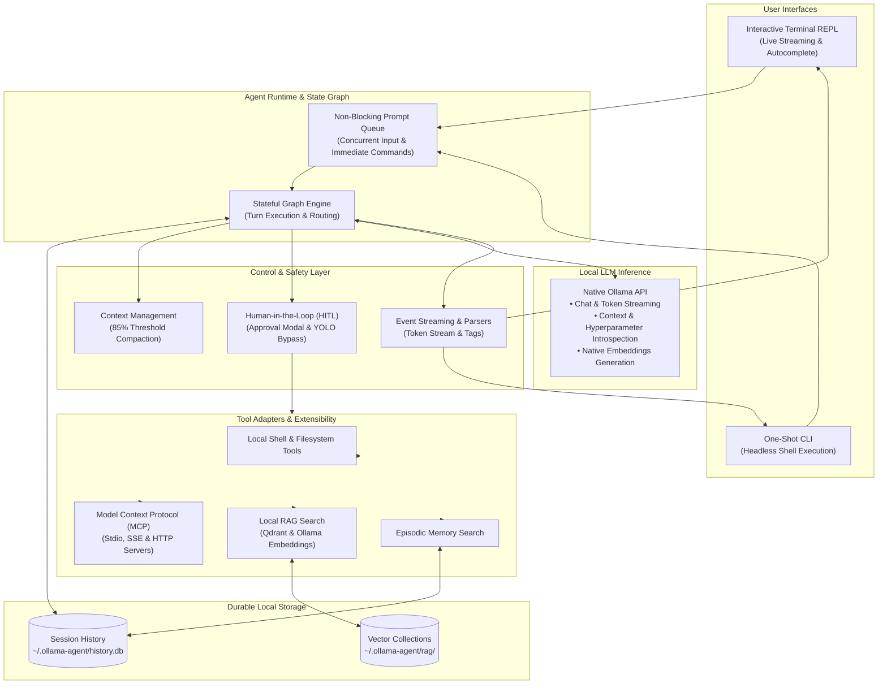
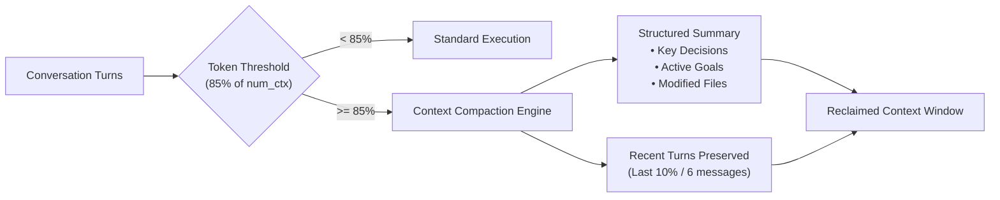
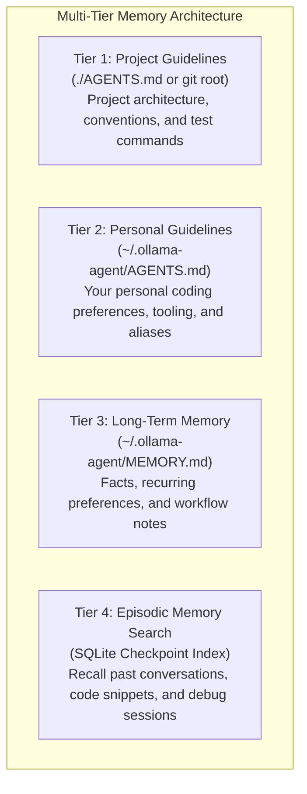

# System Architecture

**Ollama Agent** is an autonomous, local-first AI assistant engineered to run entirely on your machine. It unites local LLM inference—powered directly by Ollama's native API—with stateful graph orchestration, fine-grained safety controls, and multi-tier persistent memory.

Whether you run tasks from the interactive terminal workspace (REPL) or trigger automated workflows via the command-line interface (CLI), Ollama Agent gives local models full agency to inspect files, execute terminal commands, query documentation, and retain context across sessions—with zero data ever leaving your system.

---

## Architectural Philosophy

Ollama Agent is built around four core design principles:

1. **Local-First & Zero Telemetry**: Every prompt, tool call, reasoning trace, and vector embedding stays strictly on your local hardware. There are no cloud relays, no tracking pings, and no third-party telemetry.
2. **Stateful Resilience**: Conversation state is treated as a transactional graph backed by persistent local storage. If your terminal closes or a command crashes, your session state is safely preserved.
3. **Safety by Default**: Non-destructive operations execute smoothly, while sensitive system actions (such as running shell commands or modifying files) require interactive approval—unless you explicitly enable YOLO mode.
4. **Native Ollama Optimization**: Rather than treating Ollama as a generic OpenAI clone, the agent directly interrogates Ollama's APIs to auto-detect maximum context windows, creator-tuned hyperparameters, and native reasoning tokens.

---

## High-Level Architecture

The following diagram illustrates how user interactions flow through the runtime, safety layer, tool adapters, and local storage:

---

## Core Subsystems

### 1. Stateful Multi-Turn Execution

At the center of Ollama Agent is a stateful execution graph that tracks every conversation turn, tool invocation, and intermediate result.

* **Durable Session Store**: All turns are recorded in an embedded SQLite database (`~/.ollama-agent/history.db`) tied to a unique session ID (`thread_id`).
* **Crash Resilience & Instant Resume**: If a process is interrupted, you can resume your exact conversation state anytime with `ollama-agent session resume <id>` or `/session resume <id>` in the REPL.
* **Live Reconfiguration**: You can switch models (`/model set <name>`), change reasoning levels (`/effort set <level>`), or adjust context windows (`/context set <size>`) mid-session without losing your conversational history.
* **Stealth Mode**: For sensitive one-off sessions where you want zero traces saved to disk, running with `--stealth` (or `/stealth on`) executes the entire graph purely in volatile memory.

For details on managing sessions, see the [CLI & REPL Guide](cli_repl.md#session-management).

---

### 2. Intelligent Context Window Management

Local models have strict token boundaries. Ollama Agent prevents conversation degradation and out-of-memory errors through proactive context management:

* **Hardware-Aware Context Discovery**: Upon model selection, Ollama Agent inspects the model's GGUF metadata directly through Ollama's API to detect its true maximum context length (`context_length`), automatically overriding the conservative 2,048-token default.
* **Exact Token Accounting**: Rather than guessing token usage with external approximation tools, the agent reads the exact evaluation metrics (`prompt_eval_count` and `eval_count`) returned by Ollama after each turn.
* **Automatic Background Compaction**: When conversation tokens hit **85%** of the configured limit, the compaction engine summarizes older history while keeping recent messages and critical decisions intact.
* **Autonomous & Natural Language Compaction**: The agent can autonomously trigger compaction when concluding large subtasks, or you can request it naturally (*"compact context before we write the tests"*).
* **Live Visual Gauge**: The REPL header features a real-time visual meter displaying current context consumption against your model's ceiling.

---

### 3. Safety & Human-in-the-Loop (HITL)

Ollama Agent protects your system by enforcing an explicit permission boundary between the LLM and your environment:

* **Interactive Approval Modal**: Non-destructive operations (such as reading files or searching directories) execute immediately. Actions that modify state (shell execution, writing files, editing code) trigger an interactive approval dialog:
  * **Approve (`y`)**: Executes the pending action once.
  * **Approve for Session (`a`)**: Permits this specific tool to run without further prompts for the rest of the session.
  * **Reject (`n`)**: Blocks execution and feeds your denial rationale back to the model so it can propose an alternative.
  * **Cancel (`c`)**: Aborts the active turn immediately.
* **Autonomous YOLO Mode (`-y`, `--yolo`)**: For automated build pipelines, batch scripting, or trusted environments, YOLO mode bypasses interactive confirmations while keeping filesystem sandboxing and execution timeouts intact.

For full safety configuration options, see the [Configuration Guide](configuration.md#configuration-reference-table).

---

### 4. Extensible Tool System & Model Context Protocol (MCP)

The agent’s tool system combines built-in file and shell utilities with dynamic external capabilities via the open **Model Context Protocol (MCP)**:

* **Native Toolset**: Out of the box, the agent can inspect directory trees, read files, search project source code, run shell commands, and query past conversation history.
* **Dynamic MCP Integration**: Connect external tools (GitHub, PostgreSQL, web scrapers, Docker, Jira) by adding servers to `~/.ollama-agent/mcp.json`. Transports over `stdio`, `sse`, and `http` are supported natively.
* **Environment Variable Expansion**: Safely reference secrets in your MCP configuration using standard `${ENV_VAR}` syntax.
* **Zero-Downtime Reloading**: Run `/mcp reload` inside the REPL to connect newly added servers or refresh tool definitions without restarting your session.
* **Subagent Tool Isolation**: Specialized subagents can be granted dedicated MCP toolsets, ensuring the primary agent's context window is not saturated with unused tool schemas.

Learn how to configure servers in the [MCP Guide](mcp.md).

---

### 5. Multi-Tier Persistent Memory

To provide context-aware responses across different projects and workflows, Ollama Agent utilizes a four-tier memory architecture:

1. **Project Instructions (`AGENTS.md`)**: Automatically discovered in your project directory or repository root. Checked into version control so the entire team shares identical agent instructions.
2. **Personal Global Instructions (`~/.ollama-agent/AGENTS.md`)**: User-level rules loaded across every session, regardless of the active project.
3. **Cross-Session Memory (`~/.ollama-agent/MEMORY.md`)**: A persistent markdown knowledge base where the agent stores key facts, user preferences, and project-specific notes that persist across restarts.
4. **Episodic Memory Search**: Built-in semantic and keyword search across past session transcripts (`/session search <query>`), allowing the agent to recall how previous problems were solved.

Learn more about managing agent memory in the [Memory Guide](memory.md).

---

### 6. Streaming UI, Reasoning Traces & Prompt Queue

The terminal user interface is engineered for real-time responsiveness and high-throughput streaming:

* **Token-by-Token Streaming**: Responses render instantly as tokens are generated by Ollama, providing immediate visual feedback.
* **Collapsible Reasoning Traces**: For reasoning models (such as DeepSeek R1, Qwen 2.5/3, or GPT-OSS), raw `<think>` blocks are automatically parsed into collapsible thinking cards featuring a live duration timer, keeping conversation output tidy.
* **Non-Blocking Prompt Queue**: You can type subsequent instructions while the agent is still running. Pending prompts are placed in a FIFO queue and processed sequentially once the current turn completes.
* **Immediate Command Fast-Path**: Diagnostic and management commands (`/model`, `/context`, `/params`, `/session`, `/queue`, `/yolo`) execute immediately without waiting for or interrupting ongoing model generation.
* **Smart Auto-Scroll**: Scrolling up to read previous messages automatically pauses auto-scroll. Scrolling back to the bottom re-engages live tracking instantly.

For keyboard shortcuts and TUI controls, see the [CLI & REPL Guide](cli_repl.md#interactive-repl-walkthrough).

---

## Security & Isolation Model

Ollama Agent is engineered with security and operational safety at its core:

| Security Pillar | Mechanism | User Benefit |
| :--- | :--- | :--- |
| **Local-First Privacy** | Native HTTP communication with local Ollama daemon (`localhost:11434`). | Zero prompts, code files, or environment secrets leave your workstation. |
| **Filesystem Sandboxing** | Path validation restricts agent file operations to the current working directory. | Prevents unauthorized traversal (`../../`) outside the designated project root. |
| **Tool Execution Timeouts** | All shell invocations and tool calls execute under strict configurable timeouts. | Runaway scripts, infinite loops, or hung network requests are automatically killed. |
| **Subprocess Stderr Isolation** | Background tool processes (e.g., MCP server stderr) redirect to `~/.ollama-agent/mcp.log`. | Stderr noise and crash dumps never corrupt your active terminal workspace. |
| **Stealth Mode** | Volatile in-memory checkpointer bypasses SQLite writes. | Run sensitive queries without leaving traces in local session databases. |

---

## Architecture Summary

| Layer | Primary Responsibilities | User Controls & Configuration |
| :--- | :--- | :--- |
| **User Interface** | Terminal workspace (REPL) & one-shot execution (CLI). | `ollama-agent [flags]`, keyboard shortcuts, slash commands. |
| **Runtime & Graph** | Stateful turn execution, prompt queue, and lifecycle reload. | `/reload`, `/clear`, `/session new`, `/queue`. |
| **Control & Safety** | HITL approval modal, context tracking, 85% compaction. | `/yolo [on\|off]`, `/context set <size>`, auto-compaction. |
| **Memory & Knowledge** | Multi-tier rules (`AGENTS.md`, `MEMORY.md`), episodic search, local RAG. | `/memory show`, `/session search`, `/rag load <name>`. |
| **Tool Ecosystem** | Shell execution, file editing, and external MCP servers. | `~/.ollama-agent/mcp.json`, `/mcp reload`, `/skill list`. |
| **LLM Backend** | Native Ollama inference, context auto-detection, reasoning capture. | `/model set <name>`, `/effort set <level>`, `/params set <k> <v>`. |
| **Storage Layer** | SQLite session persistence (`history.db`) and Qdrant vector storage. | `~/.ollama-agent/history.db`, `~/.ollama-agent/rag/`. |

---

## Next Steps

* **Interactive REPL & CLI**: Master terminal controls and commands in the [CLI & REPL Guide](cli_repl.md).
* **System Configuration**: Fine-tune models, context sizes, and tool timeouts in the [Configuration Guide](configuration.md).
* **Extend with MCP**: Connect external developer tools and data sources in the [Model Context Protocol Guide](mcp.md).
* **Skills & Subagents**: Learn how to create specialized subagents in the [Subagents Guide](subagents.md) and modular skills in the [Agent Skills Guide](skills.md).
