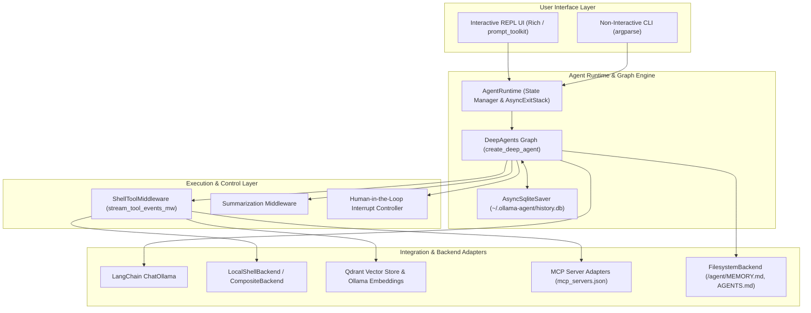
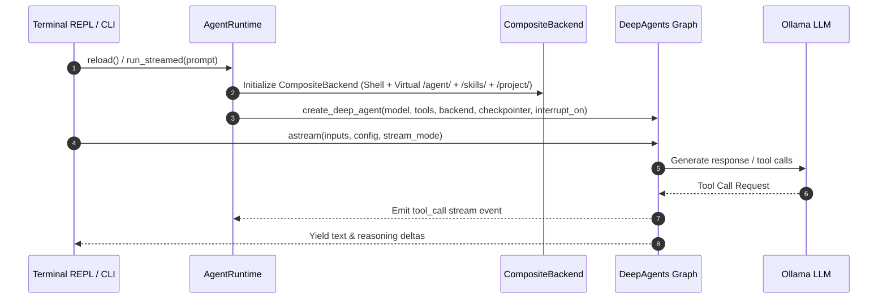
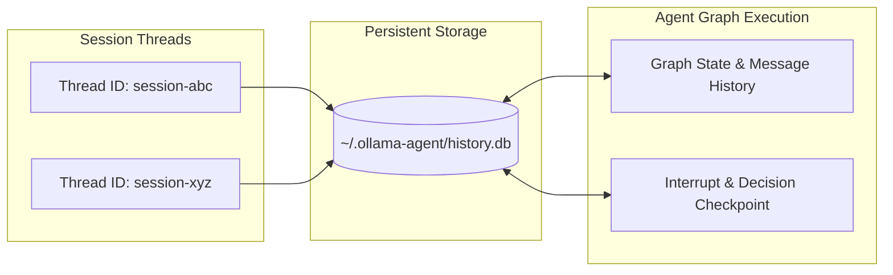
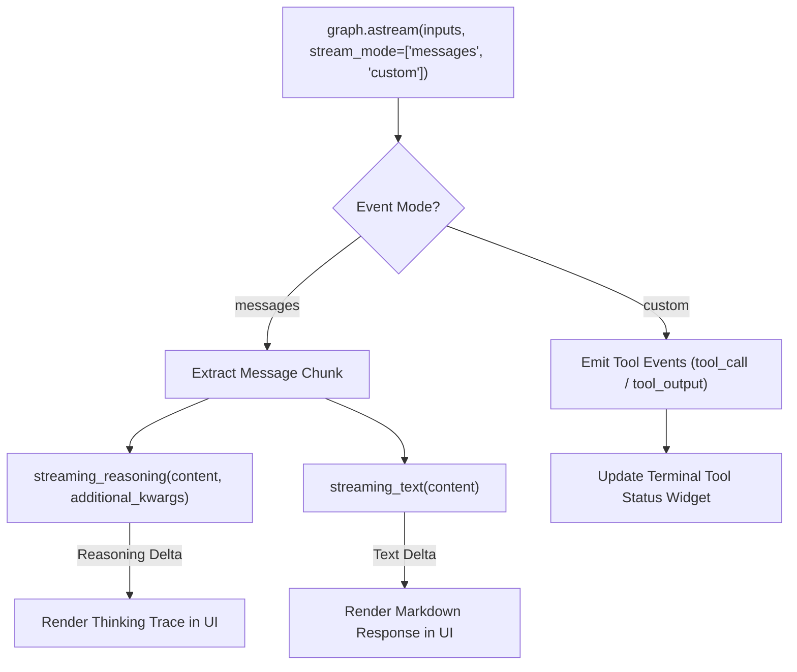
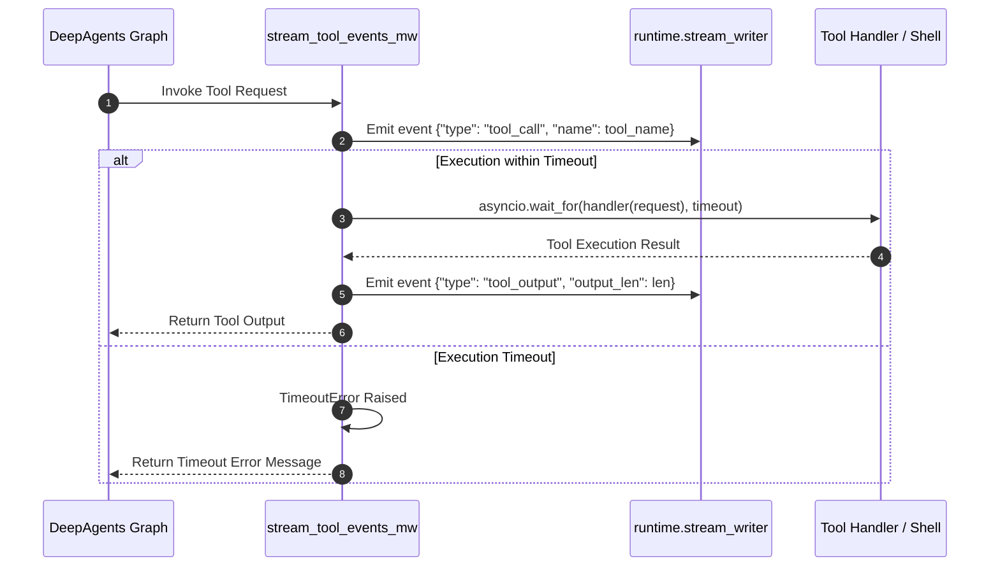
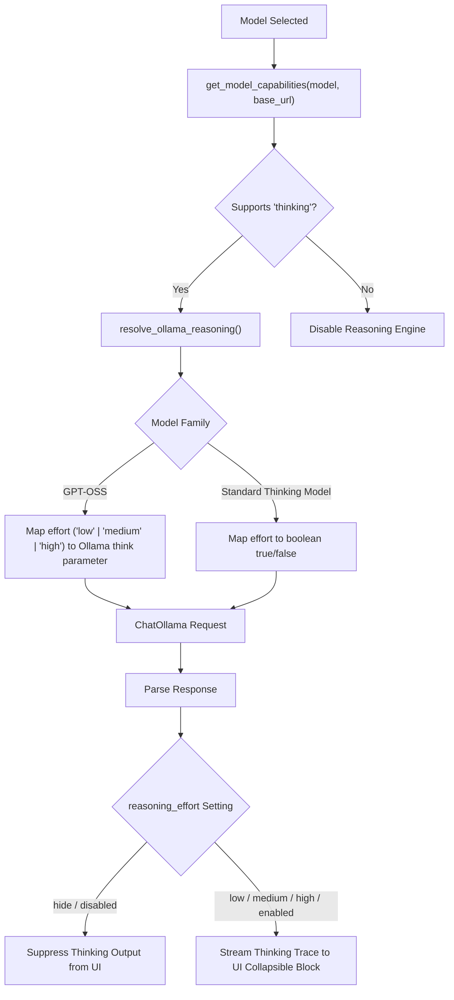

# Ollama Agent Architectural Overview

Ollama Agent is designed around a modular, event-driven architecture that bridges local LLM inference engines (via Ollama and LangChain) with stateful graph orchestration (via DeepAgents and LangGraph). This document outlines the core system design, execution pipeline, persistence layer, tool middleware, and streaming parsers.

---

## High-Level Architecture

The system uses a layered architecture where user interactions (CLI or REPL UI) trigger asynchronous event streams through a stateful graph. The graph coordinates tool invocation, memory read/writes, RAG queries, and subagent delegation while maintaining human-in-the-loop (HITL) checkpoints.

---

## Component Breakdowns

### 1. DeepAgents Graph Integration

The core agent state machine is built using **DeepAgents** (`deepagents.create_deep_agent`), which compiles a LangGraph state graph configured with specialized backends, system prompts, memory layers, and tool subnets.

#### Graph Construction Details
- **Lifecycle Management**: `AgentRuntime` owns an internal `AsyncExitStack` to manage resources (SQLite database connections, MCP process pipes, and HTTP sessions). Calling `reload()` gracefully tears down existing resources and re-instantiates the graph.
- **Backend Composition**: A `CompositeBackend` routes filesystem and tool requests:
  - `/agent/`: Routed to `FilesystemBackend` pointing to `~/.ollama-agent/` (e.g. `MEMORY.md`, global `AGENTS.md`).
  - `/skills/`: Routed to `FilesystemBackend` pointing to `~/.ollama-agent/skills/`.
  - `/project/`: Optional route to `FilesystemBackend` pointing to repository root when `AGENTS.md` is in an ancestor directory.
  - Default route: `LocalShellBackend` operating on the current working directory (`Path.cwd()`).
- **Dynamic System Instructions**: The system prompt is constructed dynamically by blending base instructions, filesystem policy directives (traversal mode vs sandboxed mode), and local environment runtime metadata (`platform.system()`, `platform.release()`).

---

### 2. State Persistence via `langgraph-checkpoint-sqlite`

Session persistence is handled by `AsyncSqliteSaver` from `langgraph-checkpoint-sqlite`.

- **Thread Tracking**: Each chat session is assigned a unique `thread_id`. State snapshots are written to SQLite after every node execution step in the graph.
- **Mid-Session Continuation**: When changing models mid-conversation via `/model set <model>`, the thread configuration (`{"configurable": {"thread_id": thread}}`) is passed to `astream()`, preserving conversation state without losing context.
- **HITL Checkpoints**: When execution is paused for user confirmation (`interrupt_on`), the graph state is snapshotted in SQLite. Resuming execution sends a `Command(resume=decision)` payload back to the same thread ID.

---

### 3. Streaming Responses & Event Processing

Ollama Agent processes inference and execution in real time by listening to LangGraph event streams.

- **Dual-Stream Listening**: The agent streams both `messages` (raw LLM token outputs) and `custom` events (tool middleware status updates).
- **Text Delta Extraction**: `streaming_text()` extracts text content regardless of payload shape (handles raw strings, single dicts, or lists of text blocks).
- **Reasoning Delta Extraction**: `streaming_reasoning()` extracts thinking content from `additional_kwargs['reasoning_content']` or OpenAI-style reasoning blocks.

---

### 4. ShellToolMiddleware & Command Execution

Command execution is managed by custom middleware (`stream_tool_events_mw`) built using `langchain.agents.middleware.wrap_tool_call`.

- **Tool Call Emitting**: Emits structured UI events before tool execution starts (`tool_call`) and after completion (`tool_output`), allowing the terminal renderer to update spinners and status lines.
- **Timeout Protection**: Wraps execution in `asyncio.wait_for(timeout=builtin_tool_timeout)` to prevent hanging sub-processes or stuck tool calls.
- **Security Policies**: Respects the `runtime.allow_traversal` setting:
  - `True`: `LocalShellBackend` allows execution across the host filesystem.
  - `False`: `LocalShellBackend` enforces virtual mode sandboxing restricted to the current working directory.

---

### 5. Ollama Thinking Trace Capture

The agent incorporates reasoning capabilities from models such as DeepSeek R1, Qwen 3, and GPT-OSS.

- **Capability Detection**: Queries `ollama.AsyncClient.show()` to inspect model capabilities for the `thinking` flag.
- **Reasoning Effort Translation**:
  - `GPT-OSS` models receive string values (`"low"`, `"medium"`, `"high"`).
  - General reasoning models receive boolean flags (`true` / `false`).
- **UI Filtering**: When `reasoning_effort` is set to `hide` or `disabled`, reasoning chunks extracted by `streaming_reasoning()` are filtered out before reaching the UI layer.
