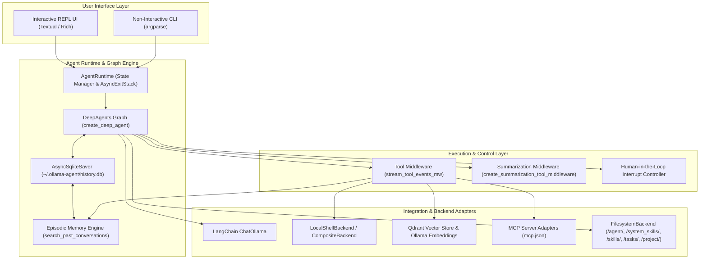
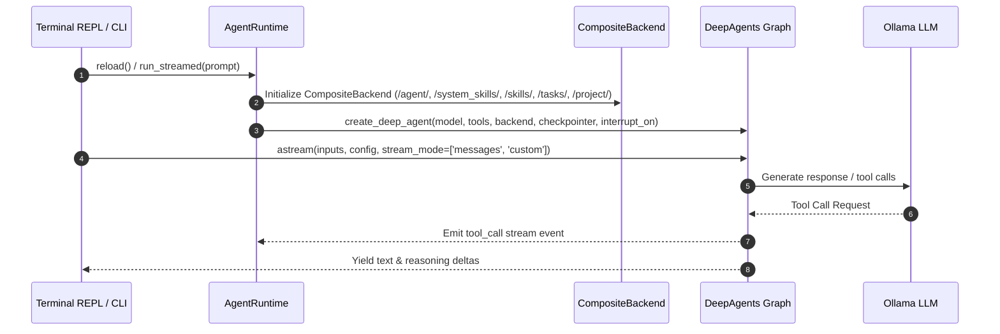
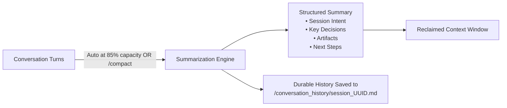
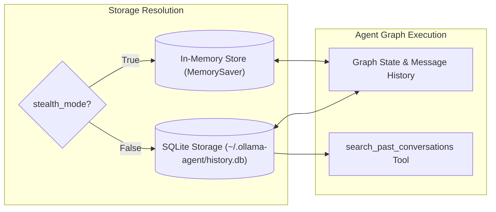
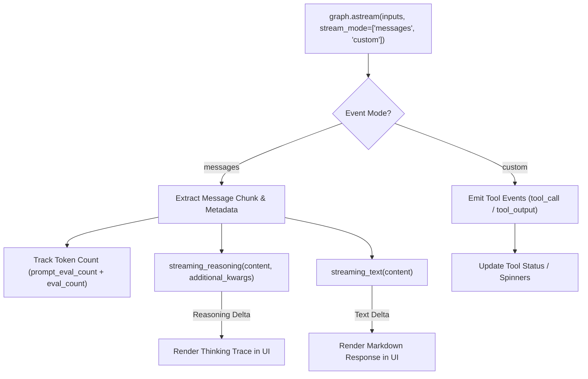
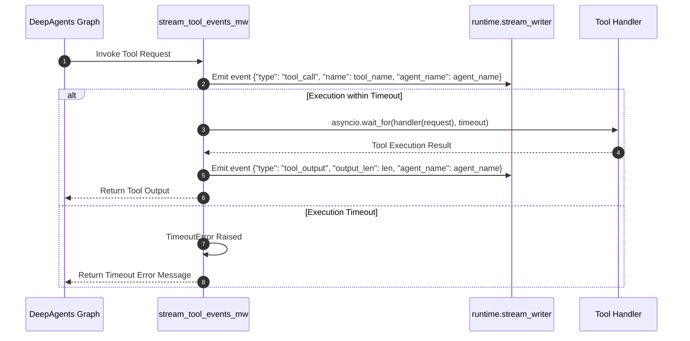
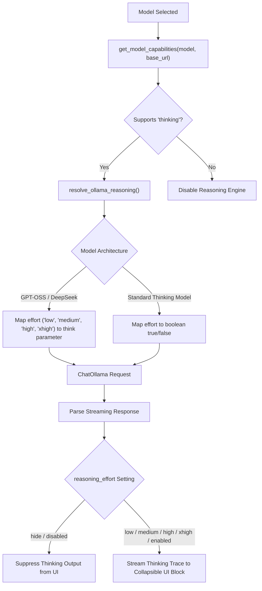
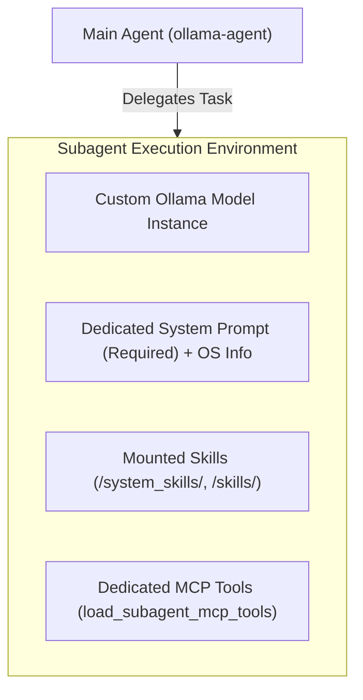

# Ollama Agent Architectural Overview

Ollama Agent is designed around a modular, event-driven architecture that bridges local LLM inference engines (via Ollama and LangChain) with stateful graph orchestration (via DeepAgents and LangGraph). This document outlines the core system design, execution pipeline, persistence layer, tool middleware, context compaction engine, episodic memory, and streaming parsers.

---

## High-Level Architecture

The system uses a layered architecture where user interactions (CLI or REPL UI) trigger asynchronous event streams through a stateful graph. The graph coordinates tool invocation, memory read/writes, RAG queries, episodic search, and subagent delegation while maintaining human-in-the-loop (HITL) checkpoints.

---

## Component Breakdowns

### 1. DeepAgents Graph Integration & Backend Routing

The core agent state machine is built using **DeepAgents** (`deepagents.create_deep_agent`), which compiles a LangGraph state graph configured with specialized virtual backends, dynamic system prompts, memory layers, and tool subnets.

#### Graph Construction Details
- **Lifecycle Management**: `AgentRuntime` owns an internal `AsyncExitStack` to manage resources (SQLite database connections, MCP process pipes, and HTTP sessions). Calling `reload()` gracefully tears down existing resources and re-instantiates the graph live without restarting the application.
- **Backend Composition**: A `CompositeBackend` routes filesystem and tool requests:
  - `/agent/`: Routed to `FilesystemBackend` pointing to `~/.ollama-agent/` (`MEMORY.md`, global `AGENTS.md`).
  - `/system_skills/`: Routed to `FilesystemBackend` pointing to built-in system skills (`skill-creator`, `task-creator`).
  - `/skills/`: Routed to `FilesystemBackend` pointing to user skills in `~/.ollama-agent/skills/`.
  - `/tasks/`: Routed to `FilesystemBackend` pointing to saved YAML prompt tasks in `~/.ollama-agent/tasks/`.
  - `/project/`: Optional route to `FilesystemBackend` pointing to the repository root when `AGENTS.md` is discovered in an ancestor directory.
  - Default route: `LocalShellBackend` operating on the current working directory (`Path.cwd().resolve()`).
- **Dynamic System Instructions**: The system prompt is constructed dynamically by blending base instructions, filesystem policy directives (traversal mode vs sandboxed mode), dynamic RAG search policies (`rag_policy.md`), and local environment runtime metadata (`platform.system()`, `platform.release()`).

---

### 2. Context Compression & Compaction Engine

To prevent conversation degradation and context overflow errors, Ollama Agent integrates both automatic background summarization and on-demand context compaction.

1. **Automatic Background Summarization**:
   - Built into DeepAgents via `create_summarization_tool_middleware(model, backend)`.
   - **Trigger Threshold**: Automatically triggers when conversation tokens reach **85%** of the model's `max_input_tokens` (or 170k token fallback).
   - **Token Retention**: Compresses older turns into a structured summary while preserving the most recent **10%** of tokens (or 6 messages).
   - **Tool Argument Pruning**: Large arguments in past tool calls are truncated to 2,000 characters.
   - **Context Overflow Recovery**: Catches context window errors from the LLM and triggers emergency summarization.

2. **On-Demand Context Compaction (`/compact` or `/compress`)**:
   - Manually executed anytime via `AgentRuntime.compact_context()` (`ollama_agent/agent/compaction.py`).
   - **Recent Message Preservation**: Preserves the last **2** messages (`KEEP_RECENT_MESSAGES = 2`).
   - **Safe Cutoff Resolution**: Uses `find_safe_cutoff()` to ensure tool call `AIMessage` items are never separated from their corresponding `ToolMessage` execution results.
   - **History Offloading**: Appends evicted message turns to `/conversation_history/session_<uuid>.md` using strict read-modify-write appending, raising `HistoryOffloadError` if offloading fails.
   - **Summary Integration**: Creates a consolidated `HumanMessage` tagged with `lc_source="summarization"`, recalculates token usage via `count_tokens_approximately()`, and updates the header gauge immediately.

---

### 3. State Persistence & Episodic Memory

Session persistence is handled dynamically by `AgentRuntime`:
- **Default Mode (`stealth_mode = False`)**: Uses `AsyncSqliteSaver` from `langgraph-checkpoint-sqlite` storing state in `~/.ollama-agent/history.db`.
- **Stealth Mode (`stealth_mode = True`)**: Uses `MemorySaver` from `langgraph.checkpoint.memory` keeping conversation checkpoints strictly in-memory during the active session without persisting to SQLite.

- **Thread Tracking**: Each chat session is assigned a unique `thread_id`. State snapshots are recorded after every node execution step in the graph.
- **Mid-Session Model Switching**: Changing models mid-conversation (`/model set <model>`) preserves conversation state by passing the active `thread_id` to the newly instantiated model.
- **Session Resumption & Export**: Past sessions stored in SQLite can be inspected, resumed with full UI message restoration (`/session resume <id>` or `/session switch <id>`), exported to Markdown (`/session export`), or deleted (`/session delete <id>`).
- **Episodic Memory Subsystem**:
  - Implemented in `ollama_agent/agent/episodic_memory.py`.
  - Queries SQLite checkpoints and `writes` records where `channel = 'messages'`, deserialized with `JsonPlusSerializer`.
  - Exposed as the built-in agent tool `search_past_conversations(query: str, limit: int = 3)` to enable autonomous recall of past solutions across sessions (excluding the active `thread_id`).
  - Exposed to users via the `/session search <query>` slash command and `ollama-agent session search` CLI command.
  - Powers `load_past_user_prompts()` for prompt history navigation (`↑`/`↓`) in the REPL.

---

### 4. Streaming Responses & Event Processing

Ollama Agent processes inference and execution in real time by listening to LangGraph event streams via `stream_agent_events` (`ollama_agent/streaming/events.py`).

- **Dual-Stream Listening**: Streams both `messages` (raw LLM token outputs) and `custom` events (tool middleware lifecycle events).
- **Token Consumption Tracking**: Inspects `response_metadata` for `prompt_eval_count` and `eval_count` to maintain accurate `last_context_tokens` metrics for the live gauge.
- **Stateful Streaming Parsers**:
  - `ThinkTagParser`: Stateful stream parser that tracks `<think>` and `</think>` tags across token chunks, buffering partial tag boundaries (`_buffer`) to prevent tag fragmentation leaks and separating `reasoning_delta` from `text_delta`.
  - `streaming_text()`: Extracts raw text across string, dictionary, and list block payloads.
  - `streaming_reasoning()`: Extracts reasoning from `additional_kwargs['reasoning_content']` or structured reasoning content blocks.
- **Interrupt Handling**: When `state.interrupts` is encountered during streaming, `StreamingInterruptHandler` parses the action requests using `extract_action_requests()` (`ollama_agent/streaming/interrupts.py`) and invokes the renderer's `handle_interrupt()` callback.
- **Prompt Queue & Concurrent Command Dispatch**:
  - `_prompt_queue: deque[QueuedItem]` holds pending turns when generation or tool approval is active.
  - `_is_immediate_command()` fast-path dispatches read-only slash commands (`/queue`, `/yolo`, `/stealth`, `/model list`, `/effort`, `/context`, `/params list`, `/session list/search/export`, `/task list`, `/skill list`, `/rag status`, `/mcp list`, `/agents list`) directly to the console/chat without blocking or interrupting active streams.
  - `SystemOutputWidget`: Dedicated TUI widget card that cleanly renders command tables, notices, and system responses separately from conversation message bubbles.
  - Stateful commands and user prompts are enqueued FIFO and automatically drained by `_process_next_in_queue()` inside `finally` blocks of stream workers.
  - Unblocked tool approval keeps `ReplInput` enabled (`_is_approval_pending = True`), allowing users to submit follow-up prompts while reviewing sensitive tool actions.

---

### 5. Tool Execution Middleware & Human-in-the-Loop (HITL) Control

All tool calls (shell execution, built-in tools, MCP tools, subagent task calls, RAG search) are wrapped by the universal tool execution middleware (`stream_tool_events_mw`) in `ollama_agent/agent/middleware.py`.

- **Universal Event Dispatch**: Emits structured UI events before tool execution starts (`tool_call`) and after completion (`tool_output`), with subagent attribution tags (`agent_name`).
- **Timeout Protection**: Wraps execution in `asyncio.wait_for(timeout=builtin_tool_timeout)` using dynamic timeout resolution via `get_tool_timeout()`.
- **Sensitive Tool Interruption**: Sensitive tools (`execute`, `write_file`, `edit_file`) trigger graph interrupts via `interrupt_on`. Users can approve (`y`), reject (`n`), allow for session (`a`), or cancel (`c`). In YOLO mode (`-y` / `/yolo on`), interrupts are bypassed.

---

### 6. Context Injection & Multimodal Pipeline

User prompts are pre-processed by `ollama_agent/core/prompt_processor.py` before being passed to the LangGraph execution graph:

1. **`@-mentions` Parsing**: Extracts file and directory references (e.g. `@src/main.py`, `@"data folder"`, `@.`).
2. **Type Detection**:
   - **Text Files**: Read as UTF-8 and appended as structured `<context_file path="...">` blocks under `--- Attached Context ---`.
   - **Multimodal Assets**: Images (`.png`, `.jpg`, `.webp`), audio (`.mp3`, `.wav`), video (`.mp4`, `.mov`), and documents (`.pdf`, `.pptx`) are base64-encoded as binary attachments in a multimodal `HumanMessage` payload.
   - **Binary Safety**: Non-multimodal binaries containing null bytes are safely blocked with descriptive errors.
3. **Budget Enforcement**: Validates file size (`max_file_size`), count (`max_files`), and total volume (`max_total_size`) against `MentionSettings`.

---

### 7. Ollama Thinking / Reasoning Trace Capture

The agent natively captures reasoning traces from models with thinking support (e.g. DeepSeek R1, Qwen 3, Qwen 3.8, GPT-OSS).

- **Capability Detection**: Queries `ollama.AsyncClient.show()` to inspect model capabilities for the `thinking` flag.
- **Effort Levels**: Supported levels are `low`, `medium`, `high`, `xhigh`, `disabled`, `hide`, and `enabled`.
- **Effort Translation**:
  - `GPT-OSS` and specialized models receive string values (`"low"`, `"medium"`, `"high"`, `"xhigh"`).
  - General reasoning models receive boolean flags (`true` / `false`).
- **UI Filtering**: When `reasoning_effort` is set to `hide` or `disabled`, reasoning chunks extracted by `streaming_reasoning()` are filtered out before reaching the UI layer.

---

### 8. Custom Subagents Architecture

Subagents are auxiliary AI agent instances configured in `settings.yaml` to handle specialized subtasks with isolated context windows:

- **Isolated Execution**: Subagents run on separate graph nodes with independent context windows and custom system prompts with OS environment details.
- **Dedicated Tools**: Subagent MCP servers are loaded independently via `load_subagent_mcp_tools()` and isolated from the main agent's tool set.
- **Attribution**: Tool execution middleware attaches `agent_name` metadata to `tool_call` and `tool_output` events for clear attribution in the UI.
- **Parameter Inheritance**: If not specified in `settings.yaml`, subagents inherit model sampling parameters, `model`, `context_window`, `base_url`, and `reasoning_effort` from the main configuration.
