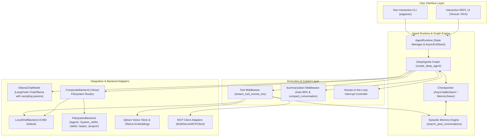
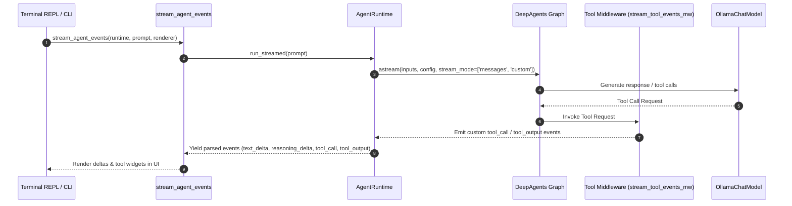
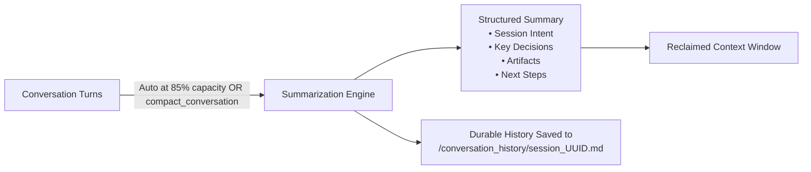
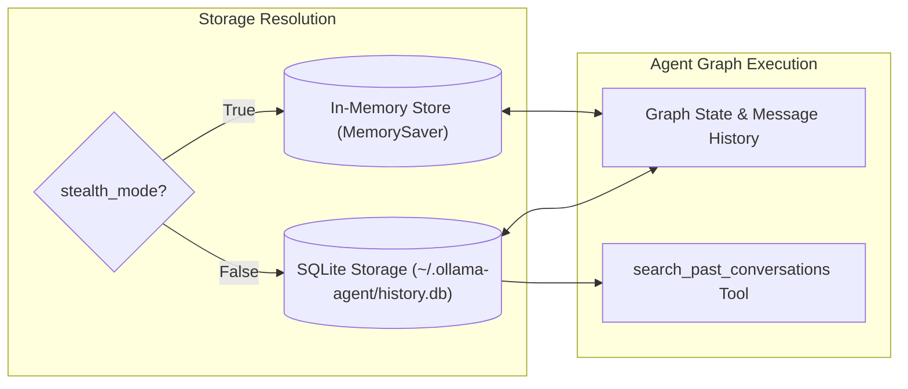
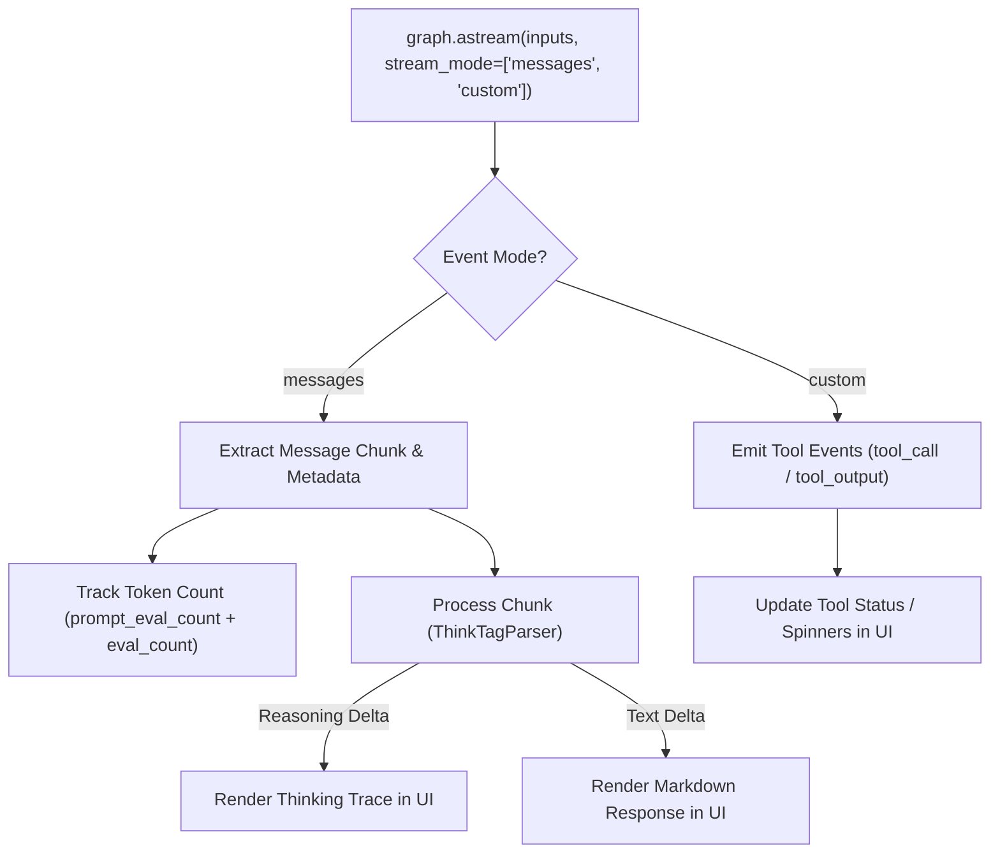
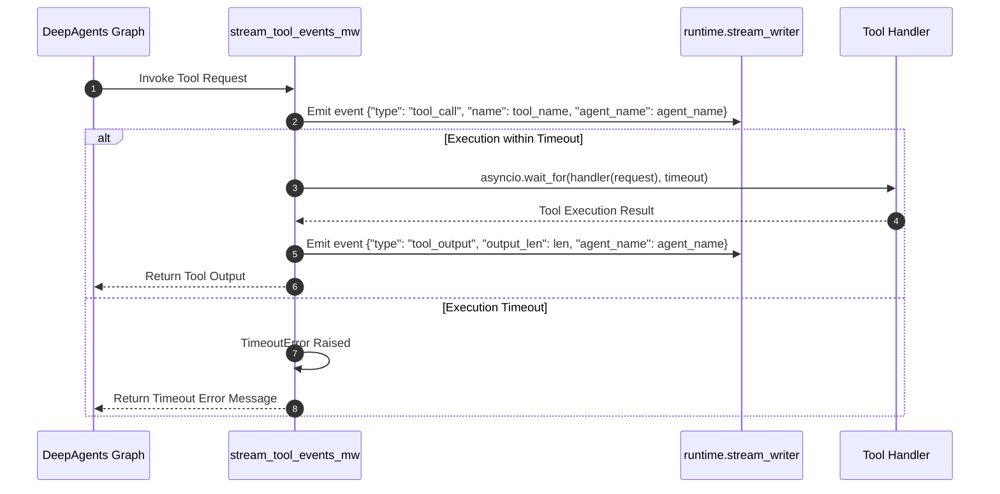
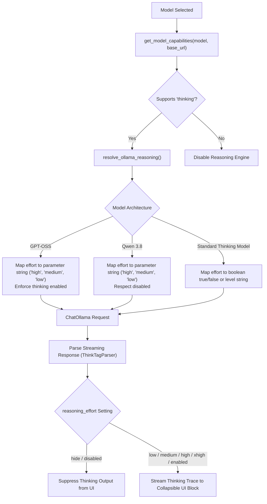
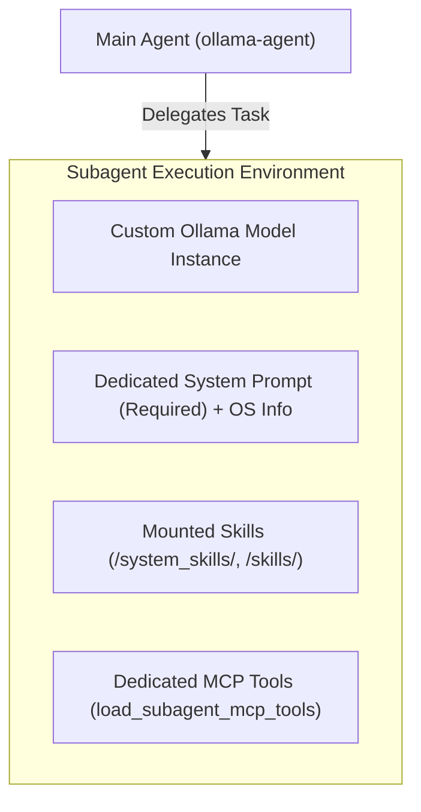
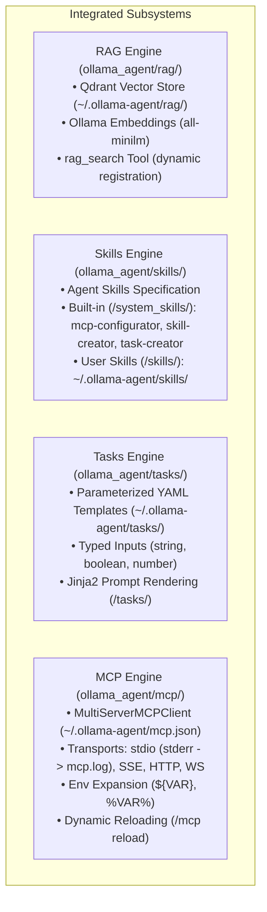

# Ollama Agent Architectural Overview

Ollama Agent is designed around a modular, event-driven architecture that bridges local LLM inference engines (via Ollama and LangChain) with stateful graph orchestration (via DeepAgents and LangGraph). This document outlines the core system design, execution pipeline, persistence layer, tool middleware, context compaction engine, episodic memory, streaming parsers, and subsystem integrations.

---

## High-Level Architecture

The system uses a layered architecture where user interactions (CLI or REPL UI) trigger asynchronous event streams through a stateful graph. The graph coordinates tool invocation, memory read/writes, RAG queries, episodic search, and subagent delegation while maintaining human-in-the-loop (HITL) checkpoints.

---

## Component Breakdowns

### 1. DeepAgents Graph Integration & Backend Routing

The core agent state machine is built using **DeepAgents** (`deepagents.create_deep_agent`), which compiles a LangGraph state graph configured with specialized virtual backends, dynamic system prompts, memory layers, and tool subnets.

#### Graph Construction Details
- **Lifecycle Management**: `AgentRuntime` owns internal `AsyncExitStack` instances (`_exit_stack` and `_checkpointer_stack`) to manage resources (SQLite database connections, MCP process pipes, and HTTP sessions). Calling `reload()` gracefully tears down existing resources and re-instantiates the graph live without restarting the application.
- **Backend Composition**: A `CompositeBackend` routes filesystem and tool requests:
  - `/agent/`: Routed to `FilesystemBackend` pointing to `~/.ollama-agent/` (`MEMORY.md`, global `AGENTS.md`).
  - `/system_skills/`: Routed to `FilesystemBackend` pointing to built-in system skills (`mcp-configurator`, `skill-creator`, `task-creator`).
  - `/skills/`: Routed to `FilesystemBackend` pointing to user skills in `~/.ollama-agent/skills/`.
  - `/tasks/`: Routed to `FilesystemBackend` pointing to saved YAML prompt tasks in `~/.ollama-agent/tasks/`.
  - `/project/`: Optional route to `FilesystemBackend` pointing to the repository root when `AGENTS.md` is discovered in an ancestor directory.
  - Default route: `LocalShellBackend` operating on the current working directory (`Path.cwd().resolve()`), configured with `timeout=get_tool_timeout()`, `virtual_mode=not allow_traversal`, and `inherit_env=inherit_env`.
- **Memory Sources Resolution**:
  - Global user memory: `["/agent/MEMORY.md"]`.
  - Global agent instructions: `["/agent/AGENTS.md"]` if present.
  - Project instructions: Discovered via `find_agents_file(Path.cwd())`. If in CWD root -> `/{filename}`; if in an ancestor directory -> `/project/` route is created and `memory_sources.append("/project/{filename}")`; if not found -> `["/AGENTS.md"]`.
- **Tool Assembly & Dynamic Registration**: Base built-in tools (`search_past_conversations`) are combined with active MCP tools (`load_main_mcp_tools()`) and conditional RAG search (`rag_search`). The `rag_search` tool is conditionally included only when an active RAG database is loaded (`rag_mgr.current_database is not None`). Loading, unloading, or deleting a RAG database triggers `runtime.reload()`, dynamically updating the tool registry.
- **Dynamic System Instructions**: The system prompt is constructed dynamically using unified Jinja2 template rendering (`render_prompt_template`), evaluating filesystem policy directives (traversal mode vs sandboxed mode), conditional RAG search policies (``), and local environment runtime metadata (`platform.system()`, `platform.release()`, `platform.machine()`, working directory, and current date/time).

---

### 2. Context Compression & Compaction Engine

To prevent conversation degradation and context overflow errors, Ollama Agent integrates both automatic background summarization and proactive tool-driven compaction.

1. **Automatic Background Summarization (`SummarizationMiddleware`)**:
   - Built into DeepAgents and initialized in the agent pipeline.
   - **Trigger Threshold**: Automatically triggers when conversation tokens reach **85%** of the model's `max_input_tokens` (or 170k token fallback).
   - **Token Retention**: Compresses older turns into a structured summary while preserving the most recent **10%** of tokens (or 6 messages).
   - **Tool Argument Pruning**: Large arguments in past tool calls are truncated to 2,000 characters.
   - **Media & History Offloading**: Evicted message turns and inline media are safely offloaded to `/conversation_history/session_<uuid>.md` on the persistent backend.
   - **Context Overflow Recovery**: Catches context window errors from the LLM and triggers emergency summarization.

2. **Agent-Driven Compaction Tool (`compact_conversation`)**:
   - Exposed to the agent via `create_summarization_tool_middleware(model, backend)`.
   - **Tool Execution**: Enables the model to proactively compact context when transitioning to new subtasks or when requested by the user in natural language (*"compact conversation"*, *"comprime el contexto"*).
   - **Eligibility Gating**: Implements an eligibility gate requiring conversation tokens to reach at least ~50% of the threshold before compaction runs.
   - **In-Graph State Update**: Emits a `Command(update={"_summarization_event": ...})` within the LangGraph graph loop to cleanly update state without out-of-band mutations.
   - **Effective Token Accounting**: `AgentRuntime.count_effective_tokens()` inspects `_summarization_event` to calculate accurate token counts (`[summary_message] + messages[cutoff_index:]`).

3. **Autonomous Compaction vs. Manual Commands**:
   - Previous manual slash commands (`/compact`, `/compress`) were removed.
   - Context compaction is executed entirely in-graph—either autonomously by the model calling `compact_conversation` or automatically at the 85% threshold—ensuring clean LangGraph state transitions without out-of-band state mutation.

---

### 3. State Persistence & Episodic Memory

Session persistence is handled dynamically by `AgentRuntime`:
- **Default Mode (`stealth_mode = False`)**: Uses `AsyncSqliteSaver` from `langgraph-checkpoint-sqlite` storing state in `~/.ollama-agent/history.db`.
- **Stealth Mode (`stealth_mode = True`)**: Uses `MemorySaver` from `langgraph.checkpoint.memory` keeping conversation checkpoints strictly in-memory during the active session without persisting to SQLite.

- **Thread Tracking**: Each chat session is assigned a unique `thread_id`. State snapshots are recorded after every node execution step in the graph.
- **Mid-Session Reconfiguration**: Changing models (`/model set <model>`), context window (`/context set <size>`), reasoning effort (`/effort set <level>`), or parameters (`/params set <k> <v>`) reloads the graph while preserving conversation state under the active `thread_id`.
- **Session Management & Export**:
  - Past sessions stored in SQLite can be inspected (`/session list`), resumed with full UI message restoration (`/session resume <id>` or `/session switch <id>`), started afresh (`/session new`, `/new`, `/clear`), exported to Markdown (`/session export [id] [-o path]`), or deleted (`/session delete <id>`).
  - Equivalent CLI commands: `ollama-agent session list`, `search`, `delete`, `export`.
- **Episodic Memory Subsystem**:
  - Implemented in `ollama_agent/agent/episodic_memory.py`.
  - Queries SQLite `checkpoints` and `writes` records where `channel = 'messages'`, deserialized with `JsonPlusSerializer`.
  - The active thread is tracked via `set_active_thread_id()` to exclude the current session from search results.
  - Exposed as the built-in agent tool `search_past_conversations(query: str, limit: int = 3)` to enable autonomous recall of past solutions across sessions.
  - Exposed to users via the `/session search <query>` slash command and `ollama-agent session search` CLI command.
  - Powers `load_past_user_prompts()` for prompt history navigation (`↑`/`↓`) in the REPL.

---

### 4. Streaming Responses & Event Processing

Ollama Agent processes inference and execution in real time by listening to LangGraph event streams via `stream_agent_events` (`ollama_agent/streaming/events.py`).

- **Dual-Stream Listening**: Streams both `messages` (raw LLM token outputs) and `custom` events (tool middleware lifecycle events).
- **Token Consumption Tracking**: Inspects `response_metadata` for `prompt_eval_count` and `eval_count` to maintain accurate `last_context_tokens` metrics for the live gauge.
- **Stateful Streaming Parsers (`ollama_agent/streaming/parsers.py`)**:
  - `ThinkTagParser`: Stateful stream parser that tracks `<think>` and `</think>` tags across token chunks, buffering partial tag boundaries (`_buffer`) to prevent tag fragmentation leaks and separating `reasoning_delta` from `text_delta`.
  - `streaming_text()`: Extracts raw text across string, dictionary, and list block payloads without altering whitespace.
  - `streaming_reasoning()`: Extracts reasoning from `additional_kwargs['reasoning_content']` or structured reasoning content blocks.
- **Interrupt Handling**: When `state.interrupts` is encountered during streaming, `extract_action_requests()` (`ollama_agent/streaming/interrupts.py`) extracts and validates the action requests before handing off to the renderer's `handle_interrupt()` callback.
- **Prompt Queue & Concurrent Command Dispatch**:
  - `_prompt_queue: deque[QueuedItem]` holds pending turns when generation or tool approval is active.
  - `_is_immediate_command()` fast-path dispatches read-only slash commands (`/exit`, `/quit`, `/queue`, `/yolo`, `/stealth`, `/model list`, `/effort`, `/context`, `/params list`, `/session list/search/export/delete`, `/task list/delete`, `/skill list/show/delete`, `/rag status/list/create/delete/load/unload`, `/mcp list/status`, `/agents list`) directly without blocking or interrupting active streams.
  - `SystemOutputWidget`: Dedicated TUI widget card that cleanly renders command tables, notices, and system responses separately from conversation message bubbles.
  - Stateful commands and user prompts are enqueued FIFO and automatically drained by `_process_next_in_queue()` inside `finally` blocks of stream workers.
  - Unblocked tool approval keeps `ReplInput` enabled (`_is_approval_pending = True`), allowing users to submit follow-up prompts or immediate commands while reviewing sensitive tool actions.

---

### 5. Tool Execution Middleware & Human-in-the-Loop (HITL) Control

All tool calls (shell execution, built-in tools, MCP tools, subagent task calls, RAG search) are wrapped by the universal tool execution middleware (`stream_tool_events_mw`) in `ollama_agent/agent/middleware.py`.

- **Universal Event Dispatch**: Emits structured UI events before tool execution starts (`tool_call`) and after completion (`tool_output`), with subagent attribution tags (`agent_name`) extracted from `task` arguments or `lc_agent_name` metadata.
- **Timeout Protection**: Wraps execution in `asyncio.wait_for(timeout=timeout_s)` using dynamic timeout resolution via `get_tool_timeout()`. On timeout, returns a structured error `ToolMessage`.
- **Sensitive Tool Interruption**: Sensitive tools (`execute`, `write_file`, `edit_file`) trigger graph interrupts via `interrupt_on`. Users can approve (`y`), reject (`n`), allow for session (`a`), or cancel (`c`). In YOLO mode (`-y` / `/yolo on`), interrupts are bypassed. Tools allowed for session are added to `auto_approved_tools` and bypass subsequent prompts.

---

### 6. Context Injection & Multimodal Pipeline

User prompts are pre-processed by `ollama_agent/core/prompt_processor.py` before being passed to the LangGraph execution graph:

1. **`@-mentions` Parsing**: Extracts file and directory references (e.g. `@src/main.py`, `@"data folder"`, `@'path with spaces'`, `@.`, `@dir`).
2. **Type Detection & Multimodal Attachments**:
   - **Text Files**: Read as UTF-8 and appended as structured `<context_file path="...">` blocks under `--- Attached Context ---`.
   - **Multimodal Assets**:
     - Images (`.png`, `.jpg`, `.jpeg`, `.webp`, `.gif`, `.bmp`, `.svg`, `.heic`, `.heif`) -> `image`
     - Audio (`.mp3`, `.wav`, `.ogg`, `.flac`, `.m4a`, `.aac`, `.aiff`) -> `audio`
     - Video (`.mp4`, `.mpeg`, `.mov`, `.avi`, `.flv`, `.mpg`, `.webm`, `.wmv`, `.3gpp`) -> `video`
     - Documents (`.pdf`, `.ppt`, `.pptx`) -> `file`
     - Attachments are base64-encoded and placed in a multimodal `HumanMessage` payload (`{"role": "user", "content": [{"type": "text", ...}, {"type": "image", ...}]}`).
   - **Binary Safety**: Non-multimodal binary files containing null bytes (`is_binary_file`) are safely blocked with descriptive `PromptProcessingError` errors.
3. **Budget Enforcement**: Validates file size (`max_file_size`), count (`max_files`), and total volume (`max_total_size`) against `MentionSettings`.

---

### 7. Ollama Thinking / Reasoning Trace Capture

The agent natively captures reasoning traces from models with thinking support (e.g. DeepSeek R1, Qwen 3, Qwen 3.8, GPT-OSS).

- **Capability Detection**: Queries `ollama.AsyncClient.show()` to inspect model capabilities for the `thinking` flag.
- **Effort Levels**: Supported levels are `low`, `medium`, `high`, `xhigh`, `disabled`, `hide`, and `enabled`.
- **Effort Translation**:
  - `GPT-OSS`: Thinking-only model; `disabled` generates a warning and keeps thinking active (`True`); `xhigh` maps to `"high"`.
  - `Qwen 3.8`: Supports `disabled` (`False`), `hide` (`True`), `xhigh`/`high`/`enabled` (`"high"`), or effort string.
  - General reasoning models: Translate `disabled` to `False`, `hide`/`enabled` to `True`, `xhigh` to `"high"`, or pass effort level.
- **UI Filtering**: When `reasoning_effort` is set to `hide` or `disabled`, reasoning chunks extracted by `streaming_reasoning()` or parsed by `ThinkTagParser` are suppressed before reaching the UI layer.

---

### 8. Custom Subagents Architecture

Subagents are auxiliary AI agent instances configured in `settings.yaml` to handle specialized subtasks with isolated context windows:

- **Isolated Execution**: Subagents run on separate graph nodes with independent context windows. Subagent system prompts support Jinja2 template rendering (`render_prompt_template`) with access to `{"subagent": sa, "model_settings": model_settings}` context, appended with OS environment metadata (`environment_block(include_cwd=False)`).
- **Dedicated Tools**: Subagent MCP servers are loaded independently via `load_subagent_mcp_tools()` and isolated from the main agent's tool set.
- **Attribution**: Tool execution middleware attaches `agent_name` metadata to `tool_call` and `tool_output` events for clear attribution in the UI.
- **Parameter Inheritance**: If not specified in `settings.yaml`, subagents inherit model sampling parameters (`temperature`, `top_p`, `top_k`, `min_p`, `presence_penalty`, `repeat_penalty`), `model`, `context_window`, `base_url`, and `reasoning_effort` from the main configuration.

---

### 9. Core Subsystems (RAG, Skills, Tasks & MCP)

- **RAG Subsystem (`ollama_agent/rag/`)**:
  - Embedded vector database powered by Qdrant stored locally in `~/.ollama-agent/rag/<database_name>/`.
  - Asynchronous embeddings generated using Ollama's embeddings endpoint (`all-minilm` by default).
  - Dynamic tool registration & prompt updates: `rag_search` is conditionally exposed only when a RAG database is loaded (`/rag load <name>`). Loading, unloading (`/rag unload`), or deleting (`/rag delete <name>`) a database triggers `runtime.reload()`, dynamically adding/removing `rag_search` from the active tools and updating the system prompt's `` policy without restarting the session.
- **Skills Subsystem (`ollama_agent/skills/`)**:
  - Follows the open Agent Skills specification with `SKILL.md` files declaring YAML frontmatter (`name`, `description`) and markdown instructions.
  - Built-in skills located in `ollama_agent/skills/builtin/` (`mcp-configurator`, `skill-creator`, `task-creator`) mounted at `/system_skills/`.
  - User skills located in `~/.ollama-agent/skills/` mounted at `/skills/`.
  - Interactive creation via `/skill create` (guided by the `skill-creator` subagent) and management via `/skill list`, `/skill show <id>`, `/skill delete <id>`.
- **Tasks Subsystem (`ollama_agent/tasks/`)**:
  - Reusable parameterized prompt tasks stored as YAML files in `~/.ollama-agent/tasks/<task_id>.yaml`.
  - Declares `title`, `prompt` (Jinja2 template), `model`, `reasoning_effort`, and typed `inputs` (`string`, `boolean`, `number` with defaults and required flags).
  - Jinja2 template rendering: Renders prompts via Jinja2 (`StrictUndefined`) with input type coercion (`_coerce_value`), validation, and required variable enforcement.
  - Mounted into the virtual backend at `/tasks/`.
  - Execution: Executed via `/task run <id> [var=val]` in REPL or `ollama-agent task run <id> [var=val]` in CLI, applying the task's configured model and reasoning effort.
  - Interactive creation via `/task create` (guided by the `task-creator` subagent) or CLI `ollama-agent task create`.
- **MCP Subsystem (`ollama_agent/mcp/`)**:
  - Connects to external Model Context Protocol (MCP) tool servers declared in `~/.ollama-agent/mcp.json`.
  - Uses `MultiServerMCPClient` from `langchain-mcp-adapters`.
  - Stdio stderr redirection: Stdio servers redirect stderr output to `~/.ollama-agent/mcp.log` to prevent corrupting the TUI display.
  - Environment variable resolution: Supports `${VAR}` and `%VAR%` syntax evaluated against `os.environ`.
  - Live reloading: The `/mcp reload` slash command closes existing MCP connections and rebuilds the runtime graph without restarting the REPL.

