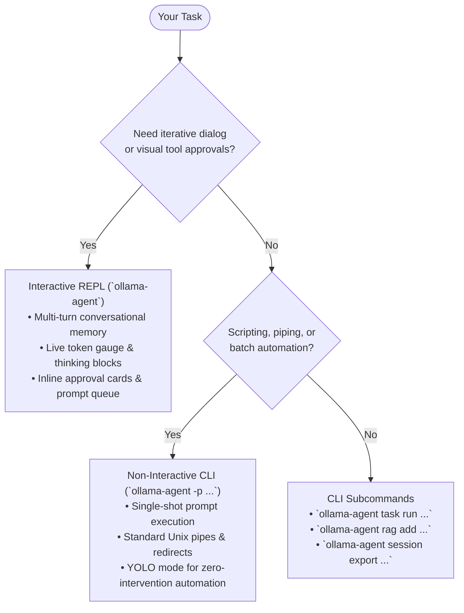
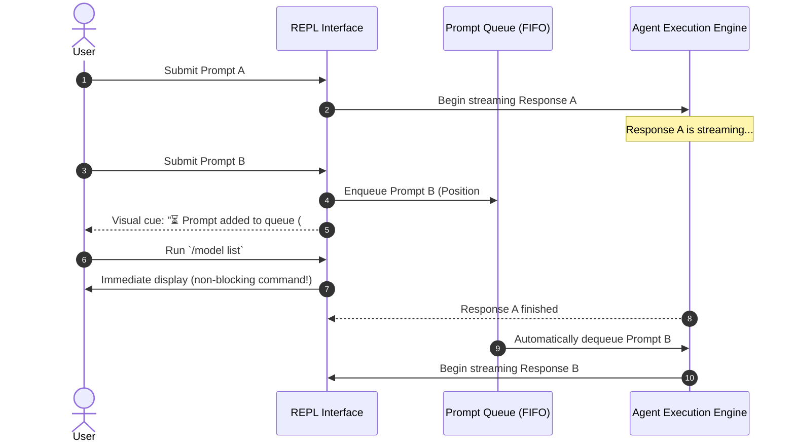

# CLI & REPL User Guide

**Ollama Agent** provides two complementary interfaces designed for different workflows: a dynamic, full-featured **Interactive REPL** (Read-Eval-Print Loop) for multi-turn conversations and visual tool interaction, and a lean, scriptable **Non-Interactive CLI** for one-off commands and pipeline automation.

Whether you are iteratively designing a complex software architecture or running an automated code audit in a continuous integration script, Ollama Agent adapts to your terminal environment.

---

## 30-Second Quickstart

=== "Interactive REPL"
    Launch the full terminal user interface with streaming Markdown, live context tracking, and tool approvals:

    ```bash
    # Start with your default model
    ollama-agent

    # Or start with a specific model and reasoning level
    ollama-agent -m "deepseek-r1:14b" -e "high"
    ```

=== "Non-Interactive CLI"
    Execute a single prompt directly from your shell, stream the response to standard output, and exit cleanly:

    ```bash
    # Ask a one-off question
    ollama-agent -p "Explain the difference between mutexes and semaphores."

    # Analyze local code with file attachments and auto-approval
    ollama-agent -y -p "Audit @src/auth.py for security vulnerabilities and suggest fixes."
    ```

### Choosing the Right Mode



| Feature | Interactive REPL (`ollama-agent`) | Non-Interactive CLI (`-p "..."`) |
| :--- | :--- | :--- |
| **Primary Use Case** | Deep exploration, pair programming, debugging | Scripts, cron jobs, git hooks, one-off questions |
| **Session Memory** | Stateful multi-turn history saved to SQLite | Ephemeral single-turn (exits immediately on finish) |
| **User Interface** | Full TUI with syntax highlighting, modals, & status bar | Standard terminal output (`stdout`), pipe-friendly |
| **Tool Approvals** | Interactive keyboard confirmation cards | Interactive prompt (or bypassed with `-y` / `--yolo`) |
| **Prompt Queuing** | Submit follow-up prompts while streaming | Not applicable |
| **Tab Completion** | 3-level completion for commands, models, files | Bash / Zsh shell autocompletion |

---

## Interactive REPL Walkthrough

Launch the REPL by typing `ollama-agent` without prompt flags. You are greeted with a full-screen, responsive terminal interface.

```text
● ollama-agent │ Model: gemma4:26b │ Context: 2.1k/10.0k (21%) │ Effort: default │ YOLO: OFF │ STEALTH: OFF
```

### TUI Interface Tour

The interactive workspace is organized into four core visual areas:

1. **Dynamic Header Bar**:
   - **Model Indicator**: Displays the active Ollama model.
   - **Real-Time Token Gauge**: Shows consumed tokens versus your configured context window limit (e.g., `2.1k/10.0k (21%)`). The gauge dynamically updates after each interaction and uses color-coded warning thresholds:
     - 🔵 **Cyan (`≤ 75%`)**: Healthy context utilization.
     - 🟡 **Amber (`76% – 90%`)**: Elevated context usage.
     - 🔴 **Red (`> 90%`)**: Approaching context limits (automatic summarization will activate).
   - **Effort & RAG Badges**: Displays current reasoning effort (`default`, `high`, etc.) and active RAG knowledge base.
   - **Mode Badges**: Visual indicators for **YOLO** (auto-approve tools) and **STEALTH** (in-memory, no disk history).

2. **Markdown Chat Stream**:
   - Live streaming responses rendered with GitHub-flavored Markdown.
   - Syntax-highlighted code blocks with copy-friendly formatting.
   - Formatted tables, bullet points, and blockquotes.

3. **Thinking Containers**:
   - When using reasoning models (such as DeepSeek-R1, Qwen 2.5/3, or Gemma 4), internal chain-of-thought traces are neatly contained in expandable containers so you can inspect the model's inner reasoning without cluttering your chat stream.

4. **Input Container & Status Bar**:
   - Multi-line input area that expands dynamically up to 8 lines.
   - Live queue counter (`⏳ N queued`) when background prompts are pending.
   - Status hints showing keybindings and current activity.

---

### Multiline Editing & History Navigation

The input box supports natural editing and shell-like history navigation:

* **Insert a Newline (`\ + Enter`)**: End any line with a backslash `\` and press `Enter`. The backslash is automatically stripped, inserting a clean newline. The prompt box expands smoothly up to 8 lines high.
* **Submit Your Message (`Enter`)**: Press `Enter` on any line without a trailing backslash to send your prompt immediately.
* **Cursor Movement (`↑` / `↓` / `←` / `→`)**: Navigate freely between lines and characters.
* **Prompt History**:
  - Press `↑` on the first line to cycle back through previously submitted prompts.
  - Press `↓` on the last line to move forward in history.
  - *Note: Slash commands (`/model`, `/session`, etc.) are kept out of prompt history to keep your history clean.*
* **Quick Dismiss / Cancel (`Esc` / `Ctrl+C`)**:
  - Press `Esc` to close autocomplete dropdowns or cancel active generation and clear the queue.
  - Press `Ctrl+C` while generating to abort the current response, or press it when idle to exit cleanly.

---

### Tab Autocompletion

Press <kbd>Tab</kbd> at any point in the input field to trigger intelligent autocompletion:

* **Slash Commands**: Type `/` and press <kbd>Tab</kbd> to see all available root commands (`/model`, `/session`, `/task`, `/skill`, `/rag`, `/queue`, etc.).
* **Subcommands**: Type a command followed by a space (e.g., `/session ` or `/task `) and press <kbd>Tab</kbd> to view valid subcommands (`list`, `switch`, `search`, `export`, etc.).
* **Dynamic Entities**:
  - `/model set <Tab>`: Shows locally installed Ollama models with their disk sizes.
  - `/context set <Tab>`: Shows standard token presets (`4096`, `8192`, `16384`, `32768`, `65536`, `max`).
  - `/session switch <Tab>`: Lists recent session IDs with message counts.
  - `/task run <Tab>`: Lists saved tasks with descriptive titles.
  - `/skill show <Tab>`: Lists discovered skill identifiers.
  - `/rag load <Tab>`: Lists indexed RAG vector databases.
  - `/queue rm <Tab>`: Lists active queued prompts with live text previews.
* **File Paths**: Type `@` and press <kbd>Tab</kbd> to autocomplete files and directories in your current workspace.

---

### Attaching Files with `@-mentions`

Inject file contents or multimodal media directly into the model's context by referencing them with `@`:

```bash
# Attach a single source file
Explain the request validation logic in @src/api/routes.py

# Attach multiple files
Compare the schema in @models/v1.py with @models/v2.py

# Paths with spaces (use single or double quotes)
Review the notes in @"project docs/meeting_notes.md"

# Attach an entire directory tree (recursively loads text files)
Analyze the test coverage across @tests/
```

#### Supported Attachment Types

* **Code & Plain Text**: Loaded as UTF-8 context files and highlighted with full source path metadata.
* **Images**: `.png`, `.jpg`, `.jpeg`, `.webp`, `.gif`, `.svg`, `.bmp`, `.heic` are encoded and provided directly to vision-capable models.
* **Audio**: `.mp3`, `.wav`, `.ogg`, `.flac`, `.m4a`, `.aac` for audio-capable models.
* **Documents & Presentations**: `.pdf`, `.ppt`, `.pptx` documents are read and attached automatically.
* **Binary Protection**: Executables and arbitrary binary files with null bytes are safely skipped to avoid corrupting the model's prompt.

!!! tip "Safety with Code Decorators"
    Standard programming decorators such as `@staticmethod`, `@property`, `@app.route`, or `@dataclass` are automatically detected and preserved as literal text. Ollama Agent will only resolve an `@` token if a matching file or directory actually exists on disk.

#### Attachment Safety Limits

Default limits prevent accidentally exhausting context memory with massive files. You can customize these in `~/.ollama-agent/settings.yaml`:

```yaml
mentions:
  max_file_size: 1048576      # 1 MB max per individual file
  max_files: 100               # 100 files max during directory traversal
  max_total_size: 10485760     # 10 MB max total attached context per prompt
  max_completions: 200         # Maximum autocompletion candidates displayed
```

---

### Non-Blocking Prompt Queue

Unlike traditional CLI tools that lock the terminal while the model is responding, Ollama Agent features an **asynchronous FIFO prompt queue**. You can continue typing prompts or running slash commands even while a response is actively streaming or while an approval card is pending!



* **Immediate Commands**: Fast inspection commands (such as `/model list`, `/effort`, `/context`, `/params list`, `/session list`, `/queue`, `/yolo`, and `/stealth`) execute immediately in the viewport without waiting for active generation to finish.
* **Queued Prompts**: Normal chat prompts, parameter changes (`/model set`, `/context set`), and task executions are placed in the FIFO queue.
* **Queue Panel**: When items are waiting, a persistent queue card appears above the input box showing pending prompt positions and snippets.
* **Queue Management**:
  - `/queue`: Display all queued prompts and their numerical positions.
  - `/queue rm <#>`: Remove a specific queued prompt (e.g., `/queue rm 2`).
  - `/queue clear`: Purge all queued prompts without interrupting the active stream.
  - Press <kbd>Esc</kbd> or <kbd>Ctrl+C</kbd> to abort the active generation and flush the queue simultaneously.

---

### Tool Approvals (Human-in-the-Loop) & YOLO Mode

When the agent decides to execute a potentially destructive system action—such as executing a bash command or writing to a file—an interactive **Action Approval** modal pauses execution and requests your consent:

```text
╭─ ⚠ Action Approval Required ────────────────────────────────────────────────╮
│ Tool: execute                                                               │
│ Arguments: {'command': 'pytest tests/test_api.py'}                          │
╰─────────────────────────────────────────────────────────────────────────────╯
 [ Approve (y) ]    [ Reject (n) ]    [ Allow Session (a) ]    [ Cancel (c) ]
```

#### Keyboard-First Approval Controls

* <kbd>y</kbd> (**Approve**): Execute this specific tool call.
* <kbd>n</kbd> (**Reject**): Reject execution. You can provide optional feedback to the agent so it can revise its approach.
* <kbd>a</kbd> (**Allow Session**): Approve this call and allow all subsequent calls for this specific tool for the rest of the active session.
* <kbd>c</kbd> or <kbd>Esc</kbd> (**Cancel**): Abort the tool call and return focus to the prompt input.
* <kbd>Tab</kbd> / Arrow keys: Cycle between buttons.
* <kbd>Enter</kbd> / <kbd>Space</kbd>: Trigger the currently focused button (defaults to `Approve`).

!!! note "Unblocked Queue During Approvals"
    Your prompt input remains fully responsive while an approval card is visible. You can queue follow-up prompts or inspect configurations while deciding whether to approve an action.

#### YOLO Mode (`-y` / `/yolo on`)

For trusted automated tasks where you do not want confirmation pauses, enable **YOLO mode**:

* **Via CLI Flag**: Launch with `-y` or `--yolo` (e.g., `ollama-agent -y`).
* **In REPL**: Toggle dynamically with `/yolo`, `/yolo on`, or `/yolo off`.

When YOLO mode is active:

1. All tool approval prompts are automatically bypassed.
2. The header displays a bright red `YOLO: ON` badge.
3. The prompt chevron (`❯ `) and input border turn **red** as a prominent visual safety warning.

#### Stealth Mode (`-s` / `/stealth on`)

When you need confidential interactions without saving chat logs or state checkpoints to disk (`~/.ollama-agent/history.db`):

* **Via CLI Flag**: Launch with `-s` or `--stealth` (e.g., `ollama-agent -s`).
* **In REPL**: Toggle dynamically with `/stealth`, `/stealth on`, or `/stealth off`.
* **Visual Cue**: The header displays a purple `STEALTH: ON` badge, and the prompt chevron turns **purple**.
* *(If both YOLO and Stealth are enabled, the prompt chevron turns **amber / warm gold**).*

---

### System Clipboard Integration

Ollama Agent integrates natively with your operating system's clipboard across macOS, Linux (Wayland & X11), and Windows:

* **Copying Output**: Click and drag with your mouse, or select text and press <kbd>Ctrl+Shift+C</kbd>, <kbd>Super+C</kbd>, or <kbd>Ctrl+Insert</kbd> to copy markdown or code blocks directly to your system clipboard.
* **Pasting Input**: Paste multiline prompts or code snippets into the input field using <kbd>Ctrl+V</kbd>, <kbd>Super+V</kbd>, or <kbd>Shift+Insert</kbd>.

---

## Slash Commands Reference

Slash commands provide complete control over model parameters, persistent sessions, skills, tasks, and system settings directly inside the REPL.

### General Commands

| Command | Subcommands / Syntax | Description |
| :--- | :--- | :--- |
| `/help` | `/help` | Display interactive command help and keyboard shortcut tips (or press <kbd>Tab</kbd> on `/`). |
| `/clear` | `/clear` | Clear the chat screen and start a fresh session (alias for `/new`). |
| `/new` | `/new` | Start a fresh session with clean context and clear the screen. |
| `/exit` | `/exit` *(alias: `/quit`)* | Exit Ollama Agent cleanly. |

### Model & Sampling Parameters

| Command | Subcommands / Syntax | Description |
| :--- | :--- | :--- |
| `/model` | `/model` or `/model list` | List all available local Ollama models with disk sizes and tool support flags. |
| `/model set` | `/model set <model_name>` | Switch the active model for the current conversation. |
| `/effort` | `/effort [<level>]` | View advertised model thinking options or set reasoning effort (`low`, `high`, `max`, `true`, `false`, `default`). |
| `/context` | `/context [set <size\|max>]` | View or set context window token limit (`num_ctx`) or set to `'max'`. |
| `/params` | `/params` or `/params list` | Display active sampling parameters (`temperature`, `top_p`, `top_k`, etc.) and their configuration sources. |
| `/params set` | `/params set <key> <val>` | Dynamically update a parameter (e.g., `/params set temperature 0.7`). |

### Session Management

| Command | Subcommands / Syntax | Description |
| :--- | :--- | :--- |
| `/session list` | `/session list` | List past conversation sessions with IDs, timestamps, and turn counts. |
| `/session switch` | `/session switch <id>` *(alias: `/session resume`)* | Switch to and resume a previous conversation thread. |
| `/session new` | `/session new` | Start a brand new conversation session. |
| `/session search` | `/session search <query>` | Search conversation history across all sessions for keywords. |
| `/session export` | `/session export [output_path.md]` | Export the active conversation into a formatted Markdown document. |
| `/session delete` | `/session delete <id>` | Remove a session from local SQLite history. |

### Tasks & Skills

| Command | Subcommands / Syntax | Description |
| :--- | :--- | :--- |
| `/task list` | `/task list` | List all saved reusable prompt tasks. See [Saved Tasks](tasks.md). |
| `/task run` | `/task run <id> [var=val ...] [-y]` | Execute a saved task with dynamic variable substitutions and optional YOLO mode. |
| `/task view` | `/task view <id>` *(or `/task list`)* | Inspect the template prompt, model, and variables for a saved task. |
| `/task create` | `/task create [<id>]` | Launch an interactive agent-guided flow to create and save a new task. |
| `/task delete` | `/task delete <id>` | Delete a saved task file. |
| `/skill list` | `/skill list` | List all discovered procedural skills. See [Agent Skills](skills.md). |
| `/skill show` | `/skill show <id>` | Display instructions and metadata for a specific skill. |
| `/skill create` | `/skill create [<id>]` | Launch an interactive agent-guided flow to author a new skill package. |
| `/skill delete` | `/skill delete <id>` | Delete a skill package from disk. |

### Knowledge & RAG

| Command | Subcommands / Syntax | Description |
| :--- | :--- | :--- |
| `/rag status` | `/rag status` | Show active RAG database name, indexed chunks, and embedding configuration. |
| `/rag list` | `/rag list` | List all local vector databases. See [Local RAG Engine](rag.md). |
| `/rag search` | `/rag search <query>` | Query the active knowledge base directly to inspect retrieved context chunks. |
| `/rag create` | `/rag create <name>` | Create a new vector database collection. |
| `/rag load` | `/rag load <name>` | Load a vector database into the active session. |
| `/rag unload` | `/rag unload` | Unload the current database from the active session. |
| `/rag add` | `/rag add <path> [--dir]` | Index a file or directory tree into the active RAG collection. |
| `/rag delete` | `/rag delete <name>` | Delete a RAG vector database collection. |

### Prompt Queue & Operational Toggles

| Command | Subcommands / Syntax | Description |
| :--- | :--- | :--- |
| `/queue` | `/queue` or `/queue list` | Inspect all pending prompts in the background FIFO queue. |
| `/queue rm` | `/queue rm <position>` | Remove a prompt from the queue by its number (e.g., `/queue rm 1`). |
| `/queue clear` | `/queue clear` | Purge all pending prompts from the queue. |
| `/yolo` | `/yolo [on \| off]` | Toggle or set YOLO mode (bypasses tool execution confirmations). |
| `/stealth` | `/stealth [on \| off]` | Toggle or set Stealth mode (runs in-memory without saving SQLite logs). |
| `/mcp list` | `/mcp list` | Check connection status of configured MCP tool servers. See [MCP Guide](mcp.md). |
| `/mcp reload` | `/mcp reload` | Reconnect MCP servers and rebuild tool definitions mid-session. |
| `/agents list` | `/agents list` | List configured specialized subagents and their capabilities. See [Subagents](subagents.md). |

---

## Non-Interactive CLI Guide

Non-interactive mode is ideal for shell scripts, git hooks, CI/CD pipelines, and quick one-liners where you want immediate answers without entering the TUI.

Run Ollama Agent with `-p` or `--prompt` to trigger non-interactive execution:

```bash
ollama-agent -p "What is the command to find large files over 100MB in Linux?"
```

### Real-World CLI One-Liners & Recipes

#### 1. Smart Git Commit Messages
Pipe your staged git diff directly into Ollama Agent to draft clean, conventional commit messages:

```bash
git diff --staged | ollama-agent -p "Write a concise Conventional Commit message based on this diff. Output only the commit message."
```

#### 2. Automated Code Refactoring (with YOLO mode)
Combine `-y` with file attachments to refactor code in-place without manual approval prompts:

```bash
ollama-agent -y -p "Refactor @src/utils.py to use standard typing and add comprehensive docstrings."
```

#### 3. Generating Documentation into Files
Redirect agent output directly into project markdown documentation:

```bash
ollama-agent -p "Generate a comprehensive API documentation table for @src/api/v1/endpoints.py" > docs/endpoints.md
```

#### 4. Preloading RAG Knowledge Bases
Query an existing project knowledge base directly from the command line:

```bash
ollama-agent --rag engineering-handbook -p "What is our policy on database migrations?"
```

#### 5. Codebase Security & Quality Audits
Run a targeted security review across an entire folder:

```bash
ollama-agent -p "Review the code in @src/auth/ for common security flaws like timing attacks or SQL injection."
```

!!! warning "Combining Subcommands with `-p`"
    The `-p` / `--prompt` option is reserved for top-level non-interactive queries. It cannot be combined with subcommands such as `ollama-agent task` or `ollama-agent rag`.

---

## CLI Subcommands Quick Reference

In addition to top-level prompt execution, `ollama-agent` provides subcommands for headless administration of tasks, RAG databases, skills, and sessions.

### `task`: Saved Prompt Tasks

```bash
# List all saved tasks
ollama-agent task list

# Create a new saved task
ollama-agent task create code-review \
    --title "Code Review Assistant" \
    --task-prompt "Review the git diff against main and highlight bugs, complexity, and styling issues." \
    --task-model "gemma4:26b" \
    --task-effort "high" \
    [--force]

# Run a saved task with dynamic variable substitutions
ollama-agent task run code-review target_file=src/app.py -y
ollama-agent task run code-review --var target_file=src/app.py --var strict=true

# Delete a saved task
ollama-agent task delete code-review
```

For full details on templating and task options, see [Saved Tasks](tasks.md).

### `rag`: Local Vector Databases

```bash
# List all vector database collections
ollama-agent rag list

# Create a new RAG database collection
ollama-agent rag create project-docs

# Ingest a single file or an entire directory
ollama-agent rag add project-docs ./docs/architecture.md
ollama-agent rag add project-docs ./src --dir

# Delete a collection
ollama-agent rag delete project-docs
```

For chunking strategies and embedding models, see [Local RAG Engine](rag.md).

### `skill`: Procedural Skills

```bash
# List all installed skills
ollama-agent skill list

# Inspect instructions for a skill
ollama-agent skill show api-design

# Create a new skill
ollama-agent skill create api-design \
    --name "API Design Guidelines" \
    --description "RESTful and OpenAPI standards" \
    --instructions "Ensure all endpoints use nouns and camelCase properties." \
    [--force]

# Delete a skill
ollama-agent skill delete api-design
```

For structuring multi-file skills and custom scripts, see [Agent Skills](skills.md).

### `session`: Chat History Management

```bash
# List saved sessions with timestamps and message counts
ollama-agent session list

# Search past conversations by keyword
ollama-agent session search "database migration"

# Export a session transcript to a Markdown document
ollama-agent session export 4d7e2a1b -o ./exports/session_summary.md

# Delete a session from SQLite history
ollama-agent session delete 4d7e2a1b
```

### `mcp` & `agents`: Tool & Subagent Inspection

```bash
# Check connectivity and tool definitions for configured MCP servers
ollama-agent mcp list

# List configured specialized subagents
ollama-agent agents list
```

---

## Global CLI Flags Reference

All global flags can be used when launching either the interactive REPL or non-interactive CLI:

| Flag | Short | Type | Default | Description |
| :--- | :--- | :--- | :--- | :--- |
| `--model` | `-m` | `string` | Configured default in `settings.yaml` | Specify the Ollama model to use for this execution. |
| `--prompt` | `-p` | `string` | `None` | Run in non-interactive mode with the specified prompt string. |
| `--effort` | `-e` | `string` | `default` | Set reasoning effort level (dynamically matched to model-supported values, e.g. `low`, `high`, `max`, or boolean toggles). |
| `--num-ctx` | `-c` | `int \| str` | `10000` | Set context window size in tokens (`num_ctx`) or set to `'max'`. |
| `--language`, `--lang` | `-l` | `string` | System locale (fallback `en`) | Set interface language code (`en`, `es`, `fr`, `de`, `it`, `pt`, `zh`, `ja`, `ru`, `hi`, `ko`, `ar`, `tr`, `pl`, `nl`, `uk`). |
| `--builtin-tool-timeout`| `-t` | `int` | `30` | Execution timeout in seconds for built-in tools (including shell commands). |
| `--yolo` | `-y` | `flag` | `false` | Enable YOLO mode (bypasses all tool execution confirmation prompts). |
| `--stealth` | `-s` | `flag` | `false` | Enable stealth mode (runs in-memory without saving conversation history to SQLite). |
| `--rag` | — | `string` | `None` | Preload and activate a named RAG database collection at launch. |
| `--allow-traversal` | — | `flag` | `false` | Allow filesystem tools to read and write outside the current working directory. |
| `--no-allow-traversal` | — | `flag` | `true` | Sandbox filesystem operations strictly to the current working directory (default). |
| `--config-reset` | — | `string` | `None` | Reset configuration files to defaults: `all`, `system-prompt`, or `config-file`. |

---

## Pro Tips & Best Practices

1. **Automatic Memory Summarization**:
   Don't worry about hitting context limits during long conversations. Ollama Agent continuously tracks token usage and automatically summarizes earlier dialogue turns in the background when the threshold is reached, preserving the active instructions and recent messages. See [Memory & Guidelines](memory.md).

2. **Reasoning Effort Optimization**:
   Tune your reasoning effort with `-e` or `/effort`:
   - Use lower effort levels (e.g. `low`) for fast, lightweight code edits, commit messages, and simple queries.
   - Use higher effort levels (e.g. `high` or `max`) for complex multi-file architectural refactors, debugging subtle race conditions, or algorithmic analysis.

3. **Sandboxing by Default**:
   By default, Ollama Agent restricts file tools to the current working directory (`--no-allow-traversal`). If your project references shared libraries or configuration files in parent folders, launch with `--allow-traversal` to permit safe access across directories.

4. **Combine Mentions with RAG**:
   For the best results on large codebases, index your extensive project documentation into a RAG database (`ollama-agent --rag docs`), and use `@-mentions` (`@src/main.py`) to inject the exact files you want the model to edit.
