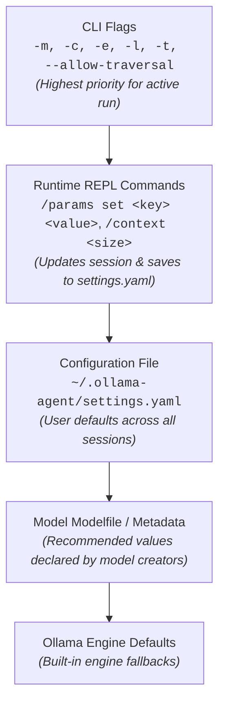
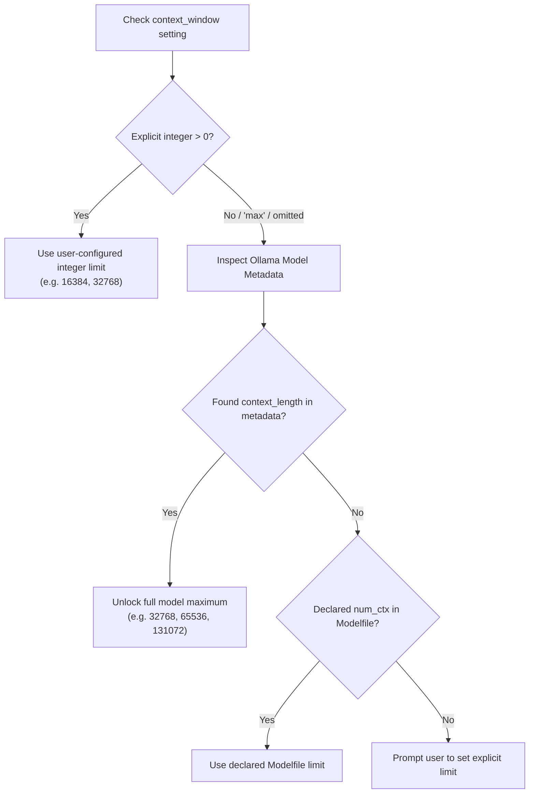

# Configuration & Settings Reference

**Ollama Agent** is designed to be lean and sensible out of the box, but fully customizable when you need fine-grained control. All application settings, model behaviors, runtime security boundaries, context limits, and subagent definitions are managed through a centralized configuration file at `~/.ollama-agent/settings.yaml` and standard shell environment variables.

Whether you are connecting to a remote Ollama server on your local network, unlocking a model's full 128k context window, tuning sampling temperature for precision code generation, or integrating LangSmith tracing, this guide provides complete, practical instructions.

---

## 30-Second Quickstart

Your settings file is created automatically on your first run. You can view, edit, or override settings immediately using standard commands:

=== "Edit Configuration File"

    Open your configuration file in your preferred editor:
    ```bash
    # Open settings with your default terminal editor
    nano ~/.ollama-agent/settings.yaml
    # or: code ~/.ollama-agent/settings.yaml
    ```

=== "CLI Flags (Session Overrides)"

    Override key settings for a single command or REPL session without touching the file:
    ```bash
    # Select model, max context, and high reasoning effort on the fly
    ollama-agent -m "qwen2.5-coder:14b" -c max -e high
    ```

=== "Live REPL Commands"

    Inspect and tune model parameters dynamically while chatting:
    ```text
    /params                          # View active sampling parameters and their sources
    /params set temperature 0.2      # Set temperature (persists to settings.yaml)
    /context max                     # Unlock maximum context window
    ```

=== "Factory Reset"

    Restore fresh default settings or system prompts at any time:
    ```bash
    ollama-agent --config-reset all
    ```

---

## How Configuration Works

Ollama Agent follows a clean, predictable precedence model. When you invoke a prompt or run the REPL, settings resolve in the following order:



### Strict Schema Validation

To prevent silent misconfigurations and hard-to-debug typos, Ollama Agent enforces **strict schema validation** on startup:

* Every setting key in `settings.yaml` must match a recognized option.
* If you mistype a key (for example, typing `temprature: 0.7` instead of `temperature: 0.7`), Ollama Agent halts immediately and notifies you with the exact unrecognized key.
* This ensures that any setting you declare is actually applied and active.

---

## Complete Annotated `settings.yaml` Template

Here is a complete, fully documented template for `~/.ollama-agent/settings.yaml`. You can copy this example directly to configure your environment:

```yaml
# ==============================================================================
# Ollama Agent Configuration File
# Location: ~/.ollama-agent/settings.yaml
# ==============================================================================

# ------------------------------------------------------------------------------
# Primary LLM Model Settings
# ------------------------------------------------------------------------------
model:
  # Active Ollama model tag. Must support tool/function calling.
  # If left empty (""), Ollama Agent presents an interactive selector on launch.
  name: "qwen2.5-coder:14b"

  # Base URL of the Ollama server. Change this to connect to a remote Ollama server.
  base_url: "http://localhost:11434"

  # Context window size in tokens (num_ctx).
  # Use an integer (e.g. 16384, 32768) or "max" to automatically unlock the model's full limit.
  context_window: 10000

  # Default reasoning effort for thinking models:
  # Options: low, medium, high, xhigh, disabled, hide, enabled
  reasoning_effort: "medium"

  # Optional sampling parameter overrides.
  # Leave commented out or unset (null) to automatically inherit recommended values
  # declared in the model's Ollama Modelfile.
  # temperature: 0.7        # Higher = creative/exploratory, lower = deterministic/analytical
  # top_p: 0.9              # Nucleus sampling probability cutoff (0.0 - 1.0)
  # top_k: 40               # Limits token pool to top K candidates
  # min_p: 0.05             # Minimum relative probability threshold (0.0 - 1.0)
  # presence_penalty: 0.0   # Penalizes tokens based on presence in generated output
  # repeat_penalty: 1.1     # Penalizes verbatim repetition of previous tokens

# ------------------------------------------------------------------------------
# Agent Runtime Behavior & Security Policies
# ------------------------------------------------------------------------------
runtime:
  # UI interface language code:
  # en, es, fr, de, it, pt, zh, ja, ru, hi, ko, ar, tr, pl, nl, uk
  # Leave empty ("") to automatically detect from your system locale.
  language: ""

  # Filesystem traversal security policy:
  # false = Sandbox agent to the current working project directory.
  # true  = Allow file tools to read/write anywhere across your OS filesystem.
  allow_traversal: false

  # Tool execution timeout in seconds (covers bash execution and built-in tools).
  builtin_tool_timeout: 30

  # Collapse thinking / reasoning blocks by default in the REPL terminal interface.
  # When true, reasoning traces appear in a tidy expandable card.
  collapse_thinking: true

  # Pass host shell environment variables (PATH, API keys, etc.) to executed commands.
  inherit_env: true

# ------------------------------------------------------------------------------
# RAG (Retrieval-Augmented Generation) Knowledge Base Settings
# ------------------------------------------------------------------------------
rag:
  # Local directory for vector database storage and persistent indexes.
  rag_dir: "~/.ollama-agent/rag"

  # Ollama model used to generate embeddings for document indexing and queries.
  embedder_model: "nomic-embed-text:latest"

  # Ollama endpoint used specifically for embeddings generation.
  embedder_base_url: "http://localhost:11434"

  # Embedding dimensionality (must match the embedder model, e.g. 768 for nomic-embed-text).
  embedding_dims: 768

  # Default number of top relevant document chunks retrieved per search query.
  default_top_k: 5

  # Document chunk size in characters.
  chunk_size: 500

  # Character overlap between consecutive chunks to maintain semantic continuity.
  chunk_overlap: 50

# ------------------------------------------------------------------------------
# Context Injection Limits (@-mentions)
# ------------------------------------------------------------------------------
mentions:
  # Maximum allowed file size for an individual @file mention in bytes (default: 1 MB).
  max_file_size: 1048576

  # Maximum number of files processed during a directory mention (e.g. @src/).
  max_files: 100

  # Maximum cumulative size of all attached files in a single prompt in bytes (default: 10 MB).
  max_total_size: 10485760

  # Maximum autocomplete candidates shown in the REPL dropdown.
  max_completions: 200

# ------------------------------------------------------------------------------
# Telemetry & Tracing via LangSmith (Optional)
# ------------------------------------------------------------------------------
# langsmith:
#   api_key: "lsv2_pt_your_api_key_here"  # LangSmith API key
#   tracing: true                        # Enable trace recording (true/false)
#   project: "ollama-agent"              # Target project name in LangSmith
#   endpoint: "https://api.smith.langchain.com" # API endpoint URL

# ------------------------------------------------------------------------------
# Specialized Subagents Configuration
# ------------------------------------------------------------------------------
subagents:
  - name: "code-reviewer"
    description: "Specialized subagent for code quality, security audits, and refactoring."
    system_prompt: "You are an expert software engineer and security auditor. Provide rigorous, actionable reviews."
    # Optional model override. Inherits model.name if omitted or empty.
    model: "qwen2.5-coder:14b"
    # Optional context window override. Inherits model.context_window if omitted or 0.
    context_window: 16384
    # Optional dedicated MCP servers attached specifically to this subagent
    mcp_servers:
      - name: "git"
        command: "uvx"
        args: ["mcp-server-git"]
        env:
          GIT_PYTHON_REFRESH: "quiet"
```

---

## Configuration Reference Table

The following table details every configuration key available in `settings.yaml`:

| Section & Key | Type | Default | Description |
| :--- | :--- | :--- | :--- |
| **`model.name`** | `string` | `""` *(interactive)* | Installed Ollama model tag (must support tool calling). If empty, an interactive picker is displayed on startup. |
| **`model.base_url`** | `string` | `http://localhost:11434` | Ollama server HTTP endpoint. Point to an IP address or hostname to use a remote GPU server. |
| **`model.context_window`** | `int \| string` | `10000` | Context token limit (`num_ctx`). Set to a positive integer or `"max"` to automatically detect model capability. |
| **`model.reasoning_effort`** | `string` | `medium` | Default reasoning depth for thinking models (`low`, `medium`, `high`, `xhigh`, `disabled`, `hide`, `enabled`). |
| **`model.temperature`** | `float \| null` | `null` *(dynamic)* | Controls generation randomness (0.0 = deterministic, 1.0+ = creative). Resolves from Modelfile if unset. |
| **`model.top_p`** | `float \| null` | `null` *(dynamic)* | Nucleus sampling probability threshold (0.0 to 1.0). Resolves from Modelfile if unset. |
| **`model.top_k`** | `int \| null` | `null` *(dynamic)* | Restricts next token candidate pool to top K tokens. Resolves from Modelfile if unset. |
| **`model.min_p`** | `float \| null` | `null` *(dynamic)* | Minimum probability threshold relative to the most likely token. Resolves from Modelfile if unset. |
| **`model.presence_penalty`** | `float \| null` | `null` *(dynamic)* | Penalizes tokens based on existing presence in text. Resolves from Modelfile if unset. |
| **`model.repeat_penalty`** | `float \| null` | `null` *(dynamic)* | Penalizes repeating identical tokens (`repetition_penalty` supported as alias). Resolves from Modelfile if unset. |
| **`runtime.language`** | `string` | `""` *(auto)* | Interface language (`en`, `es`, `fr`, `de`, `it`, `pt`, `zh`, `ja`, `ru`, `hi`, `ko`, `ar`, `tr`, `pl`, `nl`, `uk`). Auto-detects locale if empty. |
| **`runtime.allow_traversal`** | `boolean` | `false` | When `false`, sandboxes file operations to project root. When `true`, permits system-wide filesystem access. |
| **`runtime.builtin_tool_timeout`** | `int` | `30` | Maximum execution timeout in seconds for shell commands and built-in tools. |
| **`runtime.collapse_thinking`** | `boolean` | `true` | When `true`, collapses reasoning blocks inside an expandable card in the REPL TUI. |
| **`runtime.inherit_env`** | `boolean` | `true` | When `true`, child processes inherit the current host shell environment variables. |
| **`rag.rag_dir`** | `string` | `~/.ollama-agent/rag` | Directory storing local vector database collections and indexes. |
| **`rag.embedder_model`** | `string` | `nomic-embed-text:latest` | Ollama embeddings model tag. |
| **`rag.embedder_base_url`** | `string` | `http://localhost:11434` | Ollama server endpoint used for embeddings inference. |
| **`rag.embedding_dims`** | `int` | `768` | Vector embedding dimension size (must match the embedding model). |
| **`rag.default_top_k`** | `int` | `5` | Number of document chunks retrieved per RAG query. |
| **`rag.chunk_size`** | `int` | `500` | Text chunk size in characters for indexed documents. |
| **`rag.chunk_overlap`** | `int` | `50` | Character overlap between adjacent document chunks. |
| **`mentions.max_file_size`** | `int` | `1048576` *(1 MB)* | Maximum file size allowed when using `@filename` context injection. |
| **`mentions.max_files`** | `int` | `100` | Maximum number of files attached when using directory mentions (`@src/`). |
| **`mentions.max_total_size`** | `int` | `10485760` *(10 MB)* | Maximum cumulative payload size across all attached files in a prompt. |
| **`mentions.max_completions`** | `int` | `200` | Maximum autocompletion candidates displayed in the REPL `@` dropdown. |
| **`langsmith.api_key`** | `string` | `""` | Optional LangSmith API key for execution tracing. |
| **`langsmith.tracing`** | `boolean` | `false` | Enable or disable LangSmith trace export. |
| **`langsmith.project`** | `string` | `""` | Project name in LangSmith to group traces. |
| **`langsmith.endpoint`** | `string` | `""` | Optional custom LangSmith API endpoint URL (defaults to official cloud endpoint). |
| **`subagents`** | `list` | `[]` | List of specialized subagents with custom models, prompts, context limits, and MCP servers. |

---

## Model Sampling Parameter Tuning

Sampling hyperparameters dictate how the model selects tokens during generation. Ollama Agent provides full support for fine-tuning these parameters, with intelligent defaults.

### How Parameters Work

* **`temperature` (Float, e.g. `0.2` - `1.0`)**: Controls generation randomness.
    * Use **`0.0 - 0.2`** for deterministic tasks like coding, mathematical logic, and syntax analysis.
    * Use **`0.7 - 0.8`** for general conversation and collaborative brainstorming.
    * Use **`1.0+`** for creative writing and storytelling.
* **`top_p` (Float, `0.0` - `1.0`)**: Nucleus sampling cutoff. Only tokens within the cumulative top `top_p` probability mass are considered. Lowering `top_p` (e.g. `0.85`) cuts off low-probability tails.
* **`top_k` (Integer, e.g. `20` - `100`)**: Caps the candidate token pool to the top K most likely tokens.
* **`min_p` (Float, `0.0` - `1.0`)**: Filters out any token whose probability is less than `min_p` multiplied by the top token's probability. A setting like `0.05` ensures weak candidate tokens are discarded regardless of distribution shape.
* **`repeat_penalty` (Float, e.g. `1.0` - `1.2`)**: Penalizes tokens that have already appeared recently in generation. Helps prevent looping code blocks or repetitive explanations.

### Modelfile Auto-Detection

When you leave sampling parameters commented out or set to `null` in `settings.yaml`, Ollama Agent does **not** force generic hardcoded defaults. Instead:

1. It queries the model's Ollama metadata and parses parameters defined in its **Modelfile** (such as creator-recommended `temperature`, `top_k`, `min_p`, or `repetition_penalty`).
2. If declared by the model creator, those exact recommended parameters are used.
3. If not declared in the Modelfile, Ollama's native backend engine defaults apply naturally.

### Inspecting and Tuning in the REPL

You can inspect the active parameters and adjust them live at any time without leaving your interactive session:

```text
# 1. View active parameters and where they came from
/params
```

The REPL displays a formatted table showing the effective value and its resolution source:

```text
┌────────────────── Active Model Parameters: qwen2.5-coder:14b ──────────────────┐
│ Parameter        │ Effective Value │               Resolved From               │
├──────────────────┼─────────────────┼───────────────────────────────────────────┤
│ temperature      │             0.7 │         Modelfile / Metadata              │
│ top_p            │             0.8 │         Modelfile / Metadata              │
│ top_k            │              20 │         Modelfile / Metadata              │
│ min_p            │            0.05 │         Modelfile / Metadata              │
│ repeat_penalty   │            1.05 │         Modelfile / Metadata              │
└──────────────────┴─────────────────┴───────────────────────────────────────────┘
```

To adjust a parameter for the active session (which also saves it directly to `settings.yaml`):

```text
/params set temperature 0.2
/params set repeat_penalty 1.15
```

The model runtime immediately reloads with your new parameters.

---

## Intelligent Context Window (`num_ctx`) Resolution

By default, standard Ollama server installations restrict instances to a conservative 2,048 tokens unless explicitly told otherwise. This often leads to premature truncation when analyzing medium-sized source files.

Ollama Agent features **intelligent context window resolution** that unlocks the true capacity of your hardware and models:



### Unlocking Maximum Context (`"max"`)

To unlock the maximum context length supported by your model's neural architecture, set:

```yaml
model:
  context_window: "max"
```

When set to `"max"` (or omitted), Ollama Agent queries Ollama's model metadata for architecture tags like `llama.context_length` or `qwen2.context_length` and automatically allocates that full window size.

!!! tip "VRAM Considerations for Large Context Windows"
    Large context windows (e.g. 32,768 or 128,000 tokens) require significant GPU VRAM. If you encounter out-of-memory errors or Ollama offloads too many layers to CPU, set an explicit integer limit that fits your hardware:
    ```yaml
    model:
      context_window: 16384  # Balanced 16k window for 8GB-16GB GPUs
    ```

### Overriding Context Window via CLI

You can easily override the context window for a one-off task using `-c` / `--num-ctx`:

```bash
# Run a large codebase audit with maximum context
ollama-agent -c max -p "Audit all security decorators across @src/"

# Restrict context window to 8,192 tokens to save GPU memory
ollama-agent -c 8192
```

In the interactive REPL, switch your context window at any time using:

```text
/context max
/context 32768
```

---

## Reasoning Effort Levels & Model Mappings

For reasoning and "thinking" models, the `--effort` CLI flag and `model.reasoning_effort` setting govern how deeply the model thinks before returning answers.

Ollama Agent standardizes effort across different model architectures into a clean set of user levels:

| Reasoning Effort | Qwen 3.8 Series | DeepSeek R1 Series | Gemma 4 Series | GPT-OSS Series | General Thinking Models |
| :--- | :--- | :--- | :--- | :--- | :--- |
| **`high`** | Thorough reasoning (`"high"`) | High reasoning depth | Full reasoning trace | Deep reasoning depth | High reasoning depth |
| **`medium`** *(default)* | Balanced reasoning (`"medium"`) | Balanced reasoning | Balanced reasoning | Balanced reasoning | Balanced reasoning |
| **`low`** | Fast, concise reasoning (`"low"`) | Concise reasoning | Brief reasoning trace | Brief reasoning | Brief reasoning |
| **`xhigh`** | Maximum depth (`"high"`) | Maximum depth | Maximum depth | Maximum depth | Maximum depth |
| **`enabled`** | Enables thinking traces | Enables thinking traces | Enables thinking traces | Enables thinking traces | Enables thinking traces |
| **`disabled`** | Disables thinking (`false`) | Disables thinking (`false`) | Disables thinking (`false`) | *Cannot disable; stays enabled* | Disables thinking (`false`) |
| **`hide`** | Generates trace, suppresses in UI | Generates trace, suppresses in UI | Generates trace, suppresses in UI | Generates trace, suppresses in UI | Generates trace, suppresses in UI |

!!! note "The Difference Between `hide` and `collapse_thinking: true`"
    * **`reasoning_effort: hide`**: Tells Ollama to execute thinking internally, but Ollama Agent's streaming parser discards reasoning deltas so no thinking text is emitted or visible in the terminal.
    * **`runtime.collapse_thinking: true`**: Full thinking traces are received and preserved, but rendered inside a tidy collapsed card in the terminal. You can click or expand it whenever you want to inspect how the model arrived at its conclusion.

You can set reasoning effort globally in `settings.yaml`:

```yaml
model:
  reasoning_effort: "high"
```

Or pass it per-command with `-e` / `--effort`:

```bash
ollama-agent -e high -p "Analyze this complex concurrency deadlock issue: @logs/trace.log"
```

---

## Remote Ollama Servers

You do not need to run Ollama on the same machine as Ollama Agent. If you have a dedicated Linux server or desktop with a powerful GPU on your local network, you can run Ollama Agent locally on your laptop and point it to the remote server.

### 1. Configure the Remote Endpoint in `settings.yaml`

Set `model.base_url` (and `rag.embedder_base_url` if using local RAG) to your remote server's IP address and port:

```yaml
model:
  name: "qwen2.5-coder:32b"
  base_url: "http://192.168.1.100:11434"
  context_window: "max"

rag:
  embedder_base_url: "http://192.168.1.100:11434"
```

!!! warning "`OLLAMA_HOST` Environment Variable Notice"
    Ollama Agent connects to the endpoint specified in `model.base_url` (which defaults to `http://localhost:11434`). The shell environment variable `OLLAMA_HOST` is **not** automatically read; configure your remote endpoint explicitly in `settings.yaml`.

### 2. Ensure Remote Ollama Listens on All Interfaces

By default, Ollama only listens on `127.0.0.1`. On your remote machine, ensure Ollama is configured to listen on `0.0.0.0`:

```bash
# On your remote host (systemd service)
sudo systemctl edit ollama.service

# Add the following lines:
[Service]
Environment="OLLAMA_HOST=0.0.0.0:11434"

# Save and restart Ollama:
sudo systemctl restart ollama
```

### 3. Verification

Run Ollama Agent on your local machine:

```bash
ollama-agent
```

Ollama Agent connects to the remote host, verifies available models, checks for tool-calling capabilities, and launches seamlessly.

---

## Environment Variables Reference

Ollama Agent respects standard environment variables across telemetry, localization, and tool execution:

| Variable | Scope | Description |
| :--- | :--- | :--- |
| **`LANGSMITH_API_KEY`** | Tracing | API key for LangSmith. Injected automatically from `langsmith.api_key` if configured in `settings.yaml`. |
| **`LANGSMITH_TRACING`** | Tracing | Set to `"true"` to enable trace recording. Injected from `langsmith.tracing` if configured. |
| **`LANGSMITH_PROJECT`** | Tracing | Project name for organizing traces in LangSmith. Injected from `langsmith.project`. |
| **`LANGSMITH_ENDPOINT`** | Tracing | Custom LangSmith endpoint URL (defaults to `https://api.smith.langchain.com`). |
| **`LANGUAGE`, `LC_ALL`, `LC_MESSAGES`, `LANG`** | Localization | Checked in priority order at startup to automatically set interface language when `runtime.language` is unset. |
| **`${VAR}` / `%VAR%`** | MCP & Subagents | Variable substitution pattern resolved against your host environment in `mcp.json` and subagents' `env` maps. |
| **Host Shell Environment** | Tools | When `runtime.inherit_env: true` (default), executed commands inherit your full shell environment (`PATH`, Git credentials, virtual environments). |

---

## System Prompts & Jinja2 Templates

Agent behavior is steered by a unified Jinja2 prompt template located at `~/.ollama-agent/prompts/instructions.md`.

If this file does not exist, Ollama Agent generates it automatically using bundled defaults. When the agent initializes, it dynamically renders the template with context variables:

* `runtime`: Active runtime settings (`allow_traversal`, `builtin_tool_timeout`, `collapse_thinking`, `language`).
* `model`: Model configuration (`name`, `context_window`, `reasoning_effort`, `temperature`).
* `rag`: RAG settings and vector parameters.
* `rag_active`: Boolean flag indicating whether a knowledge base is currently mounted.
* `rag_database`: The name of the active RAG database.

### Sandboxing & Traversal Rules

The prompt dynamically adapts to your security policy (`runtime.allow_traversal`):

* When **sandboxed** (`allow_traversal: false`): File tools treat the current working directory as `/`. Operations cannot escape into host system folders.
* When **unrestricted** (`allow_traversal: true`): File tools accept full absolute host paths across your entire machine.

You can toggle traversal on the fly from the CLI:

```bash
# Allow agent to inspect files outside the current folder
ollama-agent --allow-traversal

# Enforce strict project sandboxing
ollama-agent --no-allow-traversal
```

---

## Resetting Configuration

If you ever want to revert customized settings, fix a broken YAML file, or restore default prompt instructions, use the `--config-reset` command-line flag:

```bash
ollama-agent --config-reset <option>
```

| Reset Option | What It Does |
| :--- | :--- |
| **`config-file`** | Re-initializes `~/.ollama-agent/settings.yaml` with clean default settings. Preserves your custom prompt template. |
| **`system-prompt`** | Resets `~/.ollama-agent/prompts/instructions.md` back to the default bundled Jinja2 system prompt. Preserves your settings file. |
| **`all`** | Performs a complete factory reset of both `settings.yaml` and `instructions.md`. |

!!! note "Zero-Interaction Reset"
    Running `ollama-agent --config-reset <option>` executes the reset, prints a confirmation message, and exits immediately. It does not launch the REPL or trigger any prompts.

---

## Practical Recipes

Here are four ready-to-use configuration recipes for common workflows:

### Recipe 1: Precision Coding Machine
Optimized for software engineering, strict syntax adherence, and large codebase analysis:

```yaml
model:
  name: "qwen2.5-coder:14b"
  context_window: "max"
  temperature: 0.1
  top_p: 0.8
  repeat_penalty: 1.1

runtime:
  allow_traversal: false
  builtin_tool_timeout: 60
  collapse_thinking: true
```

### Recipe 2: Remote High-VRAM GPU Workstation
Offloads computation to a dedicated GPU rig on your home or office network:

```yaml
model:
  name: "qwen2.5-coder:32b"
  base_url: "http://192.168.1.150:11434"
  context_window: "max"
  reasoning_effort: "high"

rag:
  embedder_base_url: "http://192.168.1.150:11434"
```

### Recipe 3: Deep Research & Complex Problem Solving
Configured for deep reasoning models like DeepSeek R1:

```yaml
model:
  name: "deepseek-r1:14b"
  context_window: 32768
  reasoning_effort: "high"

runtime:
  collapse_thinking: false  # Keep thinking visible while researching
  builtin_tool_timeout: 90
```

### Recipe 4: Secure Sandboxed Reviewer
Safely inspect untrusted third-party repositories without risk to host files:

```yaml
model:
  name: "qwen2.5-coder:14b"
  context_window: 16384

runtime:
  allow_traversal: false  # Enforce strict project root sandboxing
  inherit_env: false      # Isolate process from host environment variables
  builtin_tool_timeout: 20
```

---

## Pro Tips & Best Practices

1. **Keep Secrets in Environment Variables**: Avoid hardcoding API tokens directly into shared config files. Use `${MY_API_KEY}` syntax in MCP configurations to let Ollama Agent dynamically resolve them from your shell.
2. **Use `-s` / `--stealth` for Sensitive Work**: If you are working on confidential keys or sensitive data that you do not want stored in SQLite session history, launch with `ollama-agent -s`.
3. **Audit Active Parameters Often**: Run `/params` in the REPL whenever you switch models to confirm whether parameters are coming from your settings file or the model's Modelfile.
4. **Combine with Subagents**: Offload repetitive specialized workflows to dedicated subagents configured in your `settings.yaml` (see [Subagents Guide](subagents.md)).

---

## Related Documentation

* [CLI & REPL User Guide](cli_repl.md) — Comprehensive guide to terminal workflows, hotkeys, and slash commands.
* [Model Context Protocol (MCP) Integration](mcp.md) — Connecting external tools, databases, and APIs.
* [Specialized Subagents Guide](subagents.md) — Defining custom agents with isolated prompts and tools.
* [RAG Knowledge Bases](rag.md) — Indexing and searching your local documents.
* [Extending with Skills](skills.md) — Packaging repeatable capabilities for your agent.
