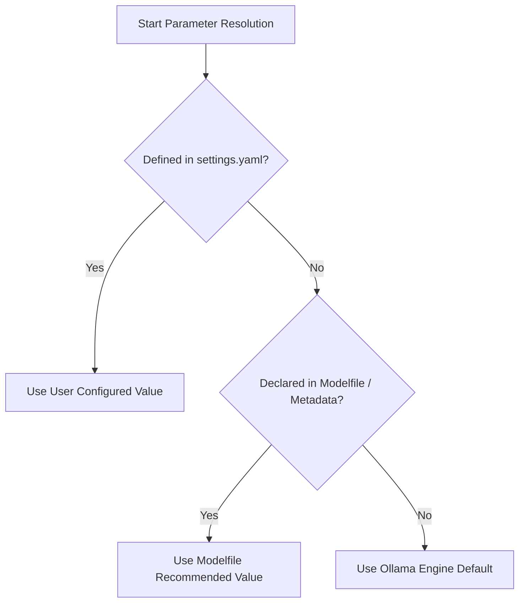

# Configuration & Tracing Reference

`ollama-agent` uses a centralized YAML configuration file stored at `~/.ollama-agent/settings.yaml` to manage model parameters, runtime security policies, document retrieval settings, context loading limits, telemetry tracing, and subagent declarations.

---

## Complete `settings.yaml` Reference

```yaml
# ==============================================================================
# Ollama Agent Configuration File
# Location: ~/.ollama-agent/settings.yaml
# ==============================================================================

# Primary LLM Model Settings
model:
  name: "qwen3.8:27b"                     # Active Ollama model tag (must support tools)
  base_url: "http://localhost:11434"     # Ollama API server endpoint
  context_window: 10000                  # Context window size in tokens (num_ctx)
  reasoning_effort: "medium"             # Reasoning effort: low, medium, high, xhigh, disabled, hide, enabled
  # Optional sampling parameter overrides (omitted by default to resolve dynamically):
  # temperature: 0.8                     # Sampling temperature (higher = creative, lower = deterministic)
  # top_p: 0.9                           # Nucleus sampling probability mass threshold
  # top_k: 40                            # Limits token selection pool to top K candidates
  # min_p: 0.0                           # Minimum probability threshold relative to most likely token
  # presence_penalty: 0.0                # Penalizes tokens if already present in text
  # repeat_penalty: 1.1                  # Penalizes token repetitions (alias: repetition_penalty)

# Agent Runtime Behavior & Security Policies
runtime:
  allow_traversal: false                 # Allow agent filesystem traversal outside the working directory
  builtin_tool_timeout: 30               # Tool execution timeout in seconds
  collapse_thinking: true                # Automatically collapse thinking blocks in REPL TUI
  inherit_env: true                      # Inherit shell environment variables for executed commands

# RAG (Retrieval-Augmented Generation) Vector Database Settings
rag:
  rag_dir: "~/.ollama-agent/rag"         # Storage directory for RAG databases and vector indices
  embedder_model: "nomic-embed-text:latest" # Embeddings model tag in Ollama
  embedder_base_url: "http://localhost:11434" # Base URL for embeddings server
  embedding_dims: 768                    # Vector dimensionality of the embedding model
  default_top_k: 5                       # Default number of documents retrieved per query
  chunk_size: 500                        # Text chunk size in characters
  chunk_overlap: 50                      # Overlap between consecutive text chunks in characters

# Context Injection Limits (@-mentions)
mentions:
  max_file_size: 1048576                 # Maximum individual file size in bytes (1 MB)
  max_files: 100                          # Maximum number of files attached per directory mention
  max_total_size: 10485760                # Maximum total context payload size in bytes (10 MB)
  max_completions: 200                    # Maximum autocompletion candidates displayed in REPL

# Telemetry & Tracing via LangSmith
langsmith:
  api_key: ""                            # LangSmith API key (e.g. "lsv2_pt_...")
  tracing: "true"                        # Enable LangChain / LangGraph tracing ("true" / "false")
  project: "ollama-agent"                # LangSmith project name
  endpoint: "https://api.smith.langchain.com" # LangSmith API endpoint URL

# Specialized Subagents Configuration
subagents:
  - name: "code-reviewer"
    description: "Specialized subagent for code review and security auditing"
    system_prompt: "You are an expert code reviewer focused on security and clean architecture."
    model: "gemma4:26b"
    context_window: 16384
    mcp_servers:
      - name: "git"
        command: "uvx"
        args: ["mcp-server-git"]
        env:
          GIT_PYTHON_REFRESH: "quiet"
```

---

## Settings Reference Table

| Section & Key | Type | Default | Description |
| :--- | :--- | :--- | :--- |
| `model.name` | `str` | *(interactive)* | Configured Ollama model name (must support tool calling). Selected interactively if unconfigured or missing. |
| `model.base_url` | `str` | `http://localhost:11434` | Ollama native API endpoint. |
| `model.temperature` | `float` | *(dynamic)* | Optional temperature override (0.8 engine default if unset in Modelfile). |
| `model.top_p` | `float` | *(dynamic)* | Optional nucleus sampling threshold override (0.9 engine default if unset). |
| `model.top_k` | `int` | *(dynamic)* | Optional top-k candidates limit override (40 engine default if unset). |
| `model.min_p` | `float` | *(dynamic)* | Optional minimum probability threshold override (0.0 default if unset). |
| `model.presence_penalty` | `float` | *(dynamic)* | Optional presence penalty override (0.0 default if unset). |
| `model.repeat_penalty` | `float` | *(dynamic)* | Optional repetition penalty override (1.1 engine default; alias: `repetition_penalty`). |
| `model.context_window` | `int` | `10000` | Fallback context window token limit (`num_ctx`). |
| `model.reasoning_effort` | `str` | `medium` | Default reasoning effort (`low`, `medium`, `high`, `xhigh`, `disabled`, `hide`, `enabled`). |
| `runtime.allow_traversal` | `bool` | `false` | If true, permits filesystem operations outside project working directory. |
| `runtime.builtin_tool_timeout` | `int` | `30` | Execution timeout in seconds for tool and shell commands. |
| `runtime.collapse_thinking` | `bool` | `true` | If true, collapses reasoning blocks by default in REPL output. |
| `runtime.inherit_env` | `bool` | `true` | If true, tool executions inherit the full parent environment. |
| `rag.rag_dir` | `str` | `~/.ollama-agent/rag` | Directory storing local Qdrant vector database collections. |
| `rag.embedder_model` | `str` | `nomic-embed-text:latest` | Ollama model used to generate vector embeddings. |
| `rag.embedder_base_url` | `str` | `http://localhost:11434` | Endpoint for Ollama embeddings inference. |
| `rag.embedding_dims` | `int` | `768` | Vector embedding dimension size. |
| `rag.default_top_k` | `int` | `5` | Default number of relevant chunks retrieved per query. |
| `rag.chunk_size` | `int` | `500` | Document chunk size in characters. |
| `rag.chunk_overlap` | `int` | `50` | Character overlap between adjacent chunks. |
| `mentions.max_file_size` | `int` | `1048576` | Maximum allowed individual file size for `@-mentions` (1 MB). |
| `mentions.max_files` | `int` | `100` | Maximum number of files processed during directory mentions. |
| `mentions.max_total_size` | `int` | `10485760` | Maximum total context size for prompt attachments (10 MB). |
| `mentions.max_completions` | `int` | `200` | Maximum autocomplete suggestions displayed in REPL dropdown. |
| `langsmith.api_key` | `str` | `""` | API key for LangSmith tracing platform. |
| `langsmith.tracing` | `str` | `""` | Enable tracing (`"true"` / `"false"`). |
| `langsmith.project` | `str` | `""` | LangSmith project name for traces. |
| `langsmith.endpoint` | `str` | `""` | API endpoint for LangSmith telemetry. |

---

## Model Sampling Parameters Resolution Hierarchy

Sampling parameters (`temperature`, `top_p`, `top_k`, `min_p`, `presence_penalty`, `repeat_penalty`) are resolved dynamically at startup and on model switches following a strict precedence hierarchy:



1. **User Settings (`settings.yaml`)**: If explicitly specified in configuration, the user's value takes precedence.
2. **Modelfile / Model Metadata**: If omitted in configuration, the agent inspects the model's metadata (`PARAMETER <name> <value>`) for model-specific recommendations.
3. **Ollama Engine Defaults**: If not specified in the Modelfile, official Ollama engine defaults are applied:
   - `temperature`: `0.8`
   - `top_p`: `0.9`
   - `top_k`: `40`
   - `min_p`: `0.0`
   - `presence_penalty`: `0.0`
   - `repeat_penalty`: `1.1`

> [!TIP]
> You can inspect active parameters at any time using `/params` (or `/params list`), and dynamically override parameters for the active session using `/params set <parameter> <value>` (e.g. `/params set temperature 0.7`).

---

## Context Window (`num_ctx`) Resolution Hierarchy

To guarantee optimal context utilization without exceeding model memory boundaries, `ollama-agent` resolves the effective context window size (`num_ctx`) at application startup using a strict priority hierarchy:

```mermaid
flowchart TD
    A[Start Context Resolution] --> B{Explicit Config Override?}
    B -- Yes (`model.context_window` > 0) --> C[Use Configured Value]
    B -- No / Unset --> D[Fetch Model Metadata via `ollama.show()`]
    D --> E{Structured `model_info` Key?}
    E -- Found `*.context_length` --> F[Use `context_length` Metadata]
    E -- Not Found --> G{Modelfile / Parameter `num_ctx`?}
    G -- Matched via Regex --> H[Use Parsed `num_ctx` Value]
    G -- Not Found --> I[Raise `ModelContextWindowError`]
```

1. **Explicit Configuration Override**: If `model.context_window` in `settings.yaml` (or CLI argument) is explicitly defined (> 0), its value is used directly.
2. **Structured Model Metadata (`model_info`)**: Queries Ollama's `AsyncClient.show()` endpoint for modern model metadata keys ending in `.context_length` (e.g., `llama.context_length`, `qwen2.context_length`).
3. **Modelfile Parameter Parsing**: Scans raw Modelfile `parameters` or string fields using regex matching (`^\s*(?:PARAMETER\s+)?num_ctx\s+(\d+)\s*$`) to extract declared `num_ctx` values.
4. **Error Handling**: If resolution fails across all stages, `ollama-agent` halts startup and raises a `ModelContextWindowError`, prompting the user to specify `context_window` in `settings.yaml`.

---

## Model Tool-Calling Capability Verification

`ollama-agent` requires a model capable of native function/tool calling. At initialization, the application verifies model capabilities before starting the runtime:

1. Asynchronously queries `ollama.AsyncClient.show(model)`.
2. Inspects returned model capabilities payload for the `"tools"` tag.
3. If `"tools"` is missing from the capability list, startup terminates immediately with a `ModelCapabilityError`:
   ```text
   ModelCapabilityError: Model 'llama2:latest' does not support tools.
   ```

---

## Reasoning Effort Controls & API Mapping

The `--effort` flag and `model.reasoning_effort` setting control model reasoning traces:

| Model Family | `--effort` Value | Ollama API Parameter | Behavior |
| :--- | :--- | :--- | :--- |
| **GPT-OSS** | `low` / `medium` / `high` / `xhigh` | `"low"` / `"medium"` / `"high"` / `"xhigh"` | Sets thinking trace depth string. |
| **GPT-OSS** | `enabled` | `"medium"` | Enables thinking with default `medium` level. |
| **GPT-OSS** | `hide` | *(omitted)* | Uses model default effort and hides reasoning trace in UI. |
| **GPT-OSS** | `disabled` | *(omitted)* | GPT-OSS cannot disable thinking; emits warning, uses default effort, and hides reasoning trace in UI. |
| **Reasoning Models**<br>*(Qwen 2.5/3, DeepSeek R1, DeepSeek-v3.1)* | `low` / `medium` / `high` / `xhigh` / `enabled` | `true` | Enables native reasoning generation. |
| **Reasoning Models** | `hide` | `true` | Generates reasoning trace but collapses/hides it from the UI. |
| **Reasoning Models** | `disabled` | `false` | Disables reasoning trace generation at the model level. |
| **Non-Thinking Models** | *(any)* | *(omitted)* | Setting is ignored gracefully. |

---

## LangSmith Tracing Setup & Environment Injection

`ollama-agent` natively supports LangSmith tracing for monitoring agent workflows, tool execution paths, and LLM latency.

### Setup
Add your credentials to the `langsmith` section in `~/.ollama-agent/settings.yaml`:

```yaml
langsmith:
  api_key: "lsv2_pt_your_api_key_here"
  tracing: "true"
  project: "ollama-agent"
  endpoint: "https://api.smith.langchain.com"
```

### Environment Injection
At runtime, `Settings.setup_environment()` automatically injects non-empty LangSmith settings directly into standard system environment variables:

* `LANGSMITH_API_KEY`
* `LANGSMITH_TRACING`
* `LANGSMITH_PROJECT`
* `LANGSMITH_ENDPOINT`

LangChain and LangGraph automatically pick up these environment variables to send execution traces to your LangSmith dashboard.

---

## System Prompt Customization & Configuration Reset

### System Prompt Files
Agent prompt instructions are managed via Markdown files located in `~/.ollama-agent/prompts/`:

* `instructions.md`: Main system instructions governing agent identity, tone, tool usage guidelines, and operational constraints.
* `fs_policy_traversal.md`: Operational policy injected when `--allow-traversal` is enabled (unrestricted filesystem access).
* `fs_policy_sandboxed.md`: Operational policy injected when sandboxed to project boundaries (`--no-allow-traversal`).
* `rag_policy.md`: Operational policy injected dynamically when a RAG database is loaded and active.

If any of these files do not exist during application startup, `ollama-agent` automatically creates them pre-populated with built-in default templates.

### Configuration Reset Options (`--config-reset`)

To restore default configurations or prompts, use the `--config-reset` flag on the CLI:

```bash
ollama-agent --config-reset <option>
```

| Reset Option | Actions Performed |
| :--- | :--- |
| `config-file` | Unlinks `~/.ollama-agent/settings.yaml` and re-initializes it with default settings. |
| `system-prompt` | Unlinks `instructions.md`, `fs_policy_traversal.md`, `fs_policy_sandboxed.md`, and `rag_policy.md` and restores default system prompt templates. |
| `all` | Performs a complete factory reset of both `settings.yaml` and all system prompt policy files. |
