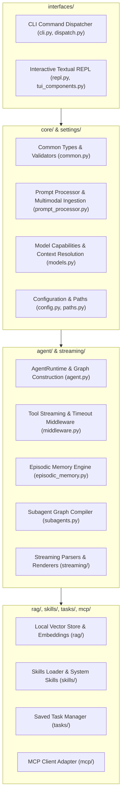

# Developer Guide & Contribution Standards

Welcome to the **Ollama Agent** developer guide! Ollama Agent is built on a clear mission: to deliver a clean, robust, local AI assistant powered by stateful agent graphs, native tool calling, extensible skills, and multi-server MCP integrations—grounded strictly in **KISS (Keep It Simple, Stupid)** and **zero defensive bloat**.

Whether you are fixing a bug, contributing a new feature, optimizing test coverage, or expanding internationalization catalogs, this guide provides everything you need to set up your environment, navigate the codebase, and uphold project standards.

---

## Quick Development Setup

Ollama Agent requires **Python 3.11+**, **Git**, and a running **[Ollama](https://ollama.com)** instance with your preferred models pulled (e.g., `ollama pull qwen2.5:latest`).

### Recommended Setup with `uv`

We recommend [uv](https://github.com/astral-sh/uv) for lightning-fast virtual environment creation and dependency resolution:

```bash
# 1. Clone repository
git clone https://github.com/arrase/ollama-agent.git
cd ollama-agent

# 2. Create and activate a virtual environment
uv venv
source .venv/bin/activate

# 3. Install in editable mode with development and documentation dependencies
uv pip install -e ".[dev,docs]"
```

### Alternative Setup with Standard `venv`

You can also use Python's built-in `venv` module and `pip`:

```bash
# 1. Clone repository
git clone https://github.com/arrase/ollama-agent.git
cd ollama-agent

# 2. Create and activate virtual environment
python3 -m venv .venv
source .venv/bin/activate

# 3. Install in editable mode with development and documentation dependencies
pip install -e ".[dev,docs]"
```

!!! tip "Verify Installation"
    After activating the virtual environment, verify that the CLI binary is available:
    ```bash
    ollama-agent --version
    ```
    If Ollama is running locally, you can start the interactive Textual REPL immediately by running `ollama-agent`.

---

## Code Quality & Linting

We maintain a strict, uniform codebase using [Ruff](https://astral-sh.github.io/ruff/) for high-speed linting and formatting.

### Running Ruff

Run Ruff against the entire repository:

```bash
ruff check .
```

Or invoke the linter directly through your active virtual environment:

```bash
.venv/bin/ruff check .
```

To automatically apply safe autofixes:

```bash
ruff check --fix .
```

### Formatting and Linting Standards

The linter configuration is defined directly in `pyproject.toml`:

```toml
[tool.ruff]
target-version = "py311"
line-length = 120

[tool.ruff.lint]
select = ["E4", "E7", "E9", "F"]
```

Key linting expectations:

- **Target Version**: Python 3.11+ modern syntax (e.g., `X | Y` union types instead of `Union[X, Y]`).
- **Line Length**: 120 characters maximum.
- **Strict Cleanliness**: Zero unused imports, undefined names, syntax errors, or unused variables.
- **Top-Level Imports**: All imports must reside strictly at the top of the file (see [Engineering Standards](#engineering-standards-kiss-zero-defensive-bloat)).

---

## Running the Test Suite

Ollama Agent uses Python's standard `unittest` framework. The automated test suite contains **27 test modules** covering over **550 tests** running in ~10 seconds with zero external test runner overhead.

### Running All Tests

Execute the full suite using your virtual environment Python binary:

```bash
.venv/bin/python -m unittest discover -s tests
```

### Running Specific Test Modules

Target individual modules during development for immediate feedback:

```bash
# Run agent runtime tests
.venv/bin/python -m unittest tests/test_agent_runtime.py

# Run prompt queue and execution pipeline tests
.venv/bin/python -m unittest tests/test_prompt_queue.py

# Run Textual TUI and widget tests
.venv/bin/python -m unittest tests/test_tui.py

# Run internationalization static analysis checks
.venv/bin/python -m unittest tests/test_i18n.py
```

To run a single test case or method:

```bash
.venv/bin/python -m unittest tests.test_agent_runtime.TestAgentRuntime.test_runtime_initialization
```

### Overview of Test Coverage

The test suite thoroughly verifies every layer of the application:

| Subsystem / Area | Test Modules | Coverage & Verification Scope |
|:---|:---|:---|
| **Runtime & Graph** | `test_agent_runtime.py`, `test_stealth.py`, `test_sessions.py` | State graph initialization, SQLite checkpointing, context compaction, session reload & export |
| **Tool Execution & Streaming** | `test_streaming.py`, `test_streaming_parsers.py`, `test_mcp_loader.py` | Tool timeout middleware, thinking tag delta parsing, MCP multi-server client connectivity |
| **Queue & Dispatch** | `test_prompt_queue.py`, `test_prompt_processor.py`, `test_dispatch_cli.py` | FIFO asynchronous prompt queue, multimodal @-mention resolution, CLI argument dispatch |
| **Terminal UI (TUI)** | `test_tui.py`, `test_repl.py`, `test_clipboard.py` | Textual REPL widgets, header/footer state, autocomplete, prompt approvals, OS clipboard |
| **Knowledge & RAG** | `test_rag_manager.py`, `test_rag_commands.py` | Local Qdrant vector database lifecycle, document chunking, batch Ollama embeddings |
| **Memory Systems** | `test_episodic_memory.py`, `test_agents_md.py` | SQLite episodic conversation search, recursive `AGENTS.md` project context discovery |
| **Skills & Tasks** | `test_skills.py`, `test_skills_commands.py`, `test_tasks.py`, `test_tasks_commands.py`, `test_resource_manager.py` | `SKILL.md` frontmatter validation, YAML task persistence, CRUD file storage managers |
| **Subagents** | `test_subagents.py` | Subagent graph compilation, tool inheritance, isolated prompt boundaries |
| **Internationalization** | `test_i18n.py` | AST static analysis verifying all `_()` strings are present in all 15 translated locale catalogs |

---

## Building Documentation

The documentation is authored in Markdown and rendered using [Material for MkDocs](https://squidfunk.github.io/mkdocs-material/).

### Live Preview Server

Start the local development server with hot-reload:

```bash
mkdocs serve
```

Or using your virtual environment binary:

```bash
.venv/bin/mkdocs serve
```

Open your browser to `http://127.0.0.1:8000/` to preview changes in real time as you edit.

### Strict Build Verification

Before submitting documentation changes or opening a pull request, run a strict build:

```bash
mkdocs build --strict
```

`--strict` mode treats all warnings—such as broken internal links, malformed admonitions, or missing navigation references—as fatal build errors. Ensure your documentation builds with zero warnings.

---

## Codebase Tour & Architecture

Ollama Agent coordinates user interfaces, runtime state graphs, external tools, vector stores, and local models.



### Annotated Directory Map

- **`ollama_agent/agent/`**: The orchestration core.
  - `agent.py`: `AgentRuntime` lifecycle, checkpointer initialization, virtual filesystem mounting, and graph construction.
  - `builtin_tools.py`: Native agent tools (`rag_search`, `search_past_conversations`) and runtime context injection.
  - `middleware.py`: Real-time tool event streaming and execution timeout guards.
  - `subagents.py`: Isolated subagent state graphs with delegated toolsets.
  - `episodic_memory.py`: Semantic search engine over stored conversation checkpoints.
- **`ollama_agent/core/`**: Shared foundational primitives.
  - `common.py`: Shared dataclasses, payload text extraction, and identifier validation.
  - `models.py`: ChatOllama initialization, model context window resolution, and dynamic API-driven reasoning controls.
  - `prompt_processor.py`: Command-line @-mention file resolution, image encoding, and prompt templating.
  - `resource_manager.py`: Generic `BaseFileStoreManager` abstraction for tasks and skills.
- **`ollama_agent/interfaces/`**: User-facing entry points.
  - `cli.py`: Non-interactive CLI argument parser, file input streaming, and command routing.
  - `repl.py`: Interactive full-screen terminal UI built with Textual.
  - `tui_components.py`: Widgets for conversation messages, prompt history, approvals, and headers.
  - `repl.css`: Textual style definitions and theme tokens.
  - `dispatch.py`: Unified command dispatcher shared by both CLI and REPL.
  - `clipboard.py`: Cross-platform clipboard backend (macOS, Wayland, X11, Windows).
- **`ollama_agent/rag/`**: Local retrieval-augmented generation engine.
  - `manager.py`: Embedded Qdrant client, chunking strategies, and Ollama embedding pipelines.
  - `commands.py`: CLI and REPL commands for indexing, clearing, and querying RAG databases.
- **`ollama_agent/skills/`**: Extensible agent capabilities following the Agent Skills specification.
  - `manager.py`: Frontmatter parsing and dynamic skill loading from `.agent/skills/` and `~/.ollama-agent/skills/`.
  - `builtin/`: Bundled core skills (`mcp-configurator`, `skill-creator`, `task-creator`).
  - `commands.py`: Skill management and execution commands.
- **`ollama_agent/tasks/`**: Reusable task automation.
  - `manager.py`: YAML serialization and lifecycle management for automated prompt sequences.
  - `commands.py`: Task running, creation, and inspection commands.
- **`ollama_agent/mcp/`**: Model Context Protocol integrations.
  - `loader.py`: `MultiServerMCPClient` connection manager with environment variable expansion.
  - `commands.py`: MCP server status inspection and tool listing.
- **`ollama_agent/i18n/`**: Multi-language localization system.
  - `__init__.py`: Locale negotiation, string catalog loader, and `_()` translation helper.
  - `locales/`: JSON translation catalogs for 15 supported languages (Arabic, German, Spanish, French, Hindi, Italian, Japanese, Korean, Dutch, Polish, Portuguese, Russian, Turkish, Ukrainian, Chinese).
- **`ollama_agent/settings/`**: Configuration management.
  - `config.py`: YAML configuration loading, typed dataclasses, and default generation.
  - `paths.py`: Centralized filesystem constants (`~/.ollama-agent/`).
- **`ollama_agent/streaming/`**: Event streaming and token parsing.
  - `events.py`: Asynchronous agent event stream generator.
  - `parsers.py`: Reasoning and thinking tag extraction (`<think>...</think>`), text deltas, and tool chunk parsers.
  - `console_renderer.py`: Rich live console rendering for CLI execution.

For deeper architectural context, read the [System Architecture Guide](architecture.md).

---

## Engineering Standards: KISS & Zero Defensive Bloat

Every contribution to Ollama Agent must adhere to our fundamental engineering principles. We value clear, unpretentious code over speculative design patterns.

### 1. Radical Simplicity (KISS)

- **Do what was asked, nothing more**: Solve the immediate problem directly. Do not build speculative features, redundant wrappers, or preemptive hooks for future requirements.
- **Linear, obvious control flow**: Code should read top-to-bottom with plain conditional logic. Avoid deep callback hierarchies or unnecessary indirection layers.
- **No premature abstraction (YAGNI)**: Do not create interfaces, abstract base classes, or factories until multiple concrete implementations genuinely require them.
- **Single Responsibility Principle (SRP)**: Keep functions and modules tightly focused on one cohesive task.
- **Self-documenting code**: Code should explain *what* it does through descriptive naming and structure. Use comments exclusively to explain non-obvious business rules or external quirks (*why*).

### 2. Zero Defensive Bloat

Defensive coding patterns mask bugs, degrade developer velocity, and create silent failures. In Ollama Agent:

- **No generic catch-and-swallow**: Never wrap code in broad `try/except Exception:` blocks just to log a warning and return dummy values (`""`, `[]`, `{}`, `None`). Let exceptions propagate naturally unless handling an explicit, expected system boundary failure.
- **No unsolicited fallback defaults**: Access dictionary keys, object attributes, and function arguments directly. Do not mask missing data with synthetic fallbacks unless the specification explicitly demands it.
- **No paranoid internal null-checks**: Validate inputs once at the public boundaries (CLI arguments, raw user input, external network APIs). Once inside internal modules, trust data flow invariants.
- **No unnecessary `Optional` types**: Avoid typing variables or parameters as `T | None` if their values are strictly controlled and guaranteed internally.
- **Fail fast and fail loud**: If an internal invariant is violated or expected data is absent, allow the program to raise an exception immediately so bugs are diagnosed and resolved at the source.

```python
# ❌ ANTI-PATTERN: Defensive bloat and exception swallowing
def get_user_session_defensive(session_id: str | None = None) -> Session | None:
    if not session_id:
        return None
    try:
        data = db.query(session_id)
        if data is None:
            return Session(id="default", name="")  # Artificial fallback
        return Session(**data)
    except Exception as e:
        logger.warning(f"Failed to load: {e}")
        return None  # Bug masked!

# ✅ RECOMMENDED: Fast, loud, and direct
def get_user_session(session_id: str) -> Session:
    data = db.query(session_id)
    return Session(**data)
```

### 3. Strict Top-Level Imports Only

All `import` and `from ... import` statements must reside at the very top of each Python file, adhering to the PEP 8 standard.

- **Never use inline or function-level imports**: Inline imports hide dependencies and complicate testing.
- **Fix circular dependencies properly**: If an import causes a circular dependency, refactor the shared types or models into an appropriate module (such as `ollama_agent/core/common.py`). Never use an inline import as a shortcut.

### 4. Virtual Environment Discipline

Always execute Python commands, test discovery, and scripts using the virtual environment interpreter (`.venv/bin/python`) or with your virtual environment actively sourced.

### 5. `pyproject.toml` as the Single Source of Truth

Dependencies and packaging configurations belong strictly in `pyproject.toml`. Do not introduce ad-hoc requirements files or unpinned installation scripts.

### 6. Internationalization (i18n) Rigor

Ollama Agent is fully localized across 16 languages:

- **Wrap all user-facing strings**: Always wrap strings displayed in the CLI, REPL, or notices with `_("Message {param}", param=value)` imported from `ollama_agent.i18n`.
- **Update all 15 locale JSON catalogs**: When adding a new translatable string, add the corresponding English key and translated text to all 15 files in `ollama_agent/i18n/locales/<locale>.json`.
- **Enforced via AST**: The test suite (`tests/test_i18n.py`) statically parses all Python files in the repository to guarantee that every `_()` call exists in every JSON catalog and that variable interpolation keys match identically.

---

## Contribution Workflow & Pull Request Checklist

Follow this workflow to submit contributions to Ollama Agent:

### Step 1: Create a Feature Branch

Fork the repository and create a descriptive branch off `main`:

```bash
git checkout -b feature/my-feature-name
```

### Step 2: Implement Changes Cleanly

Write clean, focused code aligned with our KISS and Zero Defensive Bloat guidelines. When adding a new capability or fixing a bug, add corresponding unit tests in `tests/`.

### Step 3: Run Local Validation

Before pushing your branch, run the complete local validation trifecta:

```bash
# 1. Lint and style check
.venv/bin/ruff check .

# 2. Automated test suite
.venv/bin/python -m unittest discover -s tests

# 3. Documentation build verification
.venv/bin/mkdocs build --strict
```

### Step 4: Submit Your Pull Request

Open a pull request against the `main` branch with a clear title and description explaining:

1. The problem or feature being addressed.
2. The architectural approach taken.
3. How the changes were tested.

### Pull Request Checklist

Ensure all items on this checklist are satisfied before requesting a review:

- [ ] **Tests Pass**: `.venv/bin/python -m unittest discover -s tests` runs cleanly (all 550+ tests pass).
- [ ] **Linting Passes**: `ruff check .` reports no errors or warnings.
- [ ] **Strict Docs Build**: `mkdocs build --strict` builds successfully without warnings.
- [ ] **Top-Level Imports**: All imports are at the very top of each modified file (PEP 8).
- [ ] **Zero Defensive Bloat**: No swallowed exceptions, artificial fallbacks, or paranoid null-checks.
- [ ] **Dependencies Declared**: Any newly introduced dependencies are declared in `pyproject.toml`.
- [ ] **i18n Maintained**: All new user-facing messages are wrapped in `_()` and mirrored across all 15 locale files in `ollama_agent/i18n/locales/`.
- [ ] **Tests Added**: New functionality or bug fixes include dedicated unit tests in `tests/`.

Thank you for helping make Ollama Agent the cleanest, most powerful local AI assistant!
