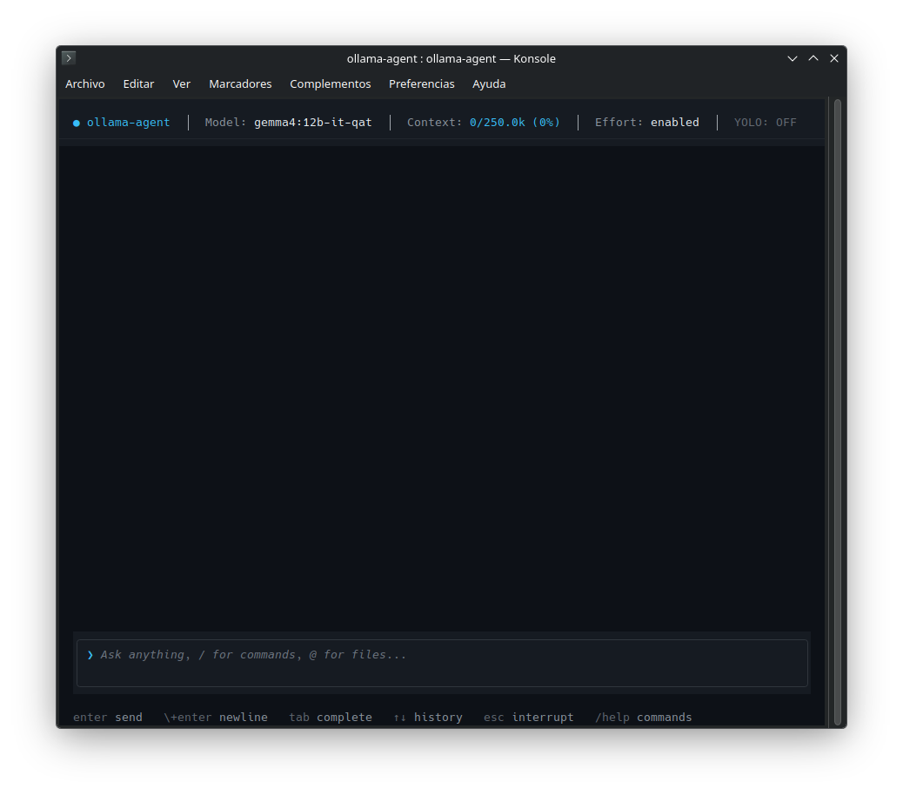
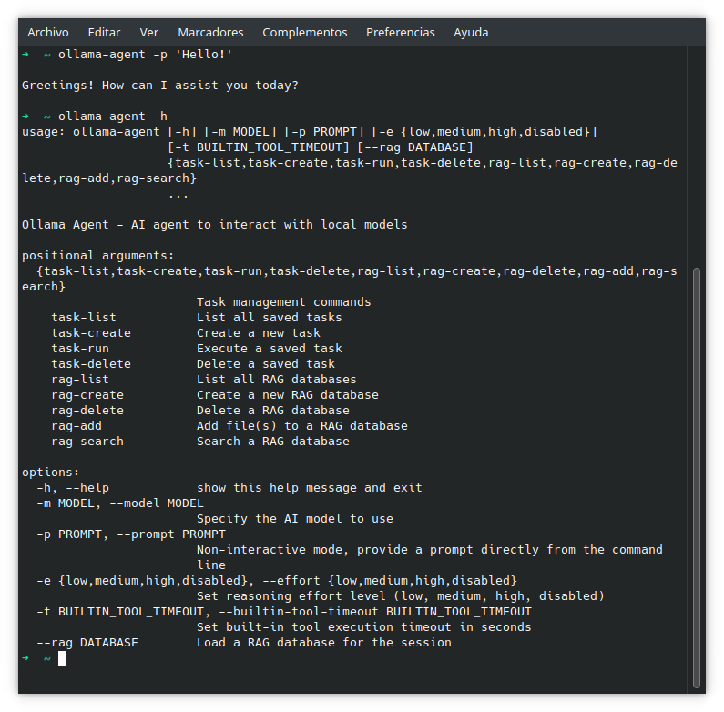

# Ollama Agent

[](https://opensource.org/licenses/MIT)
[](https://www.python.org/)
[](https://docs.langchain.com/oss/python/deepagents/overview)
[](https://github.com/langchain-ai/langchain)
[](https://ollama.com/)

**Ollama Agent** is an autonomous command-line AI assistant (interactive REPL and non-interactive CLI) designed to interact directly with local AI models. Built on top of [DeepAgents](https://docs.langchain.com/oss/python/deepagents/overview), [LangChain](https://github.com/langchain-ai/langchain), and [LangGraph](https://github.com/langchain-ai/langgraph), it delivers stateful multi-turn chat sessions, native tool execution with human-in-the-loop safety, automated context window management, Model Context Protocol (MCP) extensibility, project guidelines discovery (`AGENTS.md`), episodic memory recall, local RAG, internationalization (16 languages), and agent skills.

!!! tip "Quick Installation"
    Install Ollama Agent in an isolated Python environment using `pipx`:
    ```bash
    pipx install git+https://github.com/arrase/ollama-agent.git
    ```
    To upgrade an existing installation:
    ```bash
    pipx upgrade ollama-agent
    ```

---

## Key Features

<div class="projects-grid">
  <div class="feature-card">
    <i class="fa-solid fa-terminal feature-icon"></i>
    <h3>Interactive REPL</h3>
    <p>Full-featured Textual TUI with live Markdown rendering, multiline editing (<code>\ + Enter</code>), 3-level tab autocompletion, and live session status.</p>
  </div>
  <div class="feature-card">
    <i class="fa-solid fa-list-ol feature-icon"></i>
    <h3>Non-Blocking Prompt Queue</h3>
    <p>Submit prompts and immediate slash commands concurrently while generating responses, featuring FIFO auto-draining and <code>/queue</code> management.</p>
  </div>
  <div class="feature-card">
    <i class="fa-solid fa-bolt feature-icon"></i>
    <h3>Non-Interactive CLI</h3>
    <p>Execute single prompts directly from your shell (<code>-p</code>) for automation, scripting, CI pipelines, and rapid queries.</p>
  </div>
  <div class="feature-card">
    <i class="fa-solid fa-gauge-high feature-icon"></i>
    <h3>Context Window Monitor</h3>
    <p>Real-time token consumption tracking against model limits (<code>num_ctx</code>) with dynamic color-coded visual alerts in the header bar.</p>
  </div>
  <div class="feature-card">
    <i class="fa-solid fa-compress feature-icon"></i>
    <h3>Context Compaction</h3>
    <p>Automatic background summarization at 85% capacity and on-demand compaction (<code>/compact</code>) with durable history preservation.</p>
  </div>
  <div class="feature-card">
    <i class="fa-solid fa-brain feature-icon"></i>
    <h3>Reasoning Traces</h3>
    <p>Native thinking/reasoning trace support with configurable effort levels (<code>low</code>, <code>medium</code>, <code>high</code>, <code>xhigh</code>, <code>disabled</code>, <code>hide</code>, <code>enabled</code>).</p>
  </div>
  <div class="feature-card">
    <i class="fa-solid fa-sliders feature-icon"></i>
    <h3>Dynamic Model Parameters</h3>
    <p>Automatic sampling parameter resolution (temperature, top_p, top_k, penalties) with dynamic inspection and runtime updates via <code>/params</code>.</p>
  </div>
  <div class="feature-card">
    <i class="fa-solid fa-at feature-icon"></i>
    <h3>Interactive @-Mentions</h3>
    <p>Attach local files, directories, and multimodal binary assets (images, audio, video, PDFs) with autocompletion and safety checks.</p>
  </div>
  <div class="feature-card">
    <i class="fa-solid fa-floppy-disk feature-icon"></i>
    <h3>SQLite Session History</h3>
    <p>Durable multi-turn conversation checkpoints in <code>history.db</code> with instant resumption, markdown export, and thread management.</p>
  </div>
  <div class="feature-card">
    <i class="fa-solid fa-clock-rotate-left feature-icon"></i>
    <h3>Episodic Memory</h3>
    <p>Autonomous past conversation retrieval via the <code>search_past_conversations</code> tool and interactive keyword search with <code>/session search</code>.</p>
  </div>
  <div class="feature-card">
    <i class="fa-solid fa-language feature-icon"></i>
    <h3>Multi-Language (i18n)</h3>
    <p>Localized terminal UI and catalogs across 16 languages with automatic system locale detection and explicit runtime overrides (<code>-l</code>).</p>
  </div>
  <div class="feature-card">
    <i class="fa-solid fa-database feature-icon"></i>
    <h3>Deep RAG Engine</h3>
    <p>Local vector database powered by Ollama embeddings and Qdrant backend for semantic document retrieval via the <code>rag_search</code> tool.</p>
  </div>
  <div class="feature-card">
    <i class="fa-solid fa-book-bookmark feature-icon"></i>
    <h3>Memory & AGENTS.md</h3>
    <p>Cross-session user memory (<code>MEMORY.md</code>) and hierarchical discovery of project coding standards (<code>AGENTS.md</code>) up to repository root.</p>
  </div>
  <div class="feature-card">
    <i class="fa-solid fa-plug feature-icon"></i>
    <h3>Model Context Protocol</h3>
    <p>Seamlessly attach external MCP tool servers (<code>mcp.json</code>) over <code>stdio</code>, <code>http</code>, <code>sse</code>, <code>websocket</code>, and <code>streamable_http</code> with real-time status inspection.</p>
  </div>
  <div class="feature-card">
    <i class="fa-solid fa-sitemap feature-icon"></i>
    <h3>Custom Subagents</h3>
    <p>Configure specialized subagents in <code>settings.yaml</code> with isolated context windows, dedicated models, system prompts, and exclusive MCP toolsets.</p>
  </div>
  <div class="feature-card">
    <i class="fa-solid fa-wand-magic-sparkles feature-icon"></i>
    <h3>Agent Skills Standard</h3>
    <p>Modular skill definitions following the Agent Skills specification with progressive disclosure and dynamic context loading.</p>
  </div>
  <div class="feature-card">
    <i class="fa-solid fa-list-check feature-icon"></i>
    <h3>Task Management</h3>
    <p>Save, configure, and re-execute multi-step prompts with custom model choices and reasoning effort parameters on demand.</p>
  </div>
  <div class="feature-card">
    <i class="fa-solid fa-shield-halved feature-icon"></i>
    <h3>HITL, YOLO & Stealth</h3>
    <p>Human-in-the-Loop tool approvals, zero-friction autonomous YOLO mode, and in-memory Stealth mode without SQLite persistence.</p>
  </div>
  <div class="feature-card">
    <i class="fa-solid fa-clipboard feature-icon"></i>
    <h3>Clipboard Integration</h3>
    <p>Native cross-platform system clipboard support (macOS, Linux Wayland/X11, Windows) for copying responses and pasting prompts.</p>
  </div>
</div>

---

## Prerequisites

Before running Ollama Agent, ensure the following dependencies are available on your system:

1. **Python 3.11+**: Ensure Python 3.11 or newer is installed.
2. **Ollama**: Installed and running locally (or reachable at your configured host).
3. **Tool-Calling Model**: A local model with tool/function-calling capabilities (e.g. `qwen3.8:27b`, `qwen2.5:14b`, `llama3.1:8b`). If unconfigured or missing, the agent interactively prompts you to select one from your installed Ollama models.
4. **Embeddings Model (for RAG)**: If using RAG features, download the default embedding model in Ollama:
   ```bash
   ollama pull nomic-embed-text:latest
   ```

---

## Quick Start

### 1. Launch the Interactive REPL
```bash
ollama-agent
```

### 2. Run a One-Off Prompt (Non-Interactive)
```bash
ollama-agent -p "Summarize the git commits made in the last 7 days."
```

### 3. Run with Specific Model, Effort, YOLO, or Stealth Mode
```bash
ollama-agent -m "gemma4:26b" -e "high" -y -s -p "Refactor src/utils.py to follow PEP 8."
```

---

## Screenshot Gallery

| Interactive REPL | Non-Interactive Prompt |
| :---: | :---: |
|  |  |
| *Full REPL interface with markdown rendering, status bar & tool calls* | *Single prompt execution from CLI with structured output* |

---

## Documentation Index

Explore the complete technical guides for Ollama Agent:

- **[System Architecture](architecture.md)**: Graph orchestration, SQLite state persistence, streaming parsers, universal tool middleware, context compaction, episodic memory, and reasoning trace capture.
- **[CLI & REPL User Guide](cli_repl.md)**: Terminal interface commands, keyboard shortcuts, `@`-file mentions, multiline inputs, HITL approvals, dynamic parameters, and non-interactive usage.
- **[MCP & Subagents Architecture](mcp_subagents.md)**: Model Context Protocol setup, subagent configuration, isolated context delegation, and dependency notes.
- **[RAG Engine Guide](rag.md)**: Local vector database creation, document chunking, embeddings setup with Ollama & Qdrant, and automated search.
- **[Skills, Tasks & Memory](skills_tasks_memory.md)**: Authoring reusable skills, managing saved task templates, `AGENTS.md` project rules, `MEMORY.md` user preferences, and episodic memory.
- **[Configuration & Tracing](configuration.md)**: Comprehensive `settings.yaml` reference, context window auto-resolution, reasoning effort mapping, and LangSmith tracing.
- **[Developer Guide](developer_guide.md)**: Local development setup, codebase architecture, test suites, and contribution standards.
