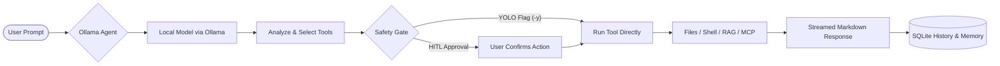

# Ollama Agent — Your Autonomous Local AI Assistant {: #ollama-agent }

[](https://opensource.org/licenses/MIT)
[](https://www.python.org/)
[](https://docs.langchain.com/oss/python/deepagents/overview)
[](https://github.com/langchain-ai/langchain)
[](https://ollama.com/)

**Ollama Agent** is an autonomous, local-first AI assistant running entirely on your machine via [Ollama](https://ollama.com/). It provides an interactive terminal user interface (REPL) and a one-shot command-line interface (CLI) to tackle daily tasks—from deep research, document analysis, and system automation to software development. With zero cloud dependency, no subscriptions, and total data privacy, you stay in complete control of your tools, your prompts, and your data.

---

## Quick Installation

Install Ollama Agent in an isolated Python environment using **pipx** (recommended) or standard **pip**:

=== "pipx (Recommended)"

    ```bash
    # Install globally in an isolated environment
    pipx install git+https://github.com/arrase/ollama-agent.git

    # Upgrade to the latest release
    pipx upgrade ollama-agent
    ```

=== "pip (Virtual Environment)"

    ```bash
    # Install into your active Python 3.11+ virtual environment
    pip install git+https://github.com/arrase/ollama-agent.git

    # Upgrade existing installation
    pip install --upgrade git+https://github.com/arrase/ollama-agent.git
    ```

---

## Prerequisites

Before launching Ollama Agent, ensure the following are available on your system:

1. **Python 3.11+**: Verify with `python3 --version`.
2. **Ollama**: Downloaded, installed, and running (`ollama serve`).
3. **Tool-Calling Model**: A model with tool/function-calling capabilities:
   ```bash
   ollama pull qwen2.5-coder:14b
   # or: ollama pull llama3.1:8b
   ```
   *(If unconfigured, Ollama Agent automatically scans your installed Ollama models and presents an interactive selector).*
4. **Embeddings Model (Optional, for Local RAG)**:
   ```bash
   ollama pull nomic-embed-text
   ```

---

## 60-Second Quick Start

### 1. Launch the Interactive REPL
Start the full-featured terminal workspace with live markdown streaming, context tracking, and command autocompletion:
```bash
ollama-agent
```

### 2. Run a One-Off CLI Prompt
Execute a task directly from your shell and stream the answer to standard output:
```bash
ollama-agent -p "Summarize git commits made in the last 7 days."
```

### 3. Combine Advanced Flags
Specify a dedicated model, reasoning effort, and autonomous execution (YOLO mode):
```bash
ollama-agent -m "qwen2.5-coder:14b" -e high -y -p "Audit src/auth.py for security vulnerabilities."
```

!!! tip "Common CLI Flags at a Glance"
    * `-p, --prompt`: Run in non-interactive single-shot mode and exit when done.
    * `-m, --model`: Select any installed Ollama model for the session.
    * `-e, --effort`: Set reasoning effort (`low`, `medium`, `high`, `xhigh`, `disabled`).
    * `-y, --yolo`: Enable YOLO mode (runs tools autonomously without approval prompts).
    * `-s, --stealth`: Run in-memory without saving conversation history to disk.

---

## Why Ollama Agent? (The Local Advantage)

Most agentic frameworks treat Ollama as a generic OpenAI-compatible proxy. This often causes truncated outputs, missed tool calls, and lost context. **Ollama Agent is built natively for Ollama**, harnessing the full potential of local LLMs:

| Capability | Generic OpenAI Proxy Agents | Ollama Agent |
| :--- | :--- | :--- |
| **Data Privacy** | Frequently routes data to third-party endpoints or telemetry servers. | **100% Local & Private.** Prompts, code, and documents never leave your machine. |
| **Context Window (`num_ctx`)** | Defaults to Ollama's 2,048-token limit, causing premature amnesia. | **Auto-detects maximum context** directly from model metadata (or up to 128k+). |
| **Model Hyperparameters** | Forces hardcoded defaults (`temp=0.7`), ignoring creator recommendations. | **Auto-discovers creator settings** from Modelfiles (`top_k`, `min_p`, `repeat_penalty`). |
| **Token Accuracy** | Relies on inaccurate `tiktoken` approximations designed for GPT models. | **Server-native token counting** reads exact evaluation metrics from Ollama. |
| **Reasoning Traces** | Leaks raw `<think>` tokens into conversation text or fails to parse them. | **Architecture-aware thinking**: translates effort into clean, collapsible UI blocks. |
| **Safety Controls** | All-or-nothing execution without fine-grained user confirmation. | **Human-in-the-Loop approval** before file edits or shell runs, with one-flag YOLO toggle. |

---

## Screenshot Gallery

| Interactive Terminal REPL | Non-Interactive Single-Shot CLI |
| :---: | :---: |
|  |  |
| *Full-featured TUI with live streaming markdown, status header, and tool approvals* | *Streamlined one-shot execution directly in your shell for scripts and CI* |

---

## How It Works

Ollama Agent operates with a transparent, user-centered execution loop designed to keep you informed and in control:



1. **Prompt Ingestion**: Type in the interactive REPL, pass a single query with `-p`, or run a saved task.
2. **Context Resolution**: The agent loads project standards (`AGENTS.md`), user preferences (`MEMORY.md`), and relevant history.
3. **Local Reasoning**: Your local model evaluates instructions and determines necessary tool actions.
4. **Safety Verification**: Interactive confirmation prompts appear before running shell commands or modifying files, unless you explicitly enable YOLO mode (`-y`).
5. **Real-Time Streaming**: Tool outputs, reasoning traces, and markdown responses stream live to your screen.

---

## Key Features

<div class="projects-grid">
  <div class="feature-card">
    <i class="fa-solid fa-terminal feature-icon"></i>
    <h3>Interactive REPL</h3>
    <p>Rich terminal UI with live syntax-highlighted streaming, multiline editing (<code>\ + Enter</code>), 3-level tab autocompletion, and real-time status updates.</p>
  </div>
  <div class="feature-card">
    <i class="fa-solid fa-bolt feature-icon"></i>
    <h3>Non-Interactive CLI</h3>
    <p>Execute single prompts directly from your shell (<code>-p</code>) for automation, scripting, CI/CD pipelines, and quick command-line queries.</p>
  </div>
  <div class="feature-card">
    <i class="fa-solid fa-list-check feature-icon"></i>
    <h3>Saved Tasks</h3>
    <p>Store, parameterize, and run repeatable prompt workflows with dynamic variables, dedicated model choices, and custom reasoning levels.</p>
  </div>
  <div class="feature-card">
    <i class="fa-solid fa-wand-magic-sparkles feature-icon"></i>
    <h3>Agent Skills</h3>
    <p>Equip your assistant with specialized procedural capabilities following the open Agent Skills standard with progressive disclosure.</p>
  </div>
  <div class="feature-card">
    <i class="fa-solid fa-plug feature-icon"></i>
    <h3>MCP Tool Support</h3>
    <p>Connect seamlessly to any external Model Context Protocol server over <code>stdio</code>, <code>http</code>, or <code>sse</code> with live discovery and management.</p>
  </div>
  <div class="feature-card">
    <i class="fa-solid fa-database feature-icon"></i>
    <h3>Local RAG Engine</h3>
    <p>Index local documentation and codebases into an embedded vector store powered by Ollama embeddings for instant semantic search.</p>
  </div>
  <div class="feature-card">
    <i class="fa-solid fa-book-bookmark feature-icon"></i>
    <h3>Memory & AGENTS.md</h3>
    <p>Persistent user preferences across sessions (<code>MEMORY.md</code>) and hierarchical auto-discovery of project guidelines (<code>AGENTS.md</code>).</p>
  </div>
  <div class="feature-card">
    <i class="fa-solid fa-sitemap feature-icon"></i>
    <h3>Custom Subagents</h3>
    <p>Delegate specialized workflows to subagents with isolated context windows, dedicated system prompts, and exclusive MCP toolsets.</p>
  </div>
  <div class="feature-card">
    <i class="fa-solid fa-clipboard feature-icon"></i>
    <h3>Clipboard Integration</h3>
    <p>Cross-platform clipboard support across Linux (Wayland/X11), macOS, and Windows to quickly pull snippets into prompts or copy responses.</p>
  </div>
  <div class="feature-card">
    <i class="fa-solid fa-language feature-icon"></i>
    <h3>Multi-Language UI</h3>
    <p>Fully localized terminal experience across 16 languages with automatic system locale detection and explicit runtime overrides (<code>-l</code>).</p>
  </div>
</div>

---

## Practical Everyday Recipes

### 1. Codebase Audit & Refactoring
Inspect project files and refactor legacy patterns while keeping changes local:
```bash
ollama-agent -m "qwen2.5-coder:14b" -e high -p "Audit src/auth.py for insecure token storage and propose fixes."
```

### 2. Interactive `@-Mention` Attachments
In the interactive REPL, attach local files, directories, or media directly using `@`:
```text
>>> Explain how authentication works in @src/auth/jwt.py and compare it to @docs/spec.md
```

### 3. Local Knowledge Base (RAG) Querying
Create a local semantic search database for your documentation and query it on demand:
```bash
# Index local docs into a collection
ollama-agent rag create project-docs ./docs --model nomic-embed-text

# Query the collection via CLI
ollama-agent --rag project-docs -p "How do I configure subagents in settings.yaml?"
```

### 4. Running Reusable Tasks with Variables
Run structured, parameterized tasks with dynamic CLI overrides:
```bash
ollama-agent task run code-review target_file=src/api.py strict=true -y
```

### 5. Instant Clipboard Transformation
Grab clipboard contents, transform them with a local LLM, and output ready-to-use code:
```bash
ollama-agent -p "Read the JSON on my clipboard and convert it into a typed Pydantic model."
```

---

## CLI Reference & Options

| Option | Short | Default | Description |
| :--- | :--- | :--- | :--- |
| `--prompt <text>` | `-p` | *None* | Runs in non-interactive mode with the given prompt and exits. |
| `--model <name>` | `-m` | `settings.yaml` | Name of the local Ollama model to use for the session. |
| `--effort <level>` | `-e` | `medium` | Reasoning effort: `low`, `medium`, `high`, `xhigh`, `disabled`. |
| `--num-ctx <int\|max>`| `-c` | `10000` | Context window size in tokens, or `max` for model capacity. |
| `--yolo` | `-y` | `False` | Autonomous mode: bypasses all tool approval prompts. |
| `--stealth` | `-s` | `False` | Ephemeral mode: does not persist chat history to SQLite. |
| `--rag <collection>` | — | *None* | Preloads a RAG database collection into the agent's context. |
| `--language <code>` | `-l` | *Auto* | UI language code (e.g. `en`, `es`, `fr`, `de`, `zh`, `ja`). |
| `--builtin-tool-timeout`| `-t` | `30` | Timeout in seconds for individual tool and command executions. |
| `--allow-traversal` | — | `False` | Permits filesystem tools to access files outside current directory. |
| `--config-reset <type>`| — | *None* | Resets configuration files: `all`, `system-prompt`, or `config-file`. |

---

## Pro Tips & Best Practices

!!! tip "1. Match Model Size to Your Task"
    For programming, code review, and script automation, models like `qwen2.5-coder:14b` or `qwen2.5-coder:32b` deliver top-tier tool calling and syntax generation. For general writing, research, and analysis, `llama3.1:8b` or `llama3.1:70b` provide broad conceptual reasoning.

!!! tip "2. Drop an `AGENTS.md` into Your Projects"
    Create an `AGENTS.md` file in your project root. Ollama Agent automatically discovers it and adopts your project's coding standards, build commands, and architectural preferences without cluttering every prompt.

!!! tip "3. Use Tab Completion Everywhere"
    In REPL mode, press <kbd>Tab</kbd> to autocomplete slash commands (e.g. `/model`, `/session`, `/context`, `/rag`), entity arguments, and local files prefixed with `@`.

!!! tip "4. Automatic Context Compaction"
    During long troubleshooting or exploratory sessions, Ollama Agent tracks your token usage against your model's context window. When usage exceeds 85%, background compaction summarizes past turns while preserving essential working memory. You can also trigger this manually in the REPL with `/context compact`.

---

## Documentation Roadmap

Dive deeper into Ollama Agent with our dedicated guides:

### User Guides
* **[CLI & REPL Interface Guide](cli_repl.md)**: Master the interactive terminal, slash commands, multiline editor, `@`-file attachments, and CLI automation.

### Extensibility & Tools
* **[Saved Tasks & Automation](tasks.md)**: Build and automate repeatable prompt templates with dynamic Jinja2 variables.
* **[Agent Skills Standard](skills.md)**: Extend capabilities with custom procedural workflows and progressive skill discovery.
* **[Model Context Protocol (MCP)](mcp.md)**: Connect external tool servers over `stdio`, `http`, or `sse` with hot-reloading.
* **[Specialized Custom Subagents](subagents.md)**: Configure dedicated subagents with tailored prompts, models, and isolated contexts.

### Knowledge & Memory
* **[Memory, Sessions & Guidelines](memory.md)**: Leverage `AGENTS.md` project guidelines, persistent user memory (`MEMORY.md`), and session history.
* **[Local RAG Engine](rag.md)**: Build, embed, and query private vector databases from your local files.

### Reference & Internals
* **[Configuration Reference](configuration.md)**: Complete guide to `settings.yaml`, environment variables, and parameter tuning.
* **[System Architecture](architecture.md)**: In-depth breakdown of state graphs, persistence, tool middleware, and streaming pipelines.
* **[Developer Guide](developer_guide.md)**: Development environment setup, testing procedures, and contribution guidelines.
