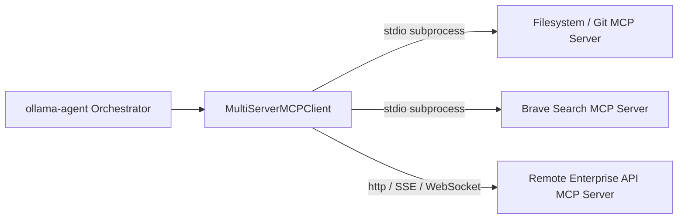

# Model Context Protocol (MCP) Integration

The **Model Context Protocol (MCP)** is an open standard designed to connect AI assistants securely with external data stores, local developer tooling, and remote enterprise APIs. `ollama-agent` integrates MCP using `langchain-mcp-adapters`, dynamically bridging MCP servers directly into LangGraph tool graphs.



---

## 1. Global Configuration (`~/.ollama-agent/mcp.json`)

Global MCP servers accessible to the primary agent during general conversation turns are configured in JSON format at `~/.ollama-agent/mcp.json`:

```json
{
  "mcpServers": {
    "filesystem": {
      "command": "npx",
      "args": ["-y", "@modelcontextprotocol/server-filesystem", "/home/user/documents"],
      "cwd": "/home/user/documents",
      "env": {
        "DEBUG": "true"
      }
    },
    "brave-search": {
      "command": "npx",
      "args": ["-y", "@modelcontextprotocol/server-brave-search"],
      "env": {
        "BRAVE_API_KEY": "${BRAVE_API_KEY}"
      }
    },
    "git": {
      "command": "uvx",
      "args": ["mcp-server-git"]
    },
    "remote-service": {
      "type": "http",
      "url": "https://mcp.internal.company.com/api",
      "headers": {
        "Authorization": "Bearer internal-api-token"
      },
      "timeout": 30,
      "sse_read_timeout": 300
    }
  }
}
```

---

## 2. Supported Transports & Configuration Options

### 1. Standard I/O Subprocess (`stdio`)
Spawns an external CLI process as a child worker and communicates over standard input and output streams.

| Field | Type | Required | Description |
| :--- | :--- | :--- | :--- |
| `command` | `string` | **Yes** | Executable name or binary path (e.g. `npx`, `uvx`, `python`, `docker`). |
| `args` | `array of strings` | No | Command-line arguments passed to the process. Defaults to `[]`. |
| `cwd` | `string` | No | Working directory for the spawned subprocess. |
| `env` | `object` | No | Environment variables passed to the child process. Supports `${VAR}` expansion. |
| `transport` | `string` | No | Defaults to `"stdio"` when `command` is present. |

> [!NOTE]
> **Clean Terminal Redirection**: To prevent subprocess diagnostic output or warning logs from corrupting the interactive Textual TUI display, `stderr` from all stdio processes is automatically redirected to `~/.ollama-agent/mcp.log`.

### 2. Remote Transports (`http`, `sse`, `websocket`, `streamable_http`)
Connects to remote services running over HTTP, Server-Sent Events (SSE), or WebSockets.

| Field | Type | Required | Description |
| :--- | :--- | :--- | :--- |
| `url` | `string` | **Yes** | Target endpoint URL of the remote MCP server. |
| `type` / `transport` | `string` | No | Protocol type: `"http"`, `"sse"`, `"websocket"`, `"streamable_http"`, or `"streamable-http"`. Defaults to `"http"`. |
| `headers` | `object` | No | Custom HTTP headers (such as authorization tokens or API keys). |
| `timeout` | `number` | No | Connection and request timeout in seconds. |
| `sse_read_timeout` | `number` | No | SSE stream read timeout in seconds. |

---

## 3. Environment Variable Expansion

Environment variable values defined inside `"env"` objects support dynamic substitution from host system variables using `${VAR_NAME}` or `%VAR_NAME%` syntax:

```json
"env": {
  "GITHUB_PERSONAL_ACCESS_TOKEN": "${GITHUB_TOKEN}",
  "DATABASE_URL": "${PROD_DB_URL}"
}
```

* **Dynamic Resolution**: Placeholders are resolved against `os.environ` before spawning the subprocess.
* **Fail-Fast Policy**: If a referenced variable is unset or empty in your environment, `ollama-agent` halts immediately with an `MCPConfigError` rather than silently failing downstream.

---

## 4. Server Inspection & Live Reloading

### Checking Server Health (`/mcp` / `ollama-agent mcp list`)

You can inspect the connectivity status, server types, and discovered tool schemas at any time:

In the interactive REPL:
```text
/mcp
/mcp list
```

From the command line:
```bash
ollama-agent mcp list
```

This renders a status table checking all configured servers:
- 🟢 **`● Active`**: Connection established and verified, with count and names of available tools.
- 🔴 **`● Failed`**: Connection or configuration error, showing the exact error message.

### Dynamic Mid-Session Reloading (`/mcp reload`)

If you edit `~/.ollama-agent/mcp.json` or install a new tool while a chat session is active, you do not need to restart the application. Run:

```text
/mcp reload
```

This cleanly tears down existing client connections, re-reads configuration files, verifies connections, and dynamically updates the LangGraph orchestrator toolset while **preserving active conversation history**.

---

## 5. Built-in `mcp-configurator` Skill

To make configuring MCP servers effortless, `ollama-agent` includes a built-in system skill named `mcp-configurator`. Simply ask the agent in natural language:

> *"Help me set up the GitHub MCP server"* or *"Add a Postgres MCP server to my config"*

The agent will look up the required package arguments, guide you through setting required environment variables, and safely write the configuration into `~/.ollama-agent/mcp.json`.
