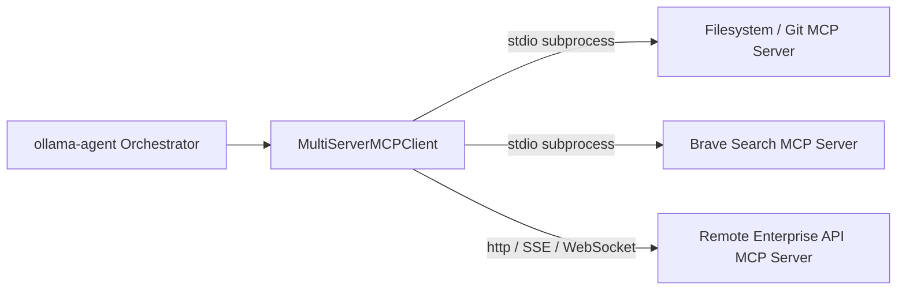
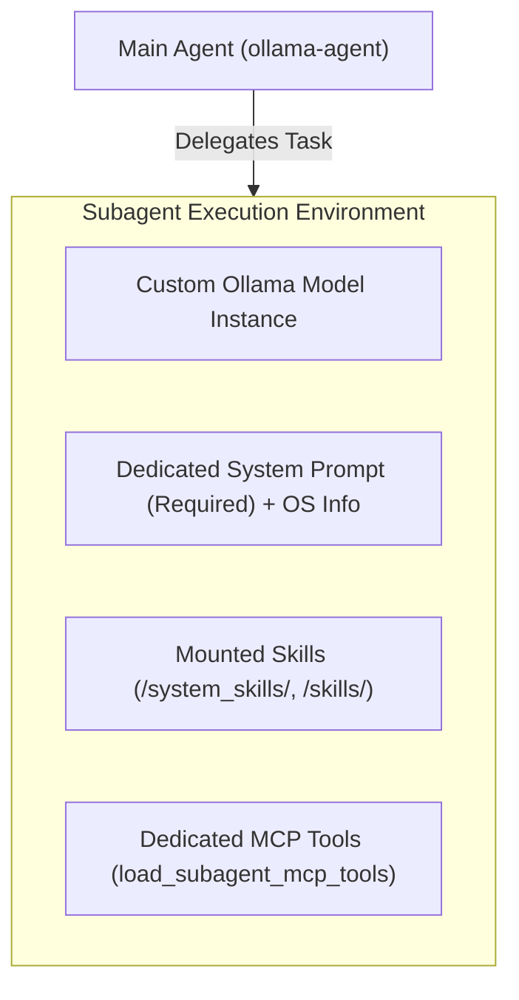

# MCP Integration & Custom Subagents

This document details the **Model Context Protocol (MCP)** integration and the **Custom Subagents System** in `ollama-agent`. These features extend the core capabilities of the agent by enabling integration with external tool servers and delegating complex tasks to specialized, isolated subagent graphs.

---

## 1. Model Context Protocol (MCP) Integration

The Model Context Protocol (MCP) is an open standard that enables AI agents to securely interact with external data sources, developer tools, and services. `ollama-agent` leverages `langchain-mcp-adapters` to bridge MCP servers with standard LangChain/LangGraph tools.



### Configuration File: `~/.ollama-agent/mcp.json`

Global MCP servers for the main agent are declared in JSON format at `~/.ollama-agent/mcp.json`. The configuration requires the top-level `"mcpServers"` key, supporting `stdio`, `http`, `sse`, `websocket`, and `streamable_http` transports.

```json
{
  "mcpServers": {
    "tavily-remote": {
      "type": "http",
      "url": "https://mcp.tavily.com/mcp/?tavilyApiKey=..."
    },
    "filesystem": {
      "command": "npx",
      "args": ["-y", "@modelcontextprotocol/server-filesystem", "/home/user/documents"],
      "cwd": "/home/user/documents",
      "env": {
        "DEBUG": "true"
      }
    },
    "brave-search": {
      "command": "npx",
      "args": ["-y", "@modelcontextprotocol/server-brave-search"],
      "env": {
        "BRAVE_API_KEY": "${BRAVE_API_KEY}"
      }
    },
    "remote_api": {
      "url": "http://localhost:8000/mcp",
      "headers": {
        "Authorization": "Bearer ${AUTH_TOKEN}"
      },
      "timeout": 30,
      "sse_read_timeout": 300
    }
  }
}
```

### Inspecting Servers (`/mcp` Slash Command & CLI)

You can check configured MCP servers, test connectivity, and inspect available tools directly from the REPL with `/mcp`:

```text
/mcp
```

Or via CLI:
```bash
ollama-agent mcp list
```

This displays a color-coded status table checking both main orchestrator servers and subagent MCP servers:
- 🟢 **`● Active`**: Successfully connected, with count and list of discovered tools.
- 🔴 **`● Failed`**: Connection or configuration error, with details of the exception.

---

### Supported Transports & Options

#### 1. Standard I/O (`stdio`) Subprocess Transport
Executes an external command as a child process and communicates via standard input/output streams.

- **`command`** (*string*, required): Executable command (e.g., `npx`, `uvx`, `python`, `docker`).
- **`args`** (*array of strings*, optional): Command-line arguments passed to the process.
- **`cwd`** (*string*, optional): Working directory for the spawned subprocess.
- **`env`** (*object*, optional): Environment variables passed to the subprocess.

#### 2. Remote Transports (`http`, `sse`, `websocket`, `streamable_http`)
Connects to a remote HTTP, Server-Sent Events (SSE), or WebSocket MCP endpoint.

- **`url`** or **`httpUrl`** (*string*, required): URL endpoint of the remote server.
- **`headers`** (*object*, optional): HTTP headers to include with requests (e.g. `Authorization`).
- **`timeout`** (*integer*, optional): Request timeout in seconds.
- **`sse_read_timeout`** (*integer*, optional): SSE stream read timeout in seconds.
- **`session_kwargs`** (*object*, optional): Additional low-level session parameters passed to the client.

---

### Environment Variable Expansion

Environment variables defined within `"env"` blocks and headers can reference host system variables using Unix `${VAR_NAME}` or Windows `%VAR_NAME%` syntax:

- Before launching the MCP subprocess or initiating remote connections, `ollama-agent` resolves all `${VAR_NAME}` and `%VAR_NAME%` placeholders against `os.environ`.
- **Fail-Fast Safety**: If a referenced environment variable is missing or unset in the host environment, `ollama-agent` halts immediately with an `MCPConfigError` (following the KISS and Fail-Fast principles) rather than masking the missing credential.

---

### Tool Registration via `langchain-mcp-adapters`

During graph construction (`AgentRuntime._build_graph`), the loader reads `mcp.json` and instantiates a `MultiServerMCPClient`:

```python
client = MultiServerMCPClient(connections)
tools = await client.get_tools()
```

1. **Async Cleanup & Lifecycle**: The client connection is bound to the runtime's internal `AsyncExitStack`. When the runtime closes or reloads (`runtime.reload()`), all active subprocesses and streams are safely terminated.
2. **Tool Injection**: Retrieved MCP tools are merged into the main agent's tool set alongside `BUILTIN_TOOLS` and `rag_search`.

---

## 2. Custom Subagents System

Subagents are auxiliary AI agent instances configured to handle specialized subtasks (e.g., code reviewer, terminal operator, web researcher, SQL analyst). They run in isolated contexts, can use different Ollama models, and can be equipped with dedicated MCP tool servers.



### Configuration in `settings.yaml`

Subagents are defined under the `subagents` array in `~/.ollama-agent/settings.yaml`:

```yaml
subagents:
  - name: "code-reviewer"
    description: "Specialist in analyzing code quality, design patterns, and potential security bugs."
    system_prompt: "You are an expert software reviewer. Analyze code changes carefully and provide actionable feedback."
    model: "gemma4:26b"
    context_window: 16384
    mcp_servers:
      - name: "git"
        command: "uvx"
        args: ["mcp-server-git"]
        env:
          GIT_PYTHON_REFRESH: "quiet"

  - name: "sql-analyst"
    description: "Specialist for querying customer databases and generating analytics reports."
    system_prompt: "You are a database engineer. Execute SQL queries and interpret results."
    mcp_servers:
      - name: "sqlite-server"
        command: "uvx"
        args: ["mcp-server-sqlite", "--db-path", "./data/analytics.db"]
```

### Configuration Fields Reference

| Field | Type | Default | Description |
| :--- | :--- | :--- | :--- |
| `name` | `string` | *(Required)* | Unique name for the subagent used during tool calls. |
| `description` | `string` | *(Required)* | Detailed description of when and how the main agent should delegate to this subagent. |
| `system_prompt` | `string` | *(Required)* | Dedicated system prompt instructions. OS environment info is appended automatically. |
| `model` | `string` | `""` | Ollama model name. If omitted or empty, inherits the main agent's configured model. |
| `context_window` | `integer` \| `string` | `0` | Context window size (`num_ctx`), or `'max'` for maximum model context. If `0` or omitted, inherits the main agent's setting. |
| `mcp_servers` | `array` | `[]` | Dedicated MCP server definitions attached exclusively to this subagent. |

#### Subagent MCP Server Fields (`mcp_servers`)
- **`name`**: Identifier for the MCP server.
- **`command`**: Subprocess executable.
- **`args`**: List of arguments.
- **`cwd`**: Optional working directory.
- **`env`**: Environment variables (supports `${VAR_NAME}` and `%VAR_NAME%` expansion).

### Context Isolation Mechanism

Subagents are instantiated using DeepAgents' `create_deep_agent(subagents=...)` framework:

1. **State & Context Isolation**: Subagents run on dedicated graph nodes. Their intermediate reasoning traces, memory modifications, and message turns do not pollute the main orchestrator's context window.
2. **Resource Scoping**: Subagent MCP servers are loaded independently via `load_subagent_mcp_tools()` and registered only within that subagent's toolset.
3. **Skills Access**: Every subagent is automatically provisioned with access to `/system_skills/` and `/skills/` for execution of modular capabilities.
4. **Live UI Attribution**: When a subagent invokes a tool, the middleware captures `agent_name` and displays it in the terminal output (e.g. `[code-reviewer] ⚙ git_diff`).

---

## 3. Practical Setup & Multi-Agent Architecture

### Complete Configuration Walkthrough

1. **Configure Global MCP Servers (`~/.ollama-agent/mcp.json`)**:
   ```json
   {
     "mcpServers": {
       "web-search": {
         "command": "npx",
         "args": ["-y", "@modelcontextprotocol/server-brave-search"],
         "env": {
           "BRAVE_API_KEY": "${BRAVE_API_KEY}"
         }
       }
     }
   }
   ```

2. **Configure Subagents (`~/.ollama-agent/settings.yaml`)**:
   ```yaml
   model:
     name: "gemma4:26b"
     temperature: 0.0

   subagents:
     - name: "database-expert"
       description: "Expert in SQL query optimization, schema migrations, and PostgreSQL."
       system_prompt: "You are a database administrator. Analyze schema designs and optimize queries."
       model: "qwen2.5-coder:32b"
       context_window: 32768
       mcp_servers:
         - name: "postgres"
           command: "npx"
           args: ["-y", "@modelcontextprotocol/server-postgres", "postgresql://localhost/mydb"]
   ```

3. **Runtime Execution**:
   - When launching `ollama-agent`, the main agent initializes with `web-search` tools.
   - If a user prompt requests database analysis, the orchestrator delegates to `database-expert`.
   - `database-expert` executes using `qwen2.5-coder:32b` and its isolated `postgres` MCP toolset, returning a synthesized summary to the main conversation.
