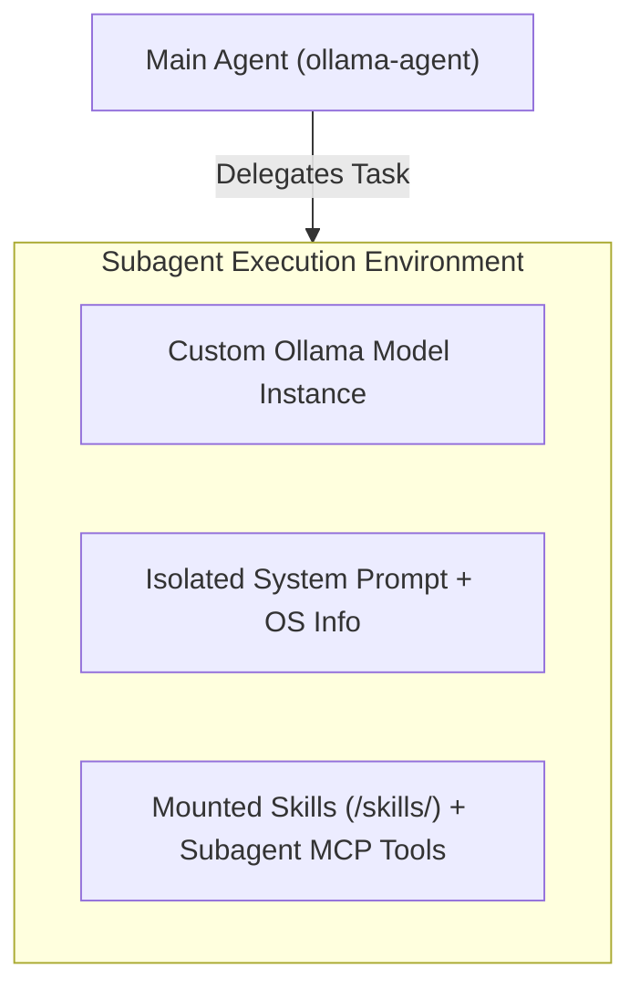

# MCP Integration & Custom Subagents

This document details the **Model Context Protocol (MCP)** integration and the **Custom Subagents System** in `ollama-agent`. These features extend the core capabilities of the agent by enabling integration with external tool servers and delegating complex tasks to specialized, isolated sub-agent graphs.

---

## 1. Model Context Protocol (MCP) Integration

The Model Context Protocol (MCP) provides a standardized standard for exposing external tools, resources, and prompts to AI models. `ollama-agent` leverages `langchain-mcp-adapters` to seamlessly bridge MCP servers with standard LangChain/LangGraph tools.

### Configuration File: `~/.ollama-agent/mcp_servers.json`

Global MCP servers for the main agent are declared in JSON format at `~/.ollama-agent/mcp_servers.json`. The configuration supports both `mcpServers` and `servers` top-level keys.

```json
{
  "mcpServers": {
    "filesystem": {
      "command": "npx",
      "args": ["-y", "@modelcontextprotocol/server-filesystem", "/home/user/documents"],
      "env": {
        "DEBUG": "true",
        "API_KEY": "${MY_API_KEY}"
      }
    },
    "remote_api": {
      "url": "http://localhost:8000/mcp",
      "headers": {
        "Authorization": "Bearer ${AUTH_TOKEN}"
      },
      "timeout": 30,
      "sse_read_timeout": 300
    }
  }
}
```

### Supported Transports

#### Standard I/O (stdio) Subprocess Transport
Executes an external command as a child process and communicates via standard input/output streams.

- **`command`** (*string*, required): Executable command (e.g., `npx`, `python`, `uvx`).
- **`args`** (*array of strings*, optional): Command-line arguments passed to the process.
- **`env`** (*object*, optional): Environment variables passed to the subprocess.

#### HTTP Remote Transport
Connects to a remote HTTP/SSE-based MCP endpoint.

- **`url`** or **`httpUrl`** (*string*, required): HTTP URL endpoint of the remote server.
- **`headers`** (*object*, optional): HTTP headers to include with requests.
- **`timeout`** (*integer*, optional): Request timeout in seconds.
- **`sse_read_timeout`** (*integer*, optional): SSE stream read timeout in seconds.

### Environment Variable Expansion
Environment variables defined within `"env"` blocks can reference host system variables using the `${VAR_NAME}` syntax.

- Before launching the MCP subprocess, `ollama-agent` resolves all `${VAR_NAME}` placeholders against `os.environ`.
- If any required environment variable is missing from the host OS environment, initialization logs a warning and gracefully skips the server connection.

### Tool Registration via `langchain-mcp-adapters`

During graph construction (`AgentRuntime._build_graph`), the loader reads `mcp_servers.json` and instantiates a `MultiServerMCPClient`:

```python
client = MultiServerMCPClient(connections)
tools = await client.get_tools()
```

1. **Async Cleanup & Lifecycle**: The client connection is bound to the runtime's internal `AsyncExitStack`. When the runtime closes or reloads (`runtime.reload()`), all active subprocesses and streams are safely terminated.
2. **Tool Injection**: Retrieved MCP tools are merged into the main agent's tool set alongside `BUILTIN_TOOLS` (such as `rag_search`).

> [!NOTE]
> **Dependency Compatibility Requirement**: `ollama-agent` explicitly constrains `mcp>=1.24.0,<2.0.0` in `pyproject.toml`. This constraint is mandatory because `langchain-mcp-adapters` (v0.3.1) relies on internal `mcp.shared.context.RequestContext` imports that were refactored out in `mcp` 2.0.0.

---

## 2. Custom Subagents System

Subagents are auxiliary AI agent instances configured to handle specialized subtasks (e.g., code reviewer, terminal operator, researcher). They run in isolated contexts, can use different Ollama models, and can be equipped with dedicated MCP tool servers.

### Configuration in `settings.yaml`

Subagents are defined under the `subagents` array in `~/.ollama-agent/settings.yaml`:

```yaml
subagents:
  - name: "code-reviewer"
    description: "Specialist in analyzing code quality, design patterns, and potential security bugs."
    system_prompt: "You are an expert software reviewer. Analyze code changes carefully and provide actionable feedback."
    model: "deepseek-coder:33b"
    context_window: 16384
    mcp_servers:
      - name: "git"
        command: "uvx"
        args: ["mcp-server-git"]
        env:
          GIT_PYTHON_REFRESH: "quiet"
```

### Configuration Fields Reference

| Field | Type | Default | Description |
| :--- | :--- | :--- | :--- |
| `name` | `string` | *(Required)* | Unique name for the subagent used during tool calls. |
| `description` | `string` | *(Required)* | Detailed description of when and how the main agent should delegate to this subagent. |
| `system_prompt` | `string` | `""` | System prompt instructions. If omitted, defaults to `description`. OS environment info is appended automatically. |
| `model` | `string` | `""` | Ollama model name. If omitted or empty, inherits the main agent's configured model. |
| `context_window` | `integer` | `0` | Context window size (`num_ctx`). If `0` or omitted, inherits the main agent's setting. |
| `mcp_servers` | `array` | `[]` | Dedicated MCP server definitions attached exclusively to this subagent. |

#### Subagent MCP Server Fields (`mcp_servers`)
- **`name`**: Identifier for the MCP server.
- **`command`**: Subprocess executable.
- **`args`**: List of arguments.
- **`env`**: Environment variables (supports `${VAR_NAME}` expansion).

### Context Isolation Mechanism

Subagents are instantiated using DeepAgents' `create_deep_agent(subagents=...)` framework:



1. **State Isolation**: Subagents run on dedicated graph nodes. Their intermediate reasoning, memory state, and message streams do not pollute the main conversation context.
2. **Resource Scoping**: Subagent MCP servers are loaded independently via `load_subagent_mcp_tools()` and registered only within that subagent's toolset.
3. **Skills Access**: Every subagent is automatically provisioned with access to `/skills/` for execution of custom capabilities.

---

## 3. Practical Setup Example

### Complete Configuration Walkthrough

1. **Configure MCP Server (`~/.ollama-agent/mcp_servers.json`)**:
   ```json
   {
     "mcpServers": {
       "web-search": {
         "command": "npx",
         "args": ["-y", "@modelcontextprotocol/server-brave-search"],
         "env": {
           "BRAVE_API_KEY": "${BRAVE_API_KEY}"
         }
       }
     }
   }
   ```

2. **Configure Subagents (`~/.ollama-agent/settings.yaml`)**:
   ```yaml
   model:
     name: "gemma4:26b"
     temperature: 0.0

   subagents:
     - name: "database-expert"
       description: "Expert in SQL query optimization, indexing, and PostgreSQL schemas."
       system_prompt: "You are a database administrator. Analyze schema designs and optimize queries."
       model: "qwen2.5-coder:32b"
       context_window: 32768
       mcp_servers:
         - name: "postgres"
           command: "npx"
           args: ["-y", "@modelcontextprotocol/server-postgres", "postgresql://localhost/mydb"]
   ```

3. **Runtime Execution**:
   When launching `ollama-agent`, the main agent initializes with `web-search` tools. If a user prompt requests database analysis, the main agent delegates to `database-expert`, which executes using `qwen2.5-coder:32b` and the `postgres` MCP toolset.
