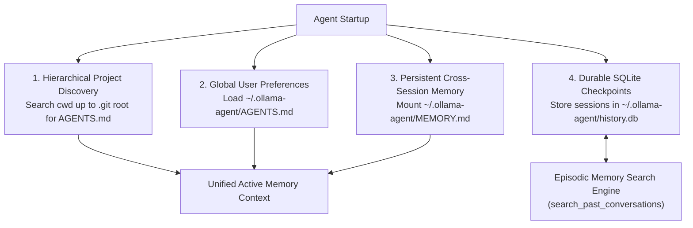
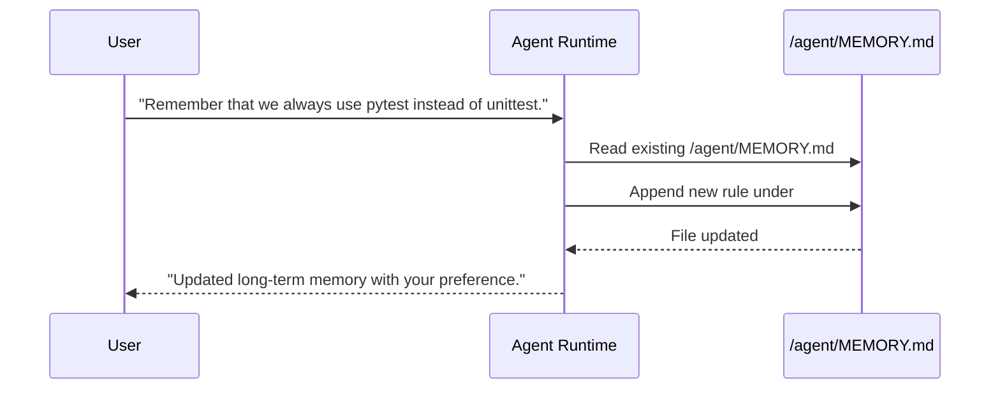

# Memory, Sessions & Guidelines

`ollama-agent` implements a comprehensive multi-tier memory architecture that combines repository-specific guidelines, global user preferences, durable SQLite conversation checkpoints, and autonomous episodic memory search across past sessions.



---

## 1. Repository Guidelines (`AGENTS.md`)

`ollama-agent` natively supports the open **`AGENTS.md` standard** for project-level coding rules and repository conventions.

### Purpose
`AGENTS.md` functions as a "README for AI agents", informing the model of:
- **Build & Test Commands**: Exact commands to run tests, linters, and compilers (e.g. `.venv/bin/python -m unittest`, `npm test`).
- **Coding Standards**: Architectural principles, naming rules, formatting guidelines, and forbidden patterns.
- **Development Workflows**: Git commit standards, PR requirements, or release checklists.

### Hierarchical Discovery
When `AgentRuntime` initializes:
1. It inspects the current working directory (`cwd`) for `AGENTS.md` (or `agents.md`, `.agents.md`).
2. If not found in `cwd`, it traverses upward through parent directories until reaching the git root (marked by `.git`) or the filesystem root.
3. **Virtual Mounting**:
   - If found in `cwd` -> mounted directly at `/<filename>`.
   - If found in an ancestor root directory -> mounts the ancestor root to `/project/` in the virtual composite backend and loads `/project/<filename>`.
   - If no file exists -> no project memory source is attached; the agent can still create `AGENTS.md` in the workspace using file tools if instructed.

---

## 2. Global Agent Guidelines (`~/.ollama-agent/AGENTS.md`)

For personal coding habits, tool preferences, or rules you want applied across **all** repositories without modifying project files:

- **Location**: `~/.ollama-agent/AGENTS.md`
- **Mount Route**: `/agent/AGENTS.md`
- **Behavior**: Loaded into the agent's memory context during execution when the file exists, complementing repository-specific rules. Unlike `MEMORY.md`, this file is optional and only loaded if present.

---

## 3. Persistent Cross-Session Memory (`MEMORY.md`)

Cross-session user memory is persisted in a structured Markdown file at `~/.ollama-agent/MEMORY.md` and mounted at `/agent/MEMORY.md`.



* **Autonomous Updates**: When you instruct the agent to remember something (e.g. *"Remember that our staging database is on port 5433"*), the agent updates this file directly using file-editing tools.
* **Automatic Scaffolding**: If `~/.ollama-agent/MEMORY.md` does not yet exist, `ollama-agent` automatically scaffolds it with initial boilerplate (`# Long-Term Memory`) on startup.
* **Persistent Scope**: Memories are retained across restarts, model changes, and different working directories.

---

## 4. Session History & Checkpointing (`history.db`)

All conversations are saved to a local SQLite database at `~/.ollama-agent/history.db` using LangGraph checkpoints (`AsyncSqliteSaver`):

* **Checkpoints**: Complete state graphs, active thread parameters, and execution step versions are saved after every node turn.
* **Writes**: Conversation messages and tool outputs are safely serialized using LangChain's `JsonPlusSerializer`.

### Session Management Commands

| Action | CLI Command | REPL Slash Command | Description |
| :--- | :--- | :--- | :--- |
| **List Sessions** | `ollama-agent session list` | `/session list` | List all saved chat threads with step counts and timestamps. |
| **Resume Session** | — | `/session resume <id>` (alias: `/session switch`) | Restore a past conversation into the viewport with full chat history. |
| **New Session** | — | `/session new` (alias: `/new`, `/clear`) | Initialize a clean conversation thread and clear the screen. |
| **Export Session** | `ollama-agent session export <id> -o <path>` | `/session export [path]` | Export conversation history and tool outputs to clean Markdown. |
| **Search Sessions** | `ollama-agent session search <query>` | `/session search <query>` | Search all saved chat sessions by keyword, topic, or date. |
| **Delete Session** | `ollama-agent session delete <id>` | `/session delete <id>` | Permanently remove a session's checkpoints from SQLite. |

> [!TIP]
> **Prefix Matching**: Session commands accept either full UUIDs or short prefix IDs (e.g. the first 8 characters shown in `/session list`). If a prefix matches multiple sessions, an ambiguity notice with the matches is shown.
>
> **Autocompletion**: In the REPL, `/session resume ` and `/session delete ` dynamically autocomplete available session IDs.
>
> **Prompt History**: Past prompts typed by the user are persisted in `history.db` and can be navigated using `↑` and `↓` arrow keys across restarts.

### Stealth Mode (In-Memory Privacy)
If you do not want conversations persisted to SQLite:
- Pass `-s` / `--stealth` on the CLI or run `/stealth` / `/stealth on` in the REPL.
- In Stealth mode, checkpoints are held exclusively in volatile RAM (`MemorySaver`) and discarded upon exit.

---

## 5. Episodic Memory & Conversation Recall

While semantic memory (`MEMORY.md`) distills high-level preferences, **Episodic Memory** preserves the actual sequence of events, troubleshooting steps, and past solutions across previous chat threads.

### Autonomous Agent Tool: `search_past_conversations`

The agent is equipped with the built-in tool:
```python
search_past_conversations(query: str, limit: int = 3)
```

- **How it works**: Queries `checkpoints` and `writes` in `history.db` across all past sessions.
- **Active Thread Exclusion**: Automatically excludes the current conversation thread (`exclude_thread_id=get_active_thread_id()`) to prevent redundant search loops.
- **Relevance Ranking**: Matches keywords, dates (e.g. *"yesterday"*, *"last week"*), and technical topics (e.g. *"docker build error"*, *"JWT token issue"*), returning timestamped excerpts to the LLM.

### User Search Commands

You can also search past sessions manually:

In REPL:
```text
/session search "postgres migration error"
```

From CLI:
```bash
ollama-agent session search "postgres migration error"
```
Matches are displayed in a clean terminal table showing the session ID, timestamp, and relevant conversation snippet.
