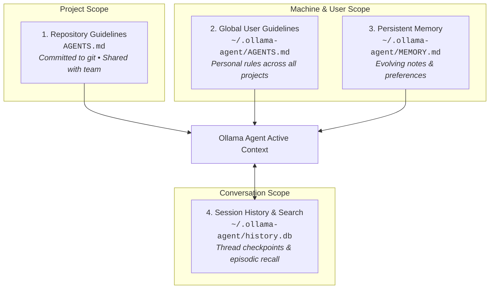
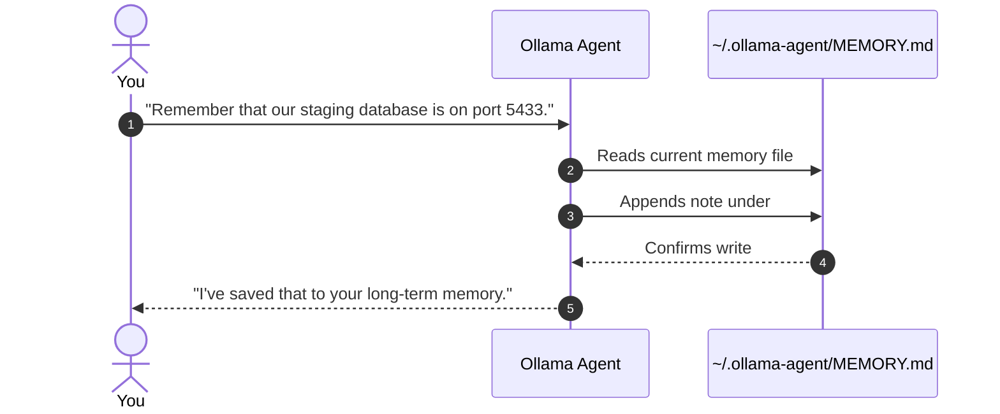
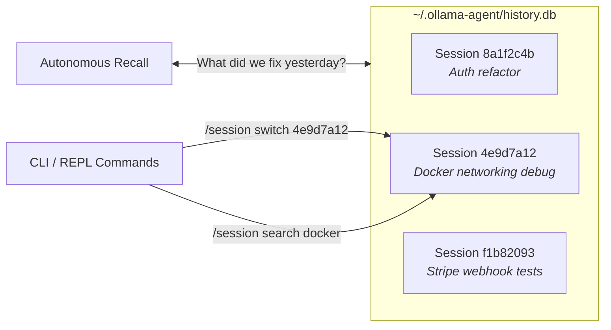
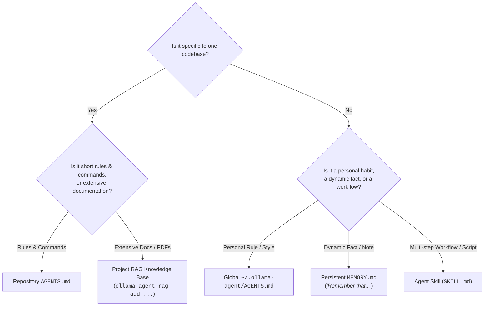

# Memory, Sessions & Guidelines

Never repeat yourself. **Ollama Agent** adapts to you, your team, and your codebases through a seamless multi-tier memory system. Whether you need your agent to follow project-specific linting and build standards, respect your personal coding style across every repo, remember key architecture decisions for months, or instantly recall a debugging session from last week, Ollama Agent keeps context effortlessly without cluttering your prompts.

---

## The 4 Memory Layers at a Glance

Ollama Agent automatically organizes knowledge into four distinct, complementary layers:



| Memory Layer | Storage Location | Scope | How It's Updated | Ideal For |
| :--- | :--- | :--- | :--- | :--- |
| **1. Repository Guidelines** | `AGENTS.md` in repo | Project / Team | Checked into git by developers | Build commands, test runners, project architecture, formatting rules |
| **2. Global Guidelines** | `~/.ollama-agent/AGENTS.md` | All projects on your machine | Edited manually in your home directory | Personal coding habits, safety constraints, preferred tools |
| **3. Persistent Memory** | `~/.ollama-agent/MEMORY.md` | All projects on your machine | Updated autonomously when you say *"Remember that..."* | Tech stack quirks, staging URLs, environment ports, personal preferences |
| **4. Session History** | `~/.ollama-agent/history.db` | Per conversation session | Saved automatically after every turn | Multi-turn chat resumption, session switching, past solution recall |

---

## 1. Repository Guidelines (`AGENTS.md`)

### What is `AGENTS.md`?

`AGENTS.md` is an open, vendor-neutral standard for instructing AI agents how to interact with a specific repository. Think of it as a **"README for AI agents"**:

- **Exact Commands**: Tells the agent the exact build, test, and linting commands for your project (e.g. `poetry run pytest`, `pnpm test`, `cargo check`).
- **Architectural Rules**: Specifies folder structures, boundary layers, and design patterns.
- **Coding Conventions**: Documents naming standards, preferred libraries, and banned functions or anti-patterns.
- **Team Workflows**: Outlines commit message conventions, PR checklists, and branching rules.

Because `AGENTS.md` lives directly in your repository and is tracked by git, your entire team shares identical agent guidelines regardless of which LLM or workstation they use.

### Hierarchical Discovery

You don't need to configure file paths or pass special flags. When you start Ollama Agent:

1. **Current Directory**: It immediately looks for `AGENTS.md` (or `agents.md`, `.agents.md`) in your current working directory.
2. **Upward Traversal**: If not found in the current folder, the agent automatically walks up the directory tree until it finds the file or reaches the git repository root (`.git`).
3. **Subdirectory Freedom**: If you run `ollama-agent` inside a deep subfolder (e.g. `services/billing/src/`), the agent automatically detects the root project's `AGENTS.md` and loads its guidelines into context.

```text
my-project/
├── .git/
├── AGENTS.md            <-- Automatically discovered from anywhere in the repo
├── frontend/
│   └── src/             <-- Running `ollama-agent` here still detects root AGENTS.md
└── backend/
    ├── AGENTS.md        <-- Subproject rules override or complement root rules
    └── api/
```

### Practical `AGENTS.md` Template

Copy this template to the root of your project as `AGENTS.md` and customize it for your stack:

```markdown
# Repository Guidelines for AI Agents

## Project Overview
Modern web API built with FastAPI and PostgreSQL. Uses clean architecture with repository patterns.

## Build, Test & Lint Commands
- Install dependencies: `poetry install`
- Run local dev server: `poetry run uvicorn app.main:app --reload --port 8000`
- Run test suite: `poetry run pytest tests/ -v`
- Run single test: `poetry run pytest tests/test_auth.py -k "test_login"`
- Format & lint: `poetry run ruff check --fix . && poetry run ruff format .`
- Type checking: `poetry run mypy app/`

## Coding Conventions & Rules
- **Type Annotations**: Always include full type annotations on all function arguments and returns.
- **Error Handling**: Use custom HTTPException subclasses defined in `app/core/exceptions.py`. Never raise generic `Exception`.
- **Database Access**: All database operations must go through repository classes in `app/repositories/`. Never execute raw SQL directly in endpoint handlers.
- **Async First**: All I/O operations (database, HTTP requests, file system) must be asynchronous (`async def`).

## Prohibited Patterns
- Do not import `datetime.datetime.now()` directly; use `app.core.time.get_utc_now()`.
- Never commit hardcoded secrets or API tokens. Always use `app.core.config.settings`.
```

!!! tip "Keep Guidelines Actionable"
    AI agents perform best when instructions are direct and actionable. Use bullet points and exact shell commands rather than long prose explanations.

---

## 2. Global Personal Guidelines (`~/.ollama-agent/AGENTS.md`)

While `AGENTS.md` in a repository sets rules for the project, **Global Guidelines** set rules for **you**.

Stored at `~/.ollama-agent/AGENTS.md`, this file applies across every repository you open on your machine. It is ideal for defining your personal working style, preferred terminal behavior, or strict safety guardrails.

### What to Put in Your Global Guidelines

- **Style & Communication**: "Keep code explanations concise. Prefer diffs over rewriting entire files."
- **Language & Libraries**: "When writing shell scripts, always use Bash with `set -euo pipefail`. Avoid zsh-specific syntax."
- **Safety Boundaries**: "Never run `git push --force` or drop database tables without asking for explicit confirmation."
- **Formatting Habits**: "Always prefer modern Python 3.12+ syntax (e.g. `list[str]` instead of `typing.List[str]`)."

### Example `~/.ollama-agent/AGENTS.md`

```markdown
# Personal Global Guidelines

## User Preferences
- Be concise. Focus on code changes and actionable terminal commands.
- When generating git commit messages, always adhere to the Conventional Commits format (`feat:`, `fix:`, `refactor:`).
- Always use `pnpm` instead of `npm` or `yarn` when working on JavaScript/TypeScript projects.
- When suggesting refactors, prioritize functional, immutable patterns over object-oriented inheritance.

## Terminal Safety
- Never run destructive commands (`rm -rf`, `git clean -fd`, `git reset --hard`) without clear notice.
```

Ollama Agent automatically checks for `~/.ollama-agent/AGENTS.md` on startup. If present, it merges these preferences with project-level guidelines seamlessly.

---

## 3. Persistent Cross-Session Memory (`MEMORY.md`)

Sometimes you want the agent to learn facts organically through conversation, rather than manually writing configuration files. **Persistent Cross-Session Memory** lets the agent record notes, preferences, and environment details on the fly.

### How It Works

Simply instruct the agent naturally during any chat session:

```text
>>> Remember that our staging database is hosted on port 5433, not 5432.
```

The agent automatically opens its long-term memory file (`~/.ollama-agent/MEMORY.md`), appends or updates the information, and confirms the update:



In every future session—regardless of which project you open or which model you switch to—the agent will remember your staging database port.

### Automatic Scaffolding

You do not need to create `MEMORY.md` manually. When you start `ollama-agent`, it automatically creates `~/.ollama-agent/MEMORY.md` with default sections if it does not already exist:

```markdown
# Long-Term Memory

## User Preferences
- Prefers concise explanations.
- Prefers pytest over unittest.

## Environment Details
- Staging database runs on port 5433.
```

### Viewing and Editing Memory Directly

Because `MEMORY.md` is a clean, human-readable Markdown file, you are always in complete control of what the agent remembers:

- **Edit in your favorite editor**: Open `~/.ollama-agent/MEMORY.md` in VS Code, Neovim, or nano to edit, reorganize, or prune outdated notes.
- **Ask the agent to review memory**: In the REPL, ask *"What do you have saved in your long-term memory?"* or *"Delete the note about the old staging server."*

---

## 4. Managing Sessions & Finding Past Conversations

Every conversation you have in the interactive REPL is safely recorded in a local SQLite database at `~/.ollama-agent/history.db`. This allows you to pause work, reboot your computer, switch between multiple tasks, and resume right where you left off.



### Listing and Switching Sessions

You can maintain separate conversational threads for different projects or debugging sessions:

```text
# List all saved sessions with message counts and timestamps
>>> /session list
```

```text
Active  ID        Updated               Steps  Summary
*       8a1f2c4b  2026-09-08 00:15:20  14     Refactor JWT authentication middleware
        4e9d7a12  2026-09-07 18:42:10  28     Fix PostgreSQL container networking error
        f1b82093  2026-09-06 11:05:04  8      Setup initial Tailwind CSS and Vite
```

To switch to a past session, provide the session ID (or just the first few characters):

```text
# Switch to the Docker networking discussion
>>> /session switch 4e9d7a12
# Or use the resume alias:
>>> /session resume 4e9d
```

To start a completely fresh conversation without losing your past work:

```text
>>> /session new
# Or simply:
>>> /new
```

!!! tip "Smart Autocompletion & Prefix Matching"
    - **Short IDs**: You don't need to copy full 36-character UUIDs. The first 4 to 8 characters displayed in `/session list` are sufficient.
    - **Tab Completion**: In the interactive REPL, pressing `<TAB>` after `/session switch ` or `/session delete ` dynamically autocompletes available session IDs.
    - **Prompt History**: Use the `↑` (Up) and `↓` (Down) arrow keys in the REPL to cycle through your previous prompts, even across application restarts.

### Finding Past Conversations (Episodic Recall)

Have you ever solved a complex error with an agent, only to encounter a similar issue a week later? Ollama Agent makes recalling past solutions effortless in two ways:

#### 1. Ask the Agent Naturally (Autonomous Episodic Search)

The agent has built-in episodic search capabilities. When you ask a question referencing past work, the agent automatically searches previous chat threads in `history.db` and extracts the relevant solution:

```text
>>> What was that Docker DNS error we encountered yesterday, and how did we fix it?
```

The agent searches past sessions, locates the exact command or configuration snippet you used, and brings it right into your current discussion—without you having to dig through terminal logs.

#### 2. Manual Keyword Search

You can also search your session archive directly using slash commands in the REPL or via the CLI:

=== "In Interactive REPL"
    ```text
    >>> /session search "docker networking"
    ```

=== "From Terminal CLI"
    ```bash
    ollama-agent session search "docker networking"
    ```

The search results display matching session IDs, timestamps, and highlighted excerpts of the conversation.

### Exporting Conversations to Markdown

Share your troubleshooting steps with your team, document an architectural decision, or create a GitHub PR description by exporting your session to clean Markdown:

=== "In Interactive REPL"
    ```text
    # Export current session to chat-export.md
    >>> /session export

    # Export to a specific file
    >>> /session export docs/auth-debugging.md
    ```

=== "From Terminal CLI"
    ```bash
    # Export a specific session by ID
    ollama-agent session export 4e9d7a12 -o docs/auth-debugging.md
    ```

The exported file includes a timestamped transcript, formatted code blocks, and clear summaries of any tool actions executed during the session.

### Private Work with Stealth Mode

When working with sensitive files, proprietary credentials, or disposable experiments that you do not want written to disk:

- Launch with `-s` or `--stealth`:
  ```bash
  ollama-agent -s
  ```
- Or toggle it inside the REPL:
  ```text
  >>> /stealth
  ```

In **Stealth Mode**, conversation state is held entirely in volatile RAM. As soon as you exit the REPL or close your terminal, the session is erased completely without leaving any trace in `~/.ollama-agent/history.db`.

### Session Command Reference

| Action | CLI Command | REPL Slash Command | Description |
| :--- | :--- | :--- | :--- |
| **List Sessions** | `ollama-agent session list` | `/session list` | Displays all saved sessions with timestamp, step count, and preview |
| **Switch Session** | — | `/session switch <id>` *(alias: `/session resume`)* | Loads a past conversation back into the active viewport |
| **New Session** | — | `/session new` *(aliases: `/new`, `/clear`)* | Starts a clean conversation thread and clears the terminal screen |
| **Search Archive** | `ollama-agent session search <query>` | `/session search <query>` | Searches past conversations by keyword, error message, or topic |
| **Export to Markdown**| `ollama-agent session export <id> -o <path>` | `/session export [path]` | Exports conversation history and code snippets to Markdown |
| **Delete Session** | `ollama-agent session delete <id>` | `/session delete <id>` | Permanently removes a session and its history from the database |
| **Stealth Mode** | `ollama-agent -s` | `/stealth` *(or `/stealth on/off`)* | Runs purely in RAM; disables database logging for private sessions |

---

## Pro Tips for Memory Management

### 1. Keep `AGENTS.md` Short and Actionable
`AGENTS.md` is loaded into the agent's context window. Avoid pasting full API documentation or lengthy tutorials into this file. Instead:
- Stick to high-value commands (exact test and linter commands).
- Explicitly state architectural boundaries and prohibited libraries.
- For deep domain knowledge (e.g. 50 pages of API docs), use [RAG (Knowledge Bases)](rag.md) or [Agent Skills](skills.md) rather than stuffing it all into `AGENTS.md`.

### 2. Curate `MEMORY.md` Periodically
Because `~/.ollama-agent/MEMORY.md` is persistent, it can accumulate outdated facts over time (e.g. old port numbers or discarded tool preferences).
- Check `~/.ollama-agent/MEMORY.md` once a month.
- Delete obsolete rules and group related notes under clear markdown headings (`## Database`, `## Formatting`).

### 3. Choose the Right Memory Tool

Not all information belongs in the same place. Use this quick decision matrix:



- **Use `AGENTS.md`** for repository-level rules and commands that the whole team shares.
- **Use `~/.ollama-agent/AGENTS.md`** for personal habits you want enforced across all projects.
- **Use `MEMORY.md`** for quick facts and evolving notes you teach the agent in natural conversation.
- **Use [Skills](skills.md)** for procedural workflows, specialized tasks, and executable helper scripts.
- **Use [RAG](rag.md)** for indexing large docsets, manuals, specifications, and codebases.

---

## Related Guides

- [Interactive REPL & CLI Workflows](cli_repl.md) — Master slash commands, hotkeys, and streaming terminal options.
- [Agent Skills](skills.md) — Create specialized, on-demand skill packages with scripts and procedural guides.
- [Knowledge Bases & RAG](rag.md) — Index large codebases and external documentation with semantic vector search.
- [Configuration Reference](configuration.md) — Configure models, context window limits, and agent behavior.
