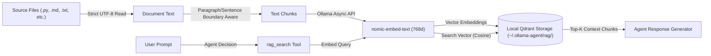

# Retrieval Augmented Generation (RAG) Architecture

`ollama-agent` features an integrated **Retrieval Augmented Generation (RAG)** pipeline powered by local Ollama embeddings and an embedded **Qdrant** vector database. This capability allows the agent to ingest local codebases, documentation, or unstructured text files and perform semantic searches during conversation.

---

## 1. RAG System Architecture

The RAG subsystem is managed by `RAGManager` (`ollama_agent/rag/manager.py`) and operates entirely on local hardware without sending vector data to third-party cloud services.



### Document Ingestion & Encoding Support
`RAGManager` processes both individual files (`add_file`) and directory trees (`add_directory`).

- **Supported File Extensions**: `.py`, `.js`, `.ts`, `.tsx`, `.jsx`, `.sh`, `.yaml`, `.yml`, `.json`, `.xml`, `.md`, `.txt`, `.toml`, `.c`, `.cpp`, `.h`, `.hpp`, `.go`, `.rs`, `.css`, `.html`, `.sql`, `.ini`, `.cfg`, `.properties`, `.java`, `.kt`, `.gradle`, `.bat`, `.ps1`, `.csv`, `.rst`.
- **Encoding Resolution**: Files are read strictly as UTF-8; files that cannot be decoded raise an error.
- **Strict Extension Whitelist**: `_read_file` rejects any file whose extension is not in `SUPPORTED_RAG_EXTENSIONS` — there is no MIME type or content sniffing fallback.

### Text Chunking
Long text files are split into overlapping chunks to ensure semantic continuity across split boundaries:

- **`chunk_size`**: Maximum character length per chunk (default: `500` characters).
- **`chunk_overlap`**: Character overlap between consecutive chunks (default: `50` characters).
- **Boundary Intelligence**: The chunking algorithm inspects natural boundaries (`\n\n`, `\n`, `. `, ` `) after the midpoint of each chunk to avoid splitting sentences or paragraphs mid-word.

### Embeddings Generation via Ollama
Embeddings are computed asynchronously via the official `ollama.AsyncClient`:

- **Default Model**: `nomic-embed-text:latest`
- **Vector Dimensions**: `768` dimensions
- **Batch Processing**: Directory ingestion processes chunks in batches of 100 to optimize throughput.
- **Validation**: Strict dimension checking guarantees that vectors match the configured dimension size before storage.

### Local Qdrant Storage
Vector indices are stored locally as file-based Qdrant collections under `~/.ollama-agent/rag/<db_name>/`:

- **Distance Metric**: Cosine similarity (`Distance.COSINE`).
- **Collection Name**: `documents`.
- **Deterministic Point IDs**: Point IDs are UUID v5 (URL namespace) hashes derived from `f"{file_path}:{chunk_index}"`, where `file_path` is the resolved absolute source path.
- **Fail-Safe Stale Point Cleanup**: When re-indexing a file, `RAGManager` only removes previous points *after* the new embeddings have been successfully generated by Ollama, preventing data loss if inference fails.

---

## 2. Configuration Settings (`settings.yaml`)

RAG parameters are defined in `~/.ollama-agent/settings.yaml` under the `rag` block:

```yaml
rag:
  rag_dir: "~/.ollama-agent/rag"
  embedder_model: "nomic-embed-text:latest"
  embedder_base_url: "http://localhost:11434"
  embedding_dims: 768
  default_top_k: 5
  chunk_size: 500
  chunk_overlap: 50
```

### Settings Reference

| Setting | Type | Default | Description |
| :--- | :--- | :--- | :--- |
| `rag_dir` | `str` | `~/.ollama-agent/rag` | Directory storing local Qdrant vector database collections. |
| `embedder_model` | `str` | `nomic-embed-text:latest` | Ollama model used to generate embeddings. |
| `embedder_base_url` | `str` | `http://localhost:11434` | Ollama server endpoint for embeddings inference. |
| `embedding_dims` | `int` | `768` | Dimensionality of generated vector embeddings. |
| `default_top_k` | `int` | `5` | Default number of top matching document chunks retrieved per query. |
| `chunk_size` | `int` | `500` | Target character size per text chunk. |
| `chunk_overlap` | `int` | `50` | Character overlap between consecutive chunks. |

---

## 3. Database Management Commands

RAG databases can be managed via the CLI or directly within the interactive REPL terminal.

### Command Reference Table

| Action | CLI Command | REPL Command | Description |
| :--- | :--- | :--- | :--- |
| **List Databases** | `ollama-agent rag list` | `/rag list` | List all available RAG databases and chunk counts. |
| **Create Database** | `ollama-agent rag create <name>` | `/rag create <name>` | Create a new empty vector database. |
| **Load Database** | — | `/rag load <name>` | Load a database into active memory for the session. |
| **Unload Database** | — | `/rag unload` | Unload the currently active database. |
| **Index Documents** | `ollama-agent rag add <db> <path> [--dir]` | `/rag add <path> [--dir]` | Add a single file or directory (`--dir`) to the target/loaded database. |
| **Delete Database** | `ollama-agent rag delete <name>` | `/rag delete <name>` | Delete a RAG database directory permanently. |
| **Database Status** | — | `/rag status` (or `/rag`) | Display current loaded database status in REPL. |

> [!TIP]
> **Prefix Matching**: Database names support unique prefix matching across CLI and REPL commands (e.g. `/rag load proj` matches `project-docs` if unambiguous).
>
> **Tab Autocompletion**: In the REPL, typing `/rag load ` or `/rag delete ` and pressing `Tab` shows available database names and their indexed chunk counts.

### CLI Auto-Load Flag
You can auto-load a RAG database at startup when running single prompts or starting the REPL:

```bash
# Non-interactive query with RAG enabled
ollama-agent --rag project-docs -p "How is authentication handled in this codebase?"

# Interactive REPL with pre-loaded database
ollama-agent --rag project-docs
```

---

## 4. Automatic Retrieval Workflow (`rag_search`)

The `rag_search` tool is dynamically registered and **only exposed to the agent when a RAG database is actively loaded**. When no database is loaded (or when unloaded or deleted), `rag_search` is excluded from the agent's tool set to prevent hallucinations, and the dynamic system prompt's RAG policy section is omitted via unified Jinja2 conditional rendering (``).

Whenever a database is loaded (`/rag load`), unloaded (`/rag unload`), or deleted (`/rag delete`), the interactive REPL dynamically recompiles the LangGraph runtime (`runtime.reload()`) to update the active tool set and instructions.

```python
@tool
async def rag_search(query: str, top_k: int | None = None) -> RAGToolResult:
    """Search the loaded RAG database for relevant document chunks."""
```

### Retrieval Execution Steps:
1. **Trigger**: User asks a domain-specific or codebase question.
2. **Execution**: The model executes `rag_search(query="...", top_k=5)`.
3. **Similarity Match**: `RAGManager` computes the query vector via Ollama and executes `client.query_points()` against Qdrant.
4. **Context Injection**: Relevant text chunks and source file headers (`[Source: filename.py]`) are returned to the agent context.
5. **Synthesis**: The LLM synthesizes an accurate answer grounded in the retrieved document snippets.
