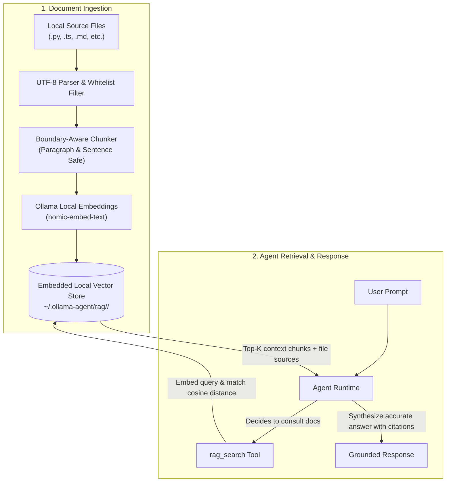

# Local RAG Engine — Chat with Your Documents

The **Local RAG (Retrieval Augmented Generation) Engine** empowers `ollama-agent` to chat directly with your private documentation, source code repositories, engineering specs, and research notes. Everything runs 100% locally on your machine using Ollama embedding models and an embedded vector store—ensuring total privacy, zero external API costs, and no third-party data leaks.

---

## 60-Second Quickstart

Get up and running with your own searchable knowledge base in four quick steps:

### 1. Pull an Embedding Model

Download a fast, high-quality local embedding model via Ollama:

```bash
ollama pull nomic-embed-text
```

### 2. Create a Knowledge Base

Create an isolated vector database for your project:

```bash
ollama-agent rag create my-project
```

### 3. Index Your Documents or Codebase

Index an entire directory tree into your knowledge base with the `--dir` flag:

```bash
ollama-agent rag add my-project ./src --dir
```

```text
✓ Added 42 files (skipped: 0, failed: 0)
```

### 4. Query with the Agent

Ask questions grounded directly in your indexed files:

```bash
# Single-shot command line query
ollama-agent --rag my-project -p "How is error handling implemented in this codebase?"
```

Or launch an interactive session with the knowledge base preloaded:

```bash
ollama-agent --rag my-project
```

```text
>>> Where is the authentication middleware configured, and how does token refresh work?
```

The agent automatically searches your knowledge base, extracts relevant excerpts, and quotes the exact source files in its answer.

---

## How Local RAG Works

Local RAG bridges the gap between your private files and the LLM without sending code or text to third-party cloud services.



### 1. Smart Boundary-Aware Chunking
When you index files, long documents are split into manageable chunks configured by `chunk_size` (default: 500 characters) and `chunk_overlap` (default: 50 characters). The chunker respects natural paragraph breaks, sentences, and line boundaries so thoughts, code blocks, and function definitions are not severed mid-word.

### 2. High-Throughput Local Embeddings
Document chunks are converted into dense vector embeddings locally via Ollama in optimized batches. By default, `nomic-embed-text` produces 768-dimensional vectors that capture semantic meaning across code and natural language.

### 3. Embedded Local Vector Store
Embeddings and file metadata are saved to an embedded vector database under `~/.ollama-agent/rag/<db_name>/`. There are no external database services or Docker containers to manage—the vector engine runs directly within `ollama-agent`.

### 4. Autonomous Agent Retrieval
When a knowledge base is loaded, the agent gains access to the `rag_search` tool. When you ask questions about your documents or code, the agent dynamically searches for semantic matches, reviews relevant excerpts with `[Source: filename]` citations, and provides an authoritative answer grounded in your data.

!!! note "Zero Hallucinations Policy"
    When no RAG database is loaded, the `rag_search` tool is completely removed from the agent's active tool registry. The agent will never pretend to search non-existent indexes or hallucinate document citations.

---

## Managing Knowledge Bases (CLI & REPL)

Manage your knowledge bases either from your shell or directly inside the interactive REPL.

### Command Reference Table

| Action | CLI Command | REPL Command | Description |
| :--- | :--- | :--- | :--- |
| **List Knowledge Bases** | `ollama-agent rag list` | `/rag list` | List all local knowledge bases and their indexed chunk counts. |
| **Create Knowledge Base** | `ollama-agent rag create <name>` | `/rag create <name>` | Create a new vector collection. |
| **Index Documents** | `ollama-agent rag add <db> <path> [--dir]` | `/rag add <path> [--dir]` | Index an individual file or an entire directory tree. |
| **Check Status** | — | `/rag status` *(or `/rag`)* | Display the currently active database and chunk count. |
| **Load into Session** | `ollama-agent --rag <name>` | `/rag load <name>` | Activate a knowledge base for agent search. |
| **Unload from Session** | — | `/rag unload` | Deactivate the current database and remove search tools. |
| **Search Directly** | — | `/rag search <query>` | Query the active knowledge base directly to inspect chunks. |
| **Delete Knowledge Base** | `ollama-agent rag delete <name>` | `/rag delete <name>` | Permanently remove a vector database from disk. |

---

### Workflows and Examples

#### Creating and Indexing

```bash
# 1. Create a database for API documentation
ollama-agent rag create api-docs

# 2. Add a single specification file
ollama-agent rag add api-docs ./docs/openapi.json

# 3. Add an entire documentation folder recursively
ollama-agent rag add api-docs ./docs/markdown --dir
```

In the interactive REPL:

```text
>>> /rag create backend
✓ RAG database created: backend
Load it with /rag load backend

>>> /rag load backend
✓ Loaded RAG database: backend

>>> /rag add ./src --dir
✓ Added 35 files (skipped: 0, failed: 0)
```

#### Inspecting and Searching

You can inspect the state of your knowledge bases at any time:

```bash
ollama-agent rag list
```

```text
┌──────────────┬────────┬────────┐
│ Name         │ Chunks │ Status │
├──────────────┼────────┼────────┤
│ backend      │ 1,420  │        │
│ my-project   │ 680    │ active │
│ api-docs     │ 310    │        │
└──────────────┴────────┴────────┘
```

Inside the REPL, test search results directly to inspect what context chunks the agent retrieves:

```text
>>> /rag search "JWT authentication configuration"
```

#### Deleting a Knowledge Base

When you no longer need an index:

```bash
ollama-agent rag delete api-docs
```

Or inside the REPL:

```text
>>> /rag delete api-docs
✓ Deleted RAG database: api-docs
```

---

### Productivity Features

- **Fuzzy & Prefix Matching**: You do not have to type full database names. If you have a database named `my-finance-project`, typing `/rag load my-fin` or `ollama-agent --rag my-fin` resolves automatically as long as the prefix is unambiguous.
- **Tab Autocompletion**: In the REPL, pressing `Tab` after `/rag load ` or `/rag delete ` autocompletes database names with preview counts of indexed chunks.
- **TUI Status Bar**: When a database is active in the REPL, the header displays `RAG: <database-name>` so you always know what context the agent can access.

---

## Supported File Types

`ollama-agent` indexes all common text, documentation, configuration, and source code formats.

| Category | File Extensions |
| :--- | :--- |
| **Source Code** | `.py`, `.js`, `.jsx`, `.ts`, `.tsx`, `.go`, `.rs`, `.c`, `.cpp`, `.h`, `.hpp`, `.java`, `.kt`, `.gradle` |
| **Documentation & Web** | `.md`, `.txt`, `.rst`, `.html`, `.css` |
| **Configuration & Data** | `.json`, `.yaml`, `.yml`, `.toml`, `.xml`, `.csv`, `.sql`, `.ini`, `.cfg`, `.properties` |
| **Scripts & Shell** | `.sh`, `.bat`, `.ps1` |

!!! warning "Encoding Requirements"
    - Files must be encoded in **UTF-8**. Any binary files or files with non-UTF-8 encodings are safely skipped during batch indexing.
    - Files with unlisted extensions are automatically filtered out during directory ingestion, protecting your index from compilation binaries, lockfiles, or images.

---

## Configuration Settings (`settings.yaml`)

Customise embedding models, chunk dimensions, and search thresholds in `~/.ollama-agent/settings.yaml` under the `rag` block:

```yaml
rag:
  rag_dir: "~/.ollama-agent/rag"
  embedder_model: "nomic-embed-text:latest"
  embedder_base_url: "http://localhost:11434"
  embedding_dims: 768
  default_top_k: 5
  chunk_size: 500
  chunk_overlap: 50
```

### Options Reference

| Option | Type | Default | Description |
| :--- | :--- | :--- | :--- |
| `rag_dir` | `string` | `~/.ollama-agent/rag` | Directory on disk where local vector collections are stored. |
| `embedder_model` | `string` | `nomic-embed-text:latest` | Ollama embedding model name used to calculate vectors. |
| `embedder_base_url` | `string` | `http://localhost:11434` | Endpoint for the local or remote Ollama server. |
| `embedding_dims` | `integer` | `768` | Dimensionality of the embedding model output. Must match `embedder_model`. |
| `default_top_k` | `integer` | `5` | Number of most relevant context chunks retrieved for each query. |
| `chunk_size` | `integer` | `500` | Maximum character length of each indexed text chunk. |
| `chunk_overlap` | `integer` | `50` | Overlap in characters between adjacent chunks to maintain context continuity. |

See the [Configuration Guide](configuration.md) for full details on global settings.

---

## Pro Tips for High-Accuracy RAG

### 1. Choose and Match the Right Embedding Model

While `nomic-embed-text` is an excellent all-rounder with a long context window, you can use any embedding model supported by Ollama. When changing models, ensure `embedding_dims` in `settings.yaml` matches the model's output dimensionality:

| Model | Dimensions (`embedding_dims`) | Best Used For |
| :--- | :--- | :--- |
| `nomic-embed-text` | `768` | Fast general documentation, code, and mixed text. |
| `mxbai-embed-large` | `1024` | Complex semantic searches and deep technical papers. |
| `bge-m3` | `1024` | Multilingual documents and cross-language retrieval. |

!!! important "Re-index After Changing Models"
    Vector embeddings generated by different models cannot be compared. If you change `embedder_model` or `embedding_dims`, create a new database or re-index your documents.

### 2. Preload Databases for Focused Sessions

When working on a specific repository, launch the agent with `--rag`:

```bash
ollama-agent --rag my-project
```

This immediately registers `rag_search` in the agent's cognitive loop. Every user question is evaluated against the database, giving the agent instant access to codebase conventions and documentation.

### 3. Ask Specific, Context-Rich Questions

Semantic vector search excels at conceptual matching, but specific inquiries yield the highest accuracy:

- **Good**: *"How does the payment processing module handle refund edge cases?"*
- **Less Effective**: *"Tell me about money."*

Mentioning module names, function signatures, error types, or architectural layers helps the similarity search isolate the exact chunks needed.

### 4. Safe Incremental Re-indexing

When you update code or edit documentation, simply re-run `ollama-agent rag add <db> <file>`. The engine replaces outdated chunks for that specific file without needing to rebuild your entire database from scratch.

---

## Related Documentation

- [Interactive REPL & CLI Reference](cli_repl.md) — Comprehensive guide to slash commands and flags.
- [Configuration Guide](configuration.md) — Full settings reference for models, tools, and environments.
- [Agent Skills](skills.md) — Modular domain capabilities and automated workflows.
- [Saved Tasks](tasks.md) — Author and execute reusable parameterised prompts.
- [Memory & Guidelines](memory.md) — Project `AGENTS.md` and cross-session persistence.
