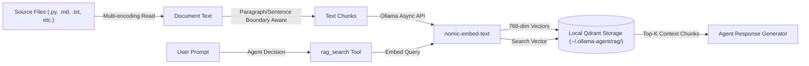

# Retrieval Augmented Generation (RAG) Architecture

`ollama-agent` features an integrated **Retrieval Augmented Generation (RAG)** pipeline powered by local Ollama embeddings and an embedded **Qdrant** vector database. This capability allows the agent to ingest local codebases, documentation, or unstructured text files and perform semantic searches during conversation.

---

## 1. RAG System Architecture

The RAG subsystem is managed by `RAGManager` (`ollama_agent/rag/manager.py`) and operates entirely on local hardware without sending vector data to third-party cloud services.



### Document Ingestion & Encoding Support
`RAGManager` processes both individual files (`add_file`) and directory trees (`add_directory`).

- **Supported File Extensions**: `.py`, `.js`, `.ts`, `.tsx`, `.jsx`, `.sh`, `.yaml`, `.yml`, `.json`, `.xml`, `.md`, `.txt`, `.toml`, `.c`, `.cpp`, `.h`, `.hpp`, `.go`, `.rs`, `.css`, `.html`, `.sql`, `.ini`, `.cfg`, `.properties`, `.java`, `.kt`, `.gradle`, `.bat`, `.ps1`, `.csv`, `.rst`.
- **Encoding Resolution**: Automatically attempts decoding using `utf-8`, `latin-1`, and `cp1252`.
- **MIME Type Validation**: Rejects unsupported binary formats or non-text files.

### Text Chunking
Long text files are split into overlapping chunks to ensure semantic continuity across split boundaries:

- **`chunk_size`**: Maximum character length per chunk (default: `500` characters).
- **`chunk_overlap`**: Character overlap between consecutive chunks (default: `50` characters).
- **Boundary Intelligence**: The chunking algorithm inspects natural boundaries (`\n\n`, `\n`, `. `, `! `, `? `) after the midpoint of each chunk to avoid splitting sentences or paragraphs mid-word.

### Embeddings Generation via Ollama
Embeddings are computed asynchronously via the official `ollama.AsyncClient`:

- **Default Model**: `nomic-embed-text:latest`
- **Vector Dimensions**: `768` dimensions
- **Batch Processing**: Ingested chunks are processed in batches of 100 to optimize throughput.
- **Validation**: Strict dimension checking guarantees that vectors match the configured dimension size before storage.

### Local Qdrant Storage
Vector indices are stored locally as file-based Qdrant collections under `~/.ollama-agent/rag/<db_name>/`:

- **Distance Metric**: Cosine similarity (`Distance.COSINE`).
- **Collection Name**: `documents`.
- **Deterministic Point IDs**: Point IDs are generated as UUID v5 hashes derived from `f"{file_path}:{chunk_index}"`.
- **Stale Point Cleanup**: When a file is updated or re-indexed, `RAGManager` automatically deletes all existing points for that file path before inserting the new chunks, avoiding duplicate or stale data.

---

## 2. Configuration Settings (`settings.yaml`)

RAG parameters are defined in `~/.ollama-agent/settings.yaml` under the `rag` block:

```yaml
rag:
  rag_dir: "/home/user/.ollama-agent/rag"
  embedder_model: "nomic-embed-text:latest"
  embedder_base_url: "http://localhost:11434"
  embedding_dims: 768
  default_top_k: 5
  chunk_size: 500
  chunk_overlap: 50
```

---

## 3. Database Management Commands

RAG databases can be managed via the CLI or directly within the interactive REPL terminal.

### Command Reference Table

| CLI Command | REPL Command | Description |
| :--- | :--- | :--- |
| `ollama-agent rag-list` | `/rag-list` | List all available RAG databases and active status. |
| `ollama-agent rag-create <name>` | `/rag-create <name>` | Create a new empty vector database. |
| `ollama-agent rag-load <name>` | `/rag-load <name>` | Load a database into active memory for the session. |
| `ollama-agent rag-unload` | `/rag-unload` | Unload the currently active database. |
| `ollama-agent rag-add <db> <path> [--dir]` | `/rag-add <path>` | Add a single file or directory (`--dir`) to a database. |
| `ollama-agent rag-delete <name>` | `/rag-delete <name>` | Delete a RAG database directory permanently. |
| N/A | `/rag-status` | Display current loaded database status. |

### CLI Auto-Load Flag
You can auto-load a RAG database at startup when running single prompts or starting the REPL:

```bash
# Non-interactive query with RAG enabled
ollama-agent --rag my_project_docs -p "How is authentication handled in this codebase?"

# Interactive REPL with pre-loaded database
ollama-agent --rag my_project_docs
```

---

## 4. Automatic Retrieval Workflow (`rag_search`)

Once a database is loaded, the built-in `rag_search` tool is registered with the agent runtime. The LLM invokes this tool automatically when it determines that external context is needed to answer a prompt.

```python
@tool
async def rag_search(query: str, top_k: int | None = None) -> RAGToolResult:
    """Search the loaded RAG database for relevant document chunks."""
```

### Retrieval Execution Steps:
1. **Trigger**: User asks a domain-specific or codebase question.
2. **Execution**: The model executes `rag_search(query="...", top_k=5)`.
3. **Similarity Match**: `RAGManager` computes the query vector via Ollama and executes `client.query_points()` against Qdrant.
4. **Context Injection**: Relevant text chunks and source file headers (`[Source: filename.py]`) are returned to the agent context.
5. **Synthesis**: The LLM synthesizes an accurate answer grounded in the retrieved document snippets.
