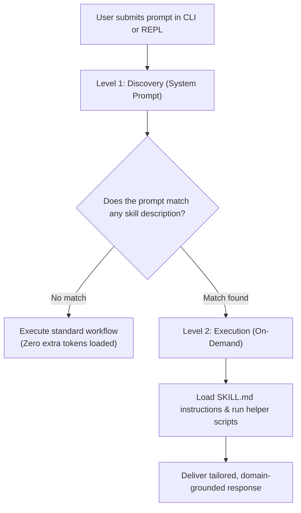

# Agent Skills Standard

**Agent Skills** are modular, self-contained packages of domain knowledge, procedural guidelines, and executable helper scripts that give your agent specialized capabilities on-demand. Built on the open **[Agent Skills specification](https://agentskills.io)**, skills teach your agent specific workflows—from reviewing REST APIs and generating conventional git commits to running automated security audits—without bloating your context window or slowing down inference.

---

## 30-Second Quickstart

You can create, test, and use a skill in under a minute.

### 1. Create a Skill in One Command

```bash
ollama-agent skill create git-commit-helper \
  --name "Git Commit Helper" \
  --description "Generates Conventional Commit messages from staged git diffs. Use when writing commit messages or reviewing git status." \
  --instructions "1. Run git diff --cached. 2. Analyze changes. 3. Format message following conventional commits: <type>(<scope>): <subject>."
```

### 2. Put It to Work

Launch the interactive REPL and ask naturally:

```bash
ollama-agent
```

```text
>>> Please inspect my staged git changes and generate a commit message.
```

The agent automatically detects that your request matches the **Git Commit Helper** skill, loads its instructions into memory, runs the necessary git commands, and presents a polished commit message.

---

## How Skills Work: Progressive Disclosure

Traditional AI agents preload every piece of documentation, prompt guideline, and tool definition into the system prompt upfront. This consumes thousands of tokens, bloats response times, and increases model confusion.

`ollama-agent` eliminates this overhead using a token-efficient **2-level progressive disclosure** architecture:



### The Two Levels Explained

1. **Level 1 (Discovery at Startup)**:
   - When the agent starts, it only registers a lightweight index containing each skill's `id`, `name`, and a 1-line `description`.
   - **Context footprint**: Only a few dozen tokens total, keeping the agent lean, fast, and responsive.
2. **Level 2 (Execution On-Demand)**:
   - When you ask a question that matches a skill's domain, the agent automatically retrieves the full `SKILL.md` and any associated scripts or references using its built-in filesystem tools.
   - **Context footprint**: Loaded only during the turns where that skill is actively needed.

---

## 2-Minute Guide: Writing Your First Skill

Skills live as standard folders in your home directory at `~/.ollama-agent/skills/`. You can create them using the CLI or simply by saving a folder with a `SKILL.md` file.

### Step 1: Create the Skill Directory

```bash
mkdir -p ~/.ollama-agent/skills/git-commit-helper
```

### Step 2: Write `SKILL.md`

Create `~/.ollama-agent/skills/git-commit-helper/SKILL.md` with standard YAML frontmatter followed by markdown instructions:

```markdown
---
name: Git Conventional Commit Helper
description: Guides the agent to generate standard Conventional Commit messages from staged git changes. Use whenever writing git commits, reviewing git diffs, or preparing release commits.
---

# Git Conventional Commit Helper

## Overview
Generate concise, high-quality commit messages following the Conventional Commits v1.0.0 specification.

## Step-by-Step Workflow
1. Check staged changes:
   ```bash
   git diff --cached
   ```
2. If no files are staged, check unstaged changes with `git status --short` and notify the user.
3. Analyze the diff and determine the primary change type:
   - `feat`: A new user-facing feature
   - `fix`: A bug fix
   - `docs`: Documentation updates only
   - `refactor`: Code changes that neither fix a bug nor add a feature
   - `perf`: Performance improvements
   - `test`: Adding or correcting tests
   - `chore`: Build tasks, dependency bumps, or tool configuration
4. Format the commit message:
   ```text
   <type>(<scope>): <concise description in imperative mood>

   [optional body explaining why the change was made]

   [optional footer: BREAKING CHANGE or issue references]
   ```
5. Ensure the first line is 72 characters or fewer and does not end with a period.
```

### Step 3: Verify the Skill

Run the CLI command to confirm your skill is registered:

```bash
ollama-agent skill list
```

You will see your new skill listed alongside any built-in system skills.

---

## Skill Directory Structure

Skills can range from simple single-file prompt guidelines to complete automation packages equipped with executable scripts and reference documents:

```text
~/.ollama-agent/skills/<skill-id>/
├── SKILL.md                 # (Mandatory) Metadata frontmatter + agent instructions
├── scripts/                 # (Optional) Python or Bash helper scripts the agent executes
│   └── audit_checker.py
├── references/              # (Optional) Cheatsheets, OpenAPI specs, JSON schemas
│   └── api_guidelines.json
└── examples/                # (Optional) Example inputs, sample outputs, or test fixtures
    └── sample_output.txt
```

### Directory Elements

| Element | Required | Purpose |
| :--- | :--- | :--- |
| `SKILL.md` | **Yes** | The core definition. Contains YAML frontmatter (`name`, `description`) and markdown guidelines. Must not exceed 10 MB. |
| `scripts/` | Optional | Deterministic code (Python, Bash) that the agent runs to parse ASTs, execute CLI tools, or process complex data. |
| `references/` | Optional | Supplemental documentation, domain schemas, or cheatsheets the agent consults on-demand. |
| `examples/` | Optional | Gold-standard input/output examples to guide the model's generation style. |

### `SKILL.md` Frontmatter Specification

The YAML frontmatter at the beginning of `SKILL.md` defines how the agent discovers and activates the skill:

```yaml
---
name: REST API Design Reviewer
description: Reviews HTTP API endpoints and OpenAPI schemas against RESTful design standards. Use when reviewing routes, designing endpoints, or checking API conventions.
metadata:
  version: "1.0.0"
  category: "architecture"
---
```

| Field | Type | Required | Description |
| :--- | :--- | :--- | :--- |
| `name` | `string` | **Yes** | Human-readable title displayed in skill listings and REPL menus. |
| `description` | `string` | **Yes** | 1–3 sentence summary of what the skill does **and the exact trigger conditions** when the agent should activate it (max 1,024 characters). |
| `metadata` | `object` | No | Optional custom key-value pairs for organization or workflow tracking. |

!!! tip "Writing Effective Descriptions"
    The `description` field is the only text loaded during Level 1 discovery. Make sure it explicitly states **both** what the skill does and **when** the agent should trigger it (e.g., *"Use when reviewing SQL queries, optimizing indexes, or diagnosing slow query logs."*).

---

## Using & Managing Skills

### Automatic Discovery in Chat

You don't need to specify flags or execute special commands to invoke a skill. Just interact with the agent naturally:

```text
>>> Can you review our user registration endpoint in src/api/routes.py for REST best practices?
```

The agent scans its lightweight index, identifies that the **REST API Design Reviewer** skill applies, loads the skill instructions, and evaluates your code against the specified rules.

### System Skills vs. User Skills

`ollama-agent` organizes skills into two distinct categories:

1. **System Skills (`/system_skills/`)**:
   - Built directly into `ollama-agent` and always available out-of-the-box.
   - Core administrative utilities:
     - `mcp-configurator`: Guides connecting, configuring, and testing [Model Context Protocol (MCP)](mcp.md) servers.
     - `skill-creator`: Conversational assistant that interviews you and writes new skills interactively.
     - `task-creator`: Guides authoring and parameterizing reusable [Saved Tasks](tasks.md).
   - System skills are protected and cannot be deleted.
2. **User Skills (`~/.ollama-agent/skills/`)**:
   - Custom skills created by you or your team.
   - Fully editable, shareable, and removable at any time.

!!! note "Shadowing & Overrides"
    If you create a user skill with the same folder name as a system skill (e.g., `skill-creator`), your custom user version safely overrides (shadows) the system skill. If you later delete your custom version, the built-in system skill automatically reactivates.

### Command Reference

Skills can be inspected, created, and managed via either the CLI or the interactive REPL:

| Action | CLI Command | REPL Slash Command | Description |
| :--- | :--- | :--- | :--- |
| **List skills** | `ollama-agent skill list` | `/skill list` *(or `/skill`)* | Displays all installed skills with ID, name, and description. |
| **View skill** | `ollama-agent skill show <id>` | `/skill show <id>` | Prints the raw markdown content and instructions of a skill. |
| **Create skill** | `ollama-agent skill create <id> [options]` | `/skill create [<id>]` | Creates a new skill via CLI flags or interactive conversation. |
| **Delete skill** | `ollama-agent skill delete <id>` | `/skill delete <id>` | Deletes a custom user skill directory. |

#### CLI Options for `skill create`

```bash
ollama-agent skill create <id> \
  --name "<Title>" \
  --description "<Trigger summary>" \
  --instructions "<Markdown body>" \
  [--force]
```

- `<id>`: Unique folder name containing only letters, numbers, underscores, or hyphens (`[A-Za-z0-9_-]+`).
- `--force`: Overwrites an existing user skill with the same ID.

#### Interactive Creation in the REPL (`/skill create`)

Inside the REPL, you can let the agent author the skill for you:

```text
>>> /skill create
```

The agent engages in an interactive dialog, asks about your workflow, determines if helper scripts are needed, drafts the `SKILL.md` frontmatter and body, and saves the skill directly into `~/.ollama-agent/skills/`.

!!! tip "Prefix Matching & Autocompletion"
    All commands accepting a skill ID support unique prefix matching. For example, `ollama-agent skill show mcp` automatically resolves to `mcp-configurator` if it is the only match. In the REPL, pressing `Tab` after `/skill show ` provides interactive autocompletion.

---

## Practical Real-World Skill Recipes

### Recipe 1: REST API Design Reviewer (Pure Markdown)

Use pure markdown when a skill provides heuristics, architectural standards, review checklists, or code style conventions.

**File location**: `~/.ollama-agent/skills/rest-api-reviewer/SKILL.md`

```markdown
---
name: REST API Design Reviewer
description: Enforces RESTful conventions and OpenAPI best practices. Use when reviewing endpoints, modifying API routes, or designing HTTP services.
---

# REST API Design Reviewer

## Purpose
Ensure all API endpoints adhere to modern RESTful architecture, standard HTTP status codes, and predictable JSON response shapes.

## Review Checklist

### 1. URL Path Naming
- Use lowercase, hyphen-separated nouns for URIs: `/api/v1/user-profiles` (not `/getUserProfiles`).
- Use plural nouns for resource collections: `/api/v1/teams`, `/api/v1/teams/{team_id}/members`.
- Avoid verbs in URLs; represent operations with standard HTTP methods (`GET`, `POST`, `PUT`, `PATCH`, `DELETE`).

### 2. HTTP Status Codes
- `200 OK`: Successful retrieval or update returning a body.
- `201 Created`: Resource successfully created via `POST`. Include a `Location` header where possible.
- `204 No Content`: Successful deletion via `DELETE` or action with no response body.
- `400 Bad Request`: Client validation error (missing required fields, malformed payload).
- `401 Unauthorized`: Authentication missing or invalid.
- `403 Forbidden`: Authenticated user lacks permission for the resource.
- `404 Not Found`: Resource ID does not exist.
- `409 Conflict`: Unique constraint violation or conflicting state.

### 3. Error Payload Standards
Enforce RFC 7807 (`application/problem+json`) error bodies:
```json
{
  "type": "https://api.example.com/errors/validation-failed",
  "title": "Validation Failed",
  "status": 400,
  "detail": "Field 'email' must be a valid email address.",
  "invalid_params": [
    {"name": "email", "reason": "Missing @ domain"}
  ]
}
```

### 4. Pagination & Filtering
- Collection endpoints must support `limit` (max 100) and `offset` (or cursor token).
- Metadata response must include `total_count`, `has_more`, and `next_cursor`.
```

---

### Recipe 2: Python Security Audit Helper (Markdown + Helper Script)

When a skill requires deterministic analysis—such as scanning code with Python's Abstract Syntax Tree (AST) or checking regex patterns—pair `SKILL.md` with an executable helper script in `scripts/`.

#### Step 1: Create the Helper Script

**File location**: `~/.ollama-agent/skills/python-security-audit/scripts/scanner.py`

```python
#!/usr/bin/env python3
"""Deterministic AST-based security vulnerability scanner for Python files."""

import ast
import json
import sys
from pathlib import Path

DANGEROUS_CALLS = {
    "eval": "Critical: eval() allows arbitrary code execution",
    "exec": "Critical: exec() allows arbitrary code execution",
}

class SecurityVisitor(ast.NodeVisitor):
    def __init__(self, filename: str):
        self.filename = filename
        self.issues = []

    def visit_Call(self, node: ast.Call):
        # Detect eval() and exec()
        if isinstance(node.func, ast.Name) and node.func.id in DANGEROUS_CALLS:
            self.issues.append({
                "file": self.filename,
                "line": node.lineno,
                "severity": "CRITICAL",
                "message": DANGEROUS_CALLS[node.func.id]
            })

        # Detect subprocess with shell=True
        if isinstance(node.func, ast.Attribute) and node.func.attr in ("Popen", "run", "call", "check_call"):
            for kw in node.keywords:
                if kw.arg == "shell" and isinstance(kw.value, ast.Constant) and kw.value.value is True:
                    self.issues.append({
                        "file": self.filename,
                        "line": node.lineno,
                        "severity": "HIGH",
                        "message": "Dangerous shell=True detected in subprocess call"
                    })
        self.generic_visit(node)

def scan_target(target_path: Path):
    findings = []
    files = [target_path] if target_path.is_file() else list(target_path.glob("**/*.py"))
    for file_path in files:
        try:
            tree = ast.parse(file_path.read_text(encoding="utf-8"), filename=str(file_path))
            visitor = SecurityVisitor(str(file_path))
            visitor.visit(tree)
            findings.extend(visitor.issues)
        except SyntaxError:
            continue
    return findings

if __name__ == "__main__":
    if len(sys.argv) < 2:
        print(json.dumps({"error": "Missing target path"}))
        sys.exit(1)

    target = Path(sys.argv[1])
    results = scan_target(target)
    print(json.dumps(results, indent=2))
```

Make the script executable:

```bash
chmod +x ~/.ollama-agent/skills/python-security-audit/scripts/scanner.py
```

#### Step 2: Create the `SKILL.md` Instructions

**File location**: `~/.ollama-agent/skills/python-security-audit/SKILL.md`

```markdown
---
name: Python Security Audit
description: Audits Python code for security vulnerabilities, dangerous calls (eval, exec, shell=True), and unsafe patterns. Use when reviewing security, running audits, or checking code safety.
---

# Python Security Audit

## Overview
Perform static security analysis on Python source files using the embedded deterministic scanner script and synthesize actionable remediation advice.

## Workflow

1. Run the security scanner script against the target file or directory:
   ```bash
   python ~/.ollama-agent/skills/python-security-audit/scripts/scanner.py <target_path>
   ```
2. Parse the JSON output returned by the scanner.
3. If issues are identified:
   - Group findings by severity (`CRITICAL`, `HIGH`, `MEDIUM`).
   - For each finding, display the filename, line number, and explanation of the security risk.
   - Provide a safe, refactored code example showing how to replace the unsafe construct (e.g., using `ast.literal_eval()` instead of `eval()`, or passing argument lists without `shell=True`).
4. If zero issues are identified, report that no common security anti-patterns were found and recommend automated testing or dependency audits (e.g. `pip-audit`).
```

---

## Pro Tips for Writing Great Skills

### 1. When to Use `scripts/` vs. Pure `SKILL.md`

- **Use Pure Markdown (`SKILL.md`)** when the skill deals with:
  - Code review heuristics, style guides, and design patterns.
  - Architectural decisions and trade-off evaluation.
  - Natural language formatting, tone rules, or documentation standards.
- **Add Executable Scripts (`scripts/`)** when the skill deals with:
  - Deterministic calculations, AST analysis, or regex data validation.
  - Interfacing with third-party command-line utilities (`git`, `docker`, `pytest`).
  - Parsing structured formats (JSON, XML, CSV) where token generation would be inefficient or error-prone.

### 2. Craft Precise Trigger Descriptions

The model relies entirely on the `description` field during Level 1 discovery. Avoid vague statements like *"Helpful utilities for coding."* Instead, describe both **scope** and **triggers**:

```yaml
# ❌ Too vague - agent rarely activates this skill
description: Utilities for database development.

# ✅ Clear and actionable - triggers reliably on relevant tasks
description: Generates, validates, and refactors PostgreSQL schema migrations and indexes. Use when writing SQL migrations, altering tables, or debugging slow database queries.
```

### 3. Keep Skills Focused on a Single Domain

A skill that attempts to handle Docker, Python, SQL, and CSS simultaneously becomes unwieldy. Create separate, modular skills (`docker-optimizer`, `python-reviewer`, `sql-migration-helper`). The agent will selectively load only the skill needed for each task.

### 4. Combine Skills with Subagents and Tasks

Skills integrate seamlessly with other `ollama-agent` capabilities:
- **[Specialized Subagents](subagents.md)**: Subagents inherit all registered system and user skills, allowing delegated workers to execute specialized tasks.
- **[Saved Tasks](tasks.md)**: Parameterized prompt routines can invoke skills directly as part of routine automation scripts.
- **[Model Context Protocol (MCP)](mcp.md)**: Skills can document workflows that orchestrate tools exposed by external MCP servers.
