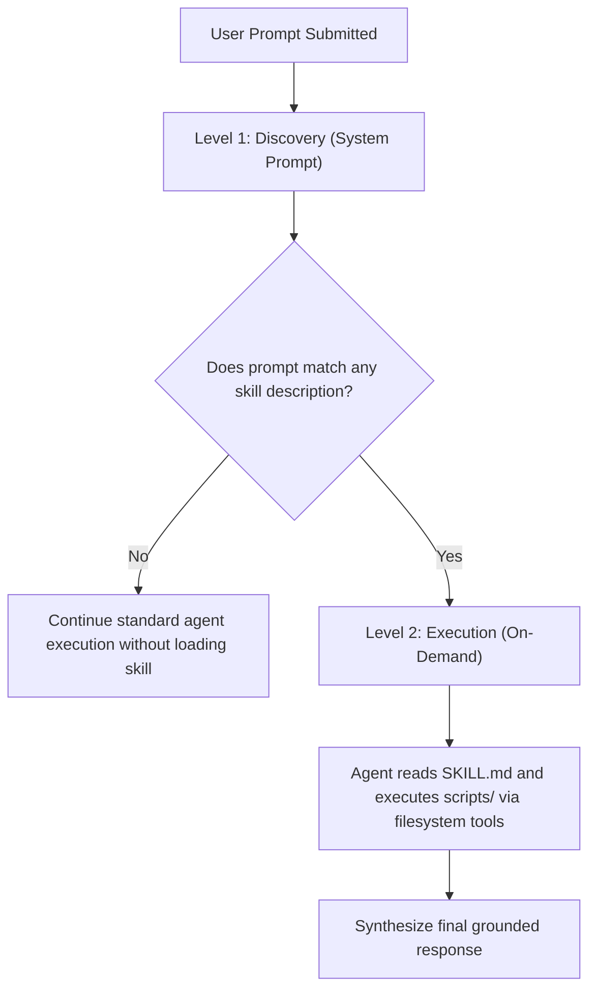

# Agent Skills System

`ollama-agent` natively supports modular capabilities built on the open **[Agent Skills specification](https://agentskills.io/specification)**. Skills provide procedural domain knowledge, coding guidelines, or specialized instructions to the agent using a token-efficient **progressive disclosure** architecture.

---

## 1. Progressive Disclosure Architecture

Standard agent architectures often bloat the system prompt by pre-loading extensive documentation and instructions for all available tools upfront. This consumes precious context window budget and degrades inference speed and reasoning quality.

To solve this, `ollama-agent` implements a 2-level progressive disclosure pattern:



1. **Level 1 (Discovery)**:
   - At startup, the agent system prompt is mounted with concise metadata about available skills.
   - Only the skill identifier, human-readable name, and short description (automatically truncated to 1,024 characters) are exposed during prompt evaluation.
   - Context footprint: minimal (a few dozen tokens per skill).
2. **Level 2 (Execution)**:
   - When the agent determines that a user's task matches a skill's description, it proactively accesses the skill's full instructions in `SKILL.md` (and any helper scripts in `scripts/` or references in `references/`) on-demand using its built-in filesystem tools.
   - Full instructions are loaded into context only when needed.

---

## 2. Skill Directory Format & Standard Layout

Skills are stored as self-contained modular directories containing a mandatory `SKILL.md` file and optional supporting code or schemas:

```text
~/.ollama-agent/skills/
├── api-design/
│   └── SKILL.md
└── web-scraper/
    ├── SKILL.md
    ├── scripts/
    │   └── scraper.py
    ├── references/
    │   └── schema.json
    └── examples/
        └── sample.html
```

### `SKILL.md` Specification

The `SKILL.md` file consists of standard YAML frontmatter delimited by `---`, followed by GitHub-flavored Markdown instructions:

```markdown
---
name: API Design Guidelines
description: Guidelines and best practices for designing RESTful and OpenAPI compliant APIs. Use when creating, reviewing, or modifying REST endpoints.
---

# API Design Guidelines

## Core Principles
1. Use resource-oriented URLs with nouns in plural form (e.g. `/api/v1/users`, `/api/v1/projects/{id}/tasks`).
2. Adhere strictly to standard HTTP status codes (200 OK, 201 Created, 400 Bad Request, 401 Unauthorized, 404 Not Found, 409 Conflict).
3. Format request and response payloads as valid JSON using camelCase property naming.
4. Always provide pagination parameters (`limit`, `offset` or `cursor`) for collection endpoints.
```

### Frontmatter Schema & Constraints

| Field | Type | Required | Rules & Constraints |
| :--- | :--- | :--- | :--- |
| `name` | `string` | **Yes** | Human-readable title of the skill. |
| `description` | `string` | **Yes** | Clear summary of what the skill does **and when the agent should trigger it**. Kept under 1,024 characters. |
| `metadata` | `object` | No | Optional key-value metadata for custom workflows. |

- **Skill Identifier (`<id>`)**: The folder name serves as the unique identifier. It must contain only alphanumeric characters, underscores, and hyphens (`[A-Za-z0-9_-]+`), without reserved system names (e.g. `con`, `aux`, `nul`).
- **File Size Limit**: `SKILL.md` files must not exceed 10 MB.

---

## 3. Virtual Skill Roots & Mounting

The agent runtime mounts two virtual skill directories (`SKILL_ROOTS`) available to both the primary agent and custom subagents:

1. **System Skills (`/system_skills/`)**:
   - Bundled directly with `ollama-agent` (`ollama_agent/skills/builtin/`).
   - Core administrative skills that cannot be deleted:
     - `mcp-configurator`: Guides the user through adding, testing, and troubleshooting MCP servers.
     - `skill-creator`: Guides the conversational authoring and validation of new skills.
     - `task-creator`: Guides the creation and parameterization of reusable prompt tasks.
2. **User Skills (`/skills/`)**:
   - Reside in `~/.ollama-agent/skills/<skill_id>/`.
   - Created, modified, or deleted by the user at any time.

---

## 4. Skill Management (CLI & REPL)

Skills can be created, inspected, listed, and deleted via either the command line or the interactive REPL:

### Command Reference

| Action | CLI Command | REPL Slash Command | Description |
| :--- | :--- | :--- | :--- |
| **List Skills** | `ollama-agent skill list` | `/skill list` (or `/skill`) | List all discovered skills (columns: ID, Name, Description). |
| **Show Skill** | `ollama-agent skill show <id>` | `/skill show <id>` | View the raw metadata and markdown instructions of a skill. |
| **Create Skill** | `ollama-agent skill create <id> --name <n> --description <d> --instructions <i> [--force]` | `/skill create [<id>]` | Interactively scaffold a new skill with agent assistance or define via CLI. |
| **Delete Skill** | `ollama-agent skill delete <id>` | `/skill delete <id>` | Permanently delete a user skill directory (restores built-in version if overridden). |

> [!NOTE]
> **Overrides & Restoration**: A user skill created in `~/.ollama-agent/skills/<id>` with the same ID as a built-in skill safely shadows the built-in version. If the user skill is deleted via `skill delete <id>`, the built-in version becomes active again.
>
> **Unique Prefix Resolution**: All commands accepting `<id>` support unique prefix matching. For example, `ollama-agent skill show mcp` resolves to `mcp-configurator` if it is the only match.

> [!TIP]
> **Conversational Creation (`/skill create`)**: When you run `/skill create` inside the REPL, the agent engages in an interactive dialogue to understand your requirements, writes the YAML frontmatter, authors comprehensive instructions, and creates helper scripts automatically.
>
> **Tab Autocompletion**: In the REPL, typing `/skill show ` or `/skill delete ` and pressing `Tab` provides 3-level autocompletion of all available skill IDs.
