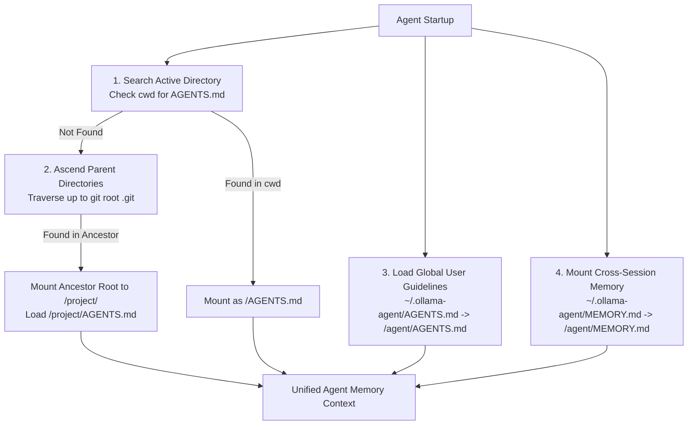
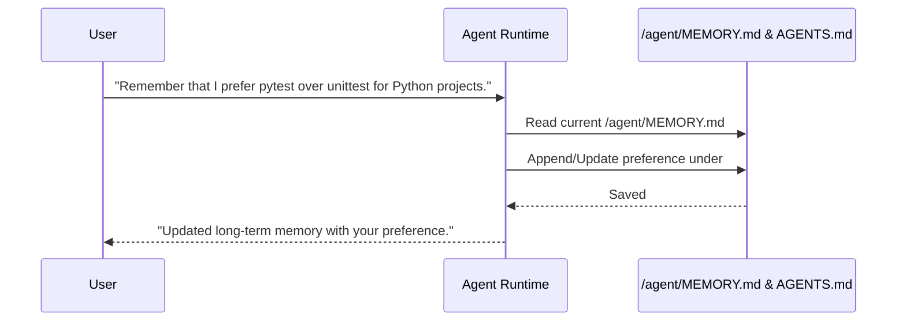

# Skills, Tasks & Persistent Memory (`AGENTS.md` & `MEMORY.md`)

This document covers four core capabilities that enable `ollama-agent` to adapt, automate repetitive routines, retain project context, and preserve long-term user memory:

1. **Agent Skills System** (Adhering to the Agent Skills specification)
2. **Task Automation System** (Pre-configured prompt templates and models)
3. **Project Agent Guidelines** (`AGENTS.md` standard integration)
4. **Long-Term Persistent Memory** (`MEMORY.md` cross-session integration)

---

## 1. Agent Skills System

`ollama-agent` implements custom capabilities using the **[Agent Skills specification](https://agentskills.io/specification)**. Skills provide procedural knowledge, domain guidelines, or specialized instructions to the agent using a progressive disclosure architecture.

### Progressive Disclosure Pattern
To conserve context window budget, skill instructions are not loaded into the system prompt upfront. Instead:

- **Level 1 (Discovery)**: The agent system prompt is mounted with access to the `/skills/` directory route. Only skill names and short descriptions (truncated to 1,024 characters) are exposed during prompt evaluation.
- **Level 2 (Execution)**: When the agent determines that a task matches a skill's description, it reads the skill's `SKILL.md` file on-demand via filesystem tools to follow its instructions.

### `SKILL.md` Directory Format & YAML Frontmatter

Skills are stored as subdirectories containing a mandatory `SKILL.md` file:

```text
~/.ollama-agent/skills/
├── api-design/
│   └── SKILL.md
└── web-scraper/
    ├── SKILL.md
    └── scraper.py
```

#### `SKILL.md` Example:
```markdown
---
name: API Design Guidelines
description: Guidelines and best practices for designing RESTful and OpenAPI compliant APIs.
---

# API Design Guidelines

## Instructions
1. Review API endpoint naming conventions (nouns, plural, kebab-case).
2. Validate HTTP status codes (200, 201, 400, 404, 409, 500).
3. Ensure request/response schemas use JSON and camelCase properties.
```

#### Specification Constraints:
- **Maximum File Size**: `SKILL.md` files must not exceed 10 MB (`_MAX_SKILL_SIZE`).
- **YAML Frontmatter**: Placed between `---` delimiters at the very top of `SKILL.md`.
  - **`name`** (*string*, required): Human-readable name of the skill.
  - **`description`** (*string*, required): Purpose of the skill (truncated to 1024 chars for discovery).
  - **`metadata`** (*object*, optional): Custom key-value pairs.

### Skill Management Commands

Skills can be managed via the CLI, REPL slash commands, or interactive TUI modal dialogs:

| Action | CLI Command | REPL Slash Command | Description |
| :--- | :--- | :--- | :--- |
| **List Skills** | `ollama-agent skill-list` | `/skill list` (or `/skill`) | List all available skills and descriptions. |
| **Show Skill** | `ollama-agent skill-show <id>` | `/skill show <id>` | View raw contents and instructions of `SKILL.md`. |
| **Create Skill** | `ollama-agent skill-create <id> --name <n> --description <d> --instructions <i> [--force]` | `/skill create <id>` *(launches modal)* | Create a new skill directory and `SKILL.md`. |
| **Delete Skill** | `ollama-agent skill-delete <id>` | `/skill delete <id>` | Delete a skill directory permanently. |

---

## 2. Task Automation System

Tasks represent saved, re-executable automation routines containing pre-defined prompts, model assignments, and reasoning effort levels.

### Task Storage Format (`~/.ollama-agent/tasks/<task_id>.yaml`)

Tasks are stored as individual YAML files under `~/.ollama-agent/tasks/`:

```yaml
title: "Repository Tree Analyzer"
prompt: "List the repository structure and describe the purpose of each top-level directory."
model: "gemma4:26b"
reasoning_effort: "medium"
```

#### Task Data Model Fields:
- **`title`**: Descriptive title of the task.
- **`prompt`**: Instruction prompt to execute.
- **`model`**: Ollama model designated for this task.
- **`reasoning_effort`**: Reasoning effort setting (`low`, `medium`, `high`, `disabled`, `hide`, `enabled`).

### Task Management Commands

| Action | CLI Command | REPL Slash Command | Description |
| :--- | :--- | :--- | :--- |
| **List Tasks** | `ollama-agent task-list` | `/task list` (or `/task`) | List all saved tasks. |
| **Create Task** | `ollama-agent task-create <id> --title <t> --task-prompt <p> [-m <model>] [-e <effort>] [--force]` | `/task create <id>` *(launches modal)* | Save a new task template. |
| **Run Task** | `ollama-agent task-run <id> [-y]` | `/task run <id> [-y]` | Execute a saved task non-interactively or in REPL. |
| **Delete Task** | `ollama-agent task-delete <id>` | `/task delete <id>` | Delete a saved task definition. |

### Task Execution Behavior
When running a task (`task-run <id>` or `/task run <id>`):
1. `TaskManager` resolves the task ID or prefix.
2. The runtime temporarily overrides `settings.model.name` and `settings.model.reasoning_effort` with the values defined in the task.
3. The prompt is streamed non-interactively or inside the interactive REPL session with live tool tracking.

---

## 3. Project Guidelines (`AGENTS.md`)

`ollama-agent` natively supports the open **`AGENTS.md` standard** (governed by the Agentic AI Foundation / Linux Foundation) for repository-level agent guidelines and coding standards.



### Purpose and Placement
`AGENTS.md` acts as a "README for AI agents", providing operational context such as:
- **Build & Test Commands**: Exact commands to run tests, linters, and builds (e.g., `pytest`, `cargo test`, `npm test`).
- **Coding Standards**: Architecture conventions, naming rules, style guidelines, and forbidden patterns.
- **Workflow Instructions**: Git commit formats, PR requirements, or task execution flows.

### Hierarchical Discovery & Resolution
When `AgentRuntime` starts or reloads:
1. It searches the active directory (`Path.cwd()`) for `AGENTS.md` (or `agents.md`, `.agents.md`).
2. If not found in `cwd`, it traverses upward through parent directories until the repository root (marked by `.git`) or filesystem boundary.
3. If found in an ancestor directory, `AgentRuntime` mounts the repository root to `/project/` in the virtual composite backend and loads `/project/AGENTS.md`.
4. If found in `cwd`, it is loaded directly as `/AGENTS.md`.
5. If a global `~/.ollama-agent/AGENTS.md` exists, it is loaded alongside project guidelines as `/agent/AGENTS.md`.

---

## 4. Long-Term Persistent Memory (`MEMORY.md`)

`ollama-agent` supports persistent memory across sessions using a structured markdown file stored at `~/.ollama-agent/MEMORY.md`.

### Architecture & Mounting
During startup (`AgentRuntime._build_graph`):
1. The system checks for the presence of `~/.ollama-agent/MEMORY.md`. If missing, `ensure_memory_file()` initializes it with default headers:
   ```markdown
   # Long-Term Memory

   No persistent memories yet.
   ```
2. The file's parent directory (`~/.ollama-agent/`) is mounted under the virtual filesystem route `/agent/`.
3. `create_deep_agent()` is initialized with memory sources containing `/agent/MEMORY.md` and resolved `AGENTS.md` paths.

### Memory Reading and Updating Workflow



- **Reading**: The agent automatically reads memory and project guidelines at the start of each execution turn via `MemoryMiddleware`.
- **Writing**: The agent edits `/agent/MEMORY.md` or `/AGENTS.md` directly using file editing tools when instructed to record new preferences or architectural patterns.
- **Persistence**: Memory persists across system restarts, terminal sessions, and model switches.
