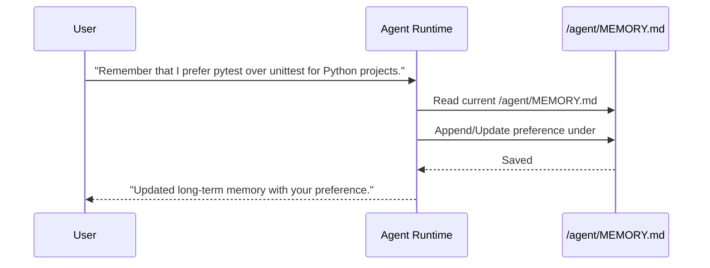

# Skills System, Task Automation & Long-term Memory

This document covers three core features that enable `ollama-agent` to adapt, automate repetitive routines, and retain long-term persistent context:

1. **Skills System** (Adhering to the Agent Skills specification)
2. **Task Automation System** (Pre-configured prompt templates and models)
3. **Long-Term Persistent Memory** (`MEMORY.md` file integration)

---

## 1. Agent Skills System

`ollama-agent` implements custom capabilities using the **Agent Skills specification**. Skills provide procedural knowledge, domain guidelines, or specialized instructions to the agent using a progressive disclosure architecture.

### Progressive Disclosure Pattern
To conserve context window budget, skill instructions are not loaded into the system prompt upfront. Instead:
- **Level 1 (Discovery)**: The agent system prompt is mounted with access to the `/skills/` directory route. Only skill names and short descriptions are initially exposed.
- **Level 2 (Execution)**: When the agent determines that a task matches a skill's description, it reads the skill's `SKILL.md` file on-demand via filesystem tools to follow its instructions.

### `SKILL.md` Directory Format & YAML Frontmatter

Skills are stored as subdirectories containing a mandatory `SKILL.md` file:

```text
~/.ollama-agent/skills/
└── code_refactoring/
    └── SKILL.md
```

#### `SKILL.md` Example:
```markdown
---
name: Code Refactoring Standard
description: Guidelines for refactoring Python code to clean code principles and PEP 8 standards.
module: quality
---

# Code Refactoring Standard

When refactoring code:
1. Ensure single level of abstraction per function.
2. Remove unused functions, parameters, and dead code blocks.
3. Replace magic numbers with named constants.
4. Keep functions small and focused on a single responsibility.
```

#### Specification Constraints:
- **Maximum File Size**: `SKILL.md` files must not exceed 10 MB (`_MAX_SKILL_SIZE`).
- **YAML Frontmatter**: Placed between `---` delimiters at the very top of `SKILL.md`.
  - **`name`** (*string*, required): Human-readable name of the skill.
  - **`description`** (*string*, required): Purpose of the skill (truncated to 1024 chars for discovery).
  - **`metadata`** (*object*, optional): Key-value keypair attributes (e.g., `module`).

### Skill Loading Precedence
Skills can be located in three distinct scopes:

1. **Global Skills**: Stored in `~/.ollama-agent/skills/`.
2. **Project Skills**: Stored in `./skills/` within the active working directory.
3. **CLI Override**: Specified via custom path options.

`AgentRuntime` mounts `SKILLS_DIR` (`~/.ollama-agent/skills/`) to the virtual filesystem route `/skills/`.

### Skill Management Commands

Skills can be managed via the CLI, REPL slash commands, or through interactive TUI wizards.

| CLI Command | REPL Slash Command | Description |
| :--- | :--- | :--- |
| `ollama-agent skill-list` | `/skill-list` | List all available skills. |
| `ollama-agent skill-show <id>` | `/skill-show <id>` | View raw contents of `SKILL.md`. |
| `ollama-agent skill-create <id> --name <n> --description <d> --instructions <i>` | `/skill-create <id>` | Create a new skill directory and `SKILL.md`. Launches modal dialog in TUI. |
| `ollama-agent skill-delete <id>` | `/skill-delete <id>` | Delete a skill directory. |

---

## 2. Task Automation System

Tasks represent saved, re-executable automation routines containing pre-defined prompts, model assignments, and reasoning effort levels.

### Task Storage Format (`~/.ollama-agent/tasks/<task_id>.yaml`)

Tasks are stored as individual YAML files under `~/.ollama-agent/tasks/`:

```yaml
title: "Generate API Tests"
prompt: "Inspect the endpoints in src/api/ and write unit tests using pytest."
model: "qwen2.5-coder:32b"
reasoning_effort: "high"
```

#### Task Data Model Fields:
- **`title`**: Descriptive title of the task.
- **`prompt`**: Instruction prompt to execute.
- **`model`**: Ollama model designated for this task.
- **`reasoning_effort`**: Reasoning effort setting (`low`, `medium`, `high`, `disabled`, `hide`, `enabled`).

### Task Management Commands

| CLI Command | REPL Slash Command | Description |
| :--- | :--- | :--- |
| `ollama-agent task-list` | `/task-list` | List all saved tasks. |
| `ollama-agent task-create <id> --title <t> --task-prompt <p> [-m <model>] [-e <effort>]` | `/task-create <id>` | Save a new task template. Launches modal dialog in TUI. |
| `ollama-agent task-run <id>` | `/task-run <id>` | Execute a saved task non-interactively or within REPL. |
| `ollama-agent task-delete <id>` | `/task-delete <id>` | Delete a saved task definition. |

### Task Execution Behavior
When running a task (`task-run <id>`):
1. `TaskManager` resolves the task ID or prefix.
2. The runtime temporarily overrides `settings.model.name` and `settings.model.reasoning_effort` with the values defined in the task.
3. The prompt is streamed non-interactively or inside the interactive REPL session.

---

## 3. Long-Term Persistent Memory

`ollama-agent` supports persistent memory across sessions using a structured markdown file stored at `~/.ollama-agent/MEMORY.md`.

### Architecture & Mounting
During startup (`AgentRuntime._build_graph`):
1. The system checks for the presence of `~/.ollama-agent/MEMORY.md`. If missing, `ensure_memory_file()` initializes it with default headers:
   ```markdown
   # Long-Term Memory

   No persistent memories yet.
   ```
2. The file's parent directory (`~/.ollama-agent/`) is mounted under the virtual filesystem route `/agent/`.
3. `create_deep_agent()` is initialized with `memory=["/agent/MEMORY.md"]`.

### Memory Reading and Updating Workflow



- **Reading**: The agent reads `/agent/MEMORY.md` whenever it needs to recall user preferences, architectural rules, or past decisions across sessions.
- **Writing**: The agent edits `/agent/MEMORY.md` directly using file editing tools when instructed to remember facts, project details, or user preferences.
- **Persistence**: Memory persists across system restarts, terminal sessions, and model switches.
