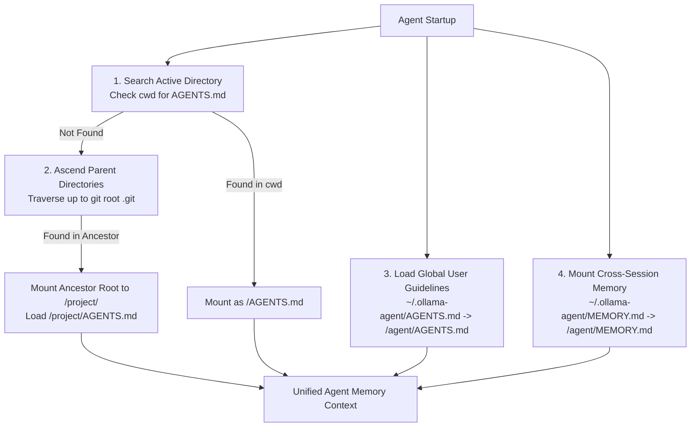
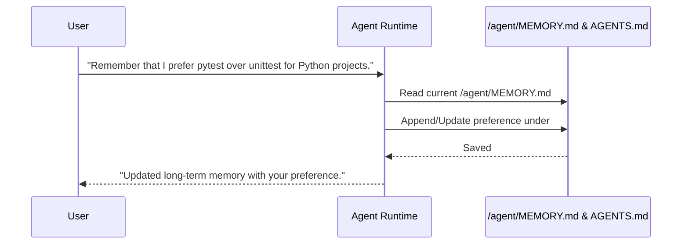

# Skills, Tasks & Persistent Memory

This document covers core capabilities that enable `ollama-agent` to adapt, automate repetitive routines, retain project context, preserve long-term user memory, checkpoint chat sessions, and recall past experiences:

1. **Agent Skills System** (Adhering to the Agent Skills specification)
2. **Task Automation System** (Pre-configured prompt templates and models)
3. **Repository Project Guidelines** (`AGENTS.md` standard integration)
4. **Global Agent Guidelines** (`~/.ollama-agent/AGENTS.md`)
5. **Long-Term Persistent Memory** (`MEMORY.md` cross-session integration)
6. **Session History & Checkpointing** (`history.db` SQLite persistence)
7. **Episodic Memory & Past Conversations** (`search_past_conversations` tool and `/session search`)

---

## 1. Agent Skills System

`ollama-agent` implements custom capabilities using the **[Agent Skills specification](https://agentskills.io/specification)**. Skills provide procedural knowledge, domain guidelines, or specialized instructions to the agent using a progressive disclosure architecture.

### Progressive Disclosure Pattern
To conserve context window budget, skill instructions are not loaded into the system prompt upfront. Instead:

- **Level 1 (Discovery)**: The agent system prompt is mounted with access to skill directories. Only skill names and short descriptions (truncated to 1,024 characters) are exposed during prompt evaluation.
- **Level 2 (Execution)**: When the agent determines that a task matches a skill's description, it reads the skill's `SKILL.md` file (and executes helper scripts in `scripts/`) on-demand via filesystem tools.

### `SKILL.md` Directory Format & Standard Layout

Skills are stored as modular directories containing a mandatory `SKILL.md` file and optional supporting assets:

```text
~/.ollama-agent/skills/
├── api-design/
│   └── SKILL.md
└── web-scraper/
    ├── SKILL.md
    ├── scripts/
    │   └── scraper.py
    ├── references/
    │   └── schema.json
    └── examples/
        └── sample.html
```

#### `SKILL.md` Example:
```markdown
---
name: API Design Guidelines
description: Guidelines and best practices for designing RESTful and OpenAPI compliant APIs. Use when creating or modifying REST endpoints.
---

# API Design Guidelines

## Instructions
1. Review API endpoint naming conventions (nouns, plural, kebab-case).
2. Validate HTTP status codes (200, 201, 400, 404, 409, 500).
3. Ensure request/response schemas use JSON and camelCase properties.
```

#### Specification Constraints:
- **Maximum File Size**: `SKILL.md` files must not exceed 10 MB.
- **YAML Frontmatter**: Placed between `---` delimiters at the very top of `SKILL.md`.
  - **`name`** (*string*, required): Human-readable name of the skill.
  - **`description`** (*string*, required): Detailed description explaining what the skill does AND when to trigger it.
  - **`metadata`** (*object*, optional): Custom key-value pairs.

### Virtual Skill Roots
The runtime mounts two virtual skill routes in `CompositeBackend`:
1. `/system_skills/`: Built-in application skills bundled with `ollama-agent` (`skill-creator`, `task-creator`, `mcp-configurator`).
2. `/skills/`: User skills stored in `~/.ollama-agent/skills/`.

### Skill Management Commands

Skills can be managed via the CLI or REPL slash commands:

| Action | CLI Command | REPL Slash Command | Description |
| :--- | :--- | :--- | :--- |
| **List Skills** | `ollama-agent skill list` | `/skill list` (or `/skill`) | List all available skills and descriptions. |
| **Show Skill** | `ollama-agent skill show <id>` | `/skill show <id>` | View raw contents and instructions of `SKILL.md`. |
| **Create Skill** | `ollama-agent skill create <id> --name <n> --description <d> --instructions <i> [--force]` | `/skill create [<id>]` | Interactive conversational creation flow with the agent. |
| **Delete Skill** | `ollama-agent skill delete <id>` | `/skill delete <id>` | Delete a skill directory permanently. |

> [!TIP]
> **Conversational Creation (`/skill create`)**: When you run `/skill create` in the REPL, the agent uses the built-in `skill-creator` system skill to interview you, determine if helper scripts are required, write `SKILL.md`, and scaffold directory assets automatically.
>
> **Tab Autocompletion**: In the REPL, `/skill show ` and `/skill delete ` autocomplete discovered skill IDs and names.

---

## 2. Task Automation System

Tasks represent saved, re-executable automation routines containing pre-defined prompts, model assignments, and reasoning effort levels.

### Task Storage Format (`~/.ollama-agent/tasks/<task_id>.yaml`)

Tasks are stored as individual YAML files under `~/.ollama-agent/tasks/` and mounted under the virtual route `/tasks/`:

```yaml
title: "Repository Tree Analyzer"
prompt: "List the repository structure and describe the purpose of each top-level directory."
model: "gemma4:26b"
reasoning_effort: "medium"
```

#### Task Data Model Fields:
- **`title`**: Descriptive title of the task.
- **`prompt`**: Instruction prompt to execute.
- **`model`**: Optional Ollama model designated for this task (inherits active session model if omitted).
- **`reasoning_effort`**: Reasoning effort setting (`low`, `medium`, `high`, `xhigh`, `disabled`, `hide`, `enabled`).

### Task Management Commands

| Action | CLI Command | REPL Slash Command | Description |
| :--- | :--- | :--- | :--- |
| **List Tasks** | `ollama-agent task list` | `/task list` (or `/task`) | List all saved tasks. |
| **Create Task** | `ollama-agent task create <id> --title <t> --task-prompt <p> [--task-model <m>] [--task-effort <e>] [--force]` | `/task create [<id>]` | Save a new task template via CLI or interactive interview. |
| **Run Task** | `ollama-agent task run <id> [-y]` | `/task run <id> [-y]` | Execute a saved task non-interactively or in REPL. |
| **Delete Task** | `ollama-agent task delete <id>` | `/task delete <id>` | Delete a saved task definition. |

### Task Execution Behavior
When running a task (`task run <id>` or `/task run <id>`):
1. `TaskManager` resolves the task ID or prefix.
2. The runtime temporarily overrides `settings.model.name` and `settings.model.reasoning_effort` with the values defined in the task.
3. The prompt is streamed non-interactively or inside the interactive REPL session with live tool tracking.
4. When execution finishes, prior session parameters and YOLO state are safely restored.

---

## 3. Repository Project Guidelines (`AGENTS.md`)

`ollama-agent` natively supports the open **`AGENTS.md` standard** for repository-level agent guidelines and coding standards.



### Purpose and Placement
`AGENTS.md` acts as a "README for AI agents", providing operational context such as:
- **Build & Test Commands**: Exact commands to run tests, linters, and builds (e.g., `pytest`, `cargo test`, `npm test`).
- **Coding Standards**: Architecture conventions, naming rules, style guidelines, and forbidden patterns.
- **Workflow Instructions**: Git commit formats, PR requirements, or task execution flows.

### Hierarchical Discovery & Resolution
When `AgentRuntime` starts or reloads:
1. It searches the active directory (`Path.cwd()`) for `AGENTS.md` (or `agents.md`, `.agents.md`).
2. If not found in `cwd`, it traverses upward through parent directories until the repository root (marked by `.git`) or filesystem boundary.
3. If found in an ancestor directory, `AgentRuntime` mounts the repository root to `/project/` in the virtual composite backend and loads `/project/AGENTS.md`.
4. If found in `cwd`, it is loaded directly as `/AGENTS.md`.
5. If not found, `/AGENTS.md` is added to memory sources so the agent can create it if requested.

---

## 4. Global Agent Guidelines (`~/.ollama-agent/AGENTS.md`)

For personal preferences and coding standards that apply across all projects, `ollama-agent` supports a global guidelines file:

- **Location**: `~/.ollama-agent/AGENTS.md`
- **Mount Route**: `/agent/AGENTS.md`
- **Behavior**: Loaded into the agent's memory context on every run, complementing repository-specific `AGENTS.md` files without requiring modifications to individual git repositories.

---

## 5. Long-Term Persistent Memory (`MEMORY.md`)

`ollama-agent` supports persistent user memory across sessions using a structured markdown file stored at `~/.ollama-agent/MEMORY.md`.

### Architecture & Mounting
During startup (`AgentRuntime._build_graph`):
1. The system checks for the presence of `~/.ollama-agent/MEMORY.md`. If missing, `ensure_memory_file()` initializes it with default headers:
   ```markdown
   # Long-Term Memory

   No persistent memories yet.
   ```
2. The file's parent directory (`~/.ollama-agent/`) is mounted under the virtual filesystem route `/agent/`.
3. `create_deep_agent()` is initialized with memory sources containing `/agent/MEMORY.md` and resolved `AGENTS.md` paths.

### Memory Reading and Updating Workflow



- **Reading**: The agent automatically reads memory and project guidelines at the start of each execution turn via `MemoryMiddleware`.
- **Writing**: The agent edits `/agent/MEMORY.md` or `/AGENTS.md` directly using file editing tools when instructed to record new preferences or architectural patterns.
- **Persistence**: Memory persists across system restarts, terminal sessions, and model switches.

---

## 6. Session History & Checkpointing (`history.db`)

Session persistence is handled by `AsyncSqliteSaver` from `langgraph-checkpoint-sqlite`, storing checkpoints and message history in `~/.ollama-agent/history.db`.

### SQLite Checkpointer Architecture
- **`checkpoints` Table**: Tracks graph state, thread configuration, and execution step versions.
- **`writes` Table**: Stores channel updates (`messages`, task outputs) serialized via LangChain's `JsonPlusSerializer`.

### Session Management Commands

| Action | CLI Command | REPL Slash Command | Description |
| :--- | :--- | :--- | :--- |
| **List Sessions** | `ollama-agent session list` | `/session list` | List all saved chat sessions with step counts and timestamps. |
| **Resume Session** | — | `/session resume <id>` (alias: `/session switch <id>`) | Resume a previous session by thread ID or prefix, restoring chat messages into the viewport. |
| **New Session** | — | `/session new` (alias: `/new`, `/clear`) | Reset context to a fresh session ID and clear the viewport. |
| **Export Session** | `ollama-agent session export <id> -o <path>` | `/session export [path]` | Export multi-turn conversation and tool calls to Markdown. |
| **Delete Session** | `ollama-agent session delete <id>` | `/session delete <id>` | Delete checkpoints and writes for a session from SQLite. |

### Prompt History Navigation
User prompts stored in `history.db` are automatically loaded into the REPL input history at startup via `load_past_user_prompts()`, allowing seamless `↑` / `↓` recall across sessions.

---

## 7. Episodic Memory & Past Conversations

Episodic memory captures records of past experiences, decisions, and troubleshooting dialogues across conversation threads. Unlike semantic memory (which distills preferences into files like `MEMORY.md`), episodic memory preserves conversation turns and actions so the agent can look back at *how* problems were solved previously.

### Autonomous Episodic Tool: `search_past_conversations`

The agent is equipped with the built-in tool `search_past_conversations(query: str, limit: int = 3)`.

- **Mechanism**: Reads serialized message checkpoints directly from `~/.ollama-agent/history.db` (`writes` table) using `JsonPlusSerializer`.
- **Active Thread Exclusion**: Automatically skips the current active session to avoid duplicating short-term memory.
- **Keyword & Topic Matching**: Analyzes user prompts and assistant actions across past threads, ranking matches by relevance score.
- **Structured Context**: Formats the matched sessions into clean Markdown excerpts for the LLM.

### User Search Commands (CLI & REPL)

Users can search conversation history directly from the terminal:

| Interface | Command | Description |
| :--- | :--- | :--- |
| **REPL Slash Command** | `/session search <query>` | Search all saved chat sessions and display matching snippets in a Rich table. |
| **CLI Command** | `ollama-agent session search <query>` | Query past sessions non-interactively from the shell. |
| **Resume Matched Session** | `/session resume <id>` | Resume a discovered session by thread ID. |
