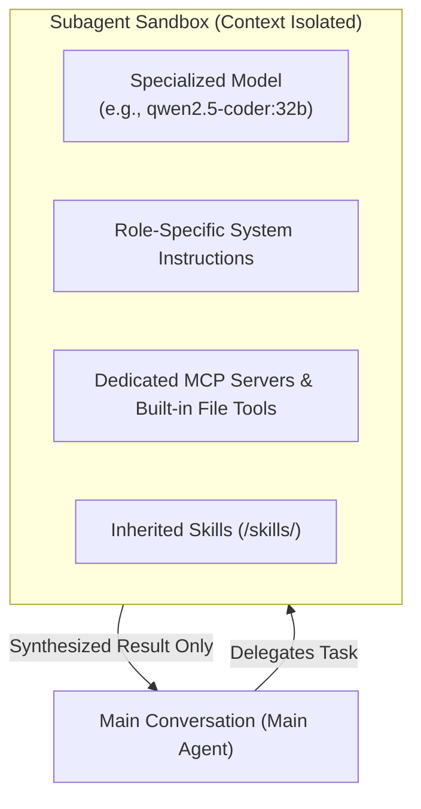

# Specialized Custom Subagents

**Subagents** allow you to delegate complex, specialized tasks—such as deep code reviews, automated web research, or database audits—to dedicated AI agents operating with complete **context isolation**. Each subagent can run its own specialized Ollama model, hold an independent context window, and wield tailored toolsets, returning only a crisp, synthesized answer to your main conversation.



---

## 2-Minute Quickstart: Defining a Subagent

Subagents are configured in your global settings file (`~/.ollama-agent/settings.yaml`) under the `subagents` key.

### 1. Add a Subagent to `settings.yaml`

Open `~/.ollama-agent/settings.yaml` and define a dedicated code review specialist:

```yaml
subagents:
  - name: "code-reviewer"
    description: "Specialist in analyzing code quality, architecture patterns, and security vulnerabilities. Use when reviewing code files, pull requests, or diffs."
    model: "qwen2.5-coder:32b"
    context_window: 32768
    system_prompt: |
      You are {{ subagent.name }}, an expert code reviewer.
      Analyze code for security flaws, memory leaks, performance bottlenecks, and adherence to clean architecture principles.
      Provide concise, actionable recommendations with line-by-line examples.
```

### 2. Verify Your Configuration

Check that your subagent is registered and ready:

=== "Interactive REPL"
    ```text
    /agents
    ```

=== "Command Line (CLI)"
    ```bash
    ollama-agent agents list
    ```

You will see a formatted table showing the agent name, description, assigned model, context window limit, and active MCP servers.

### 3. Put Your Subagent to Work

Start `ollama-agent` and delegate a task either automatically or explicitly:

```text
>>> Review the changes in src/auth/jwt.py for potential timing attacks and memory leaks.
```

The orchestrator recognizes that this matches the **code-reviewer** expertise, spins up the subagent in an isolated sandbox with `qwen2.5-coder:32b`, analyzes the file, and returns a clean report directly to your chat!

---

## The Context Isolation Advantage

Why delegate work to a subagent instead of letting the main model do everything in one thread?

In standard AI workflows, complex tasks like reading a dozen files, running linters, or scouring web search results fill the context window rapidly. This leads to **context bloat**, forgotten user instructions, degraded reasoning, and sluggish responses.

Subagents solve this through structural advantages:

* **Zero Conversation Clutter**: The subagent executes all intermediate steps, tool calls, and trial-and-error reasoning loops inside its own private context. Only the final synthesized result is posted back to your main chat.
* **Specialized Model per Task**: Keep your main session on a fast, snappy model (e.g., `mistral-small:24b` or `llama3.1:8b`) while offloading heavy code auditing to a heavyweight specialist (e.g., `qwen2.5-coder:32b`).
* **Custom Context Budgets**: Grant a code-reading subagent a generous 32K or 64K context window without wasting system RAM keeping that context permanently active in your primary conversation.
* **Focused Tool Scopes**: Equip a subagent with only the exact tools it needs (like Git commands or SQL clients), eliminating tool confusion and hallucinated parameters.

---

## How Delegation Works

You can invoke subagents naturally—either by letting the orchestrator pick the right specialist or by naming the subagent directly.

### 1. Automatic Delegation

The main agent continuously analyzes your requests against the `description` of each configured subagent. If your prompt matches a subagent's domain, the main agent automatically delegates the task:

```text
>>> Find any SQL injection risks in our query builder under src/db/
```

*The main agent matches this query to your `db-analyst` or `code-reviewer` subagent, passes the relevant context, waits for the result, and presents the conclusion.*

### 2. Explicit Delegation

You can explicitly instruct the agent to use a specific subagent:

```text
>>> Use the code-reviewer subagent to analyze git diff HEAD~1.
```

```text
>>> Ask the web-researcher subagent to find the latest migration guide for Pydantic v2.
```

### 3. Built-in Tool Access

Every subagent is fully autonomous and comes equipped with:

* **Filesystem & Terminal Tools**: Read files, write files, apply targeted diff edits, list directory trees, search via grep/glob, and run bash commands.
* **Agent Skills**: Subagents automatically inherit access to all installed [Agent Skills](skills.md) located in `~/.ollama-agent/skills/` and your workspace `.skills/`.
* **Dedicated vs. Inherited MCP Tools**:
    * If `mcp_servers` is specified for a subagent, the subagent gets exclusive access to those dedicated servers.
    * If `mcp_servers` is omitted, the subagent inherits the primary agent's global tools configured in [mcp.json](mcp.md).

### 4. Real-Time UI Attribution

When a delegated subagent runs a tool, the interactive interface tags the output with the subagent's name in real time:

```text
  ⚙ [code-reviewer] read_file: src/auth/jwt.py
  ✓ [code-reviewer] read 142 lines
  ⚙ [code-reviewer] grep: "hmac.compare_digest"
  ✓ [code-reviewer] found 0 matches
```

You can always see exactly which specialist is working and what actions it is taking.

---

## Configuration Reference

Subagents are defined as a list under the `subagents:` block in `~/.ollama-agent/settings.yaml`.

### Subagent Fields

| Field | Type | Required | Description |
| :--- | :--- | :--- | :--- |
| `name` | `string` | **Yes** | Unique identifier for the subagent (e.g. `code-reviewer`, `db-analyst`). Must be lowercase and hyphen-separated. |
| `description` | `string` | **Yes** | Comprehensive description of what this subagent does and when it should be invoked. Crucial for automatic delegation. |
| `system_prompt` | `string` | **Yes** | Role-specific system instructions. Supports Jinja2 templating. |
| `model` | `string` | No | Custom Ollama model tag (e.g. `qwen2.5-coder:32b`). If omitted, inherits the `model.name` from your main settings. |
| `context_window` | `integer` \| `string` | No | Token limit for this subagent's context window (e.g., `32768` or `"max"`). Inherits main settings if omitted or set to `0`. |
| `mcp_servers` | `list` | No | List of dedicated MCP server definitions attached exclusively to this subagent. |

### Jinja2 Prompt Templating

Your `system_prompt` can use Jinja2 variables to adapt dynamically to your current environment and model configuration:

| Variable | Available Properties | Description |
| :--- | :--- | :--- |
| `{{ subagent }}` | `name`, `description`, `model`, `context_window` | The configuration properties of the current subagent. |
| `{{ model_settings }}` | `name`, `base_url`, `context_window`, `reasoning_effort`, `temperature` | The primary agent's global model settings. |

#### Example: Adapting Prompt Depth to Reasoning Effort

```yaml
system_prompt: |
  You are {{ subagent.name }}, a {{ subagent.description }}.
  
  Conduct a rigorous, exhaustive analysis. Examine subtle edge cases, race conditions, and theoretical attack vectors.
  
  Focus on the most impactful defects, architectural clarity, and immediate fixes.
  
```

### Dedicated MCP Server Fields

When defining servers in `mcp_servers`:

| Field | Type | Required | Description |
| :--- | :--- | :--- | :--- |
| `name` | `string` | **Yes** | Identifier for the MCP server (e.g. `git`, `brave-search`). |
| `command` | `string` | **Yes** | Executable binary to spawn (e.g., `uvx`, `npx`, `python`). |
| `args` | `list[string]` | No | Command-line arguments passed to the binary. |
| `env` | `map[string, string]` | No | Environment variables with `${VAR}` dynamic variable expansion support. |

---

## Practical Recipes

### Recipe 1: Senior Code Reviewer

A dedicated reviewer powered by the state-of-the-art `qwen2.5-coder:32b` model with dedicated Git inspection tooling and deep reasoning logic:

```yaml
subagents:
  - name: "code-reviewer"
    description: "Expert software engineer specializing in code quality, architecture patterns, performance optimization, and security audits. Invoke whenever the user asks for a code review, PR check, or diff analysis."
    model: "qwen2.5-coder:32b"
    context_window: 32768
    system_prompt: |
      You are a Senior Principal Code Reviewer.
      When reviewing code:
      1. Verify correctness, concurrency safety, and error handling.
      2. Check for security flaws (OWASP Top 10, injection, timing attacks).
      3. Suggest idiom and clean code improvements.
      
      
      Perform deep verification of all edge cases and trace data flows exhaustively.
      
      Focus on critical defects, performance bottlenecks, and clear code patterns.
      
      
      Structure your report with:
      - Executive Summary
      - Critical Issues (with line numbers & suggested diffs)
      - Non-Critical Suggestions & Clean Code Advice
    mcp_servers:
      - name: "git"
        command: "uvx"
        args: ["mcp-server-git"]
        env:
          GIT_PYTHON_REFRESH: "quiet"
```

**Workflow Example:**

```text
>>> Review my uncommitted changes and tell me if anything breaks backward compatibility.
```

---

### Recipe 2: Deep Web Researcher

A specialized subagent equipped with Brave Search to investigate technical documentation, APIs, and online resources without loading search noise into your main chat:

```yaml
subagents:
  - name: "web-researcher"
    description: "Technical researcher specializing in searching the web, evaluating official documentation, and retrieving up-to-date developer information. Invoke when current documentation, libraries, or external web queries are needed."
    model: "llama3.1:8b"
    context_window: 16384
    system_prompt: |
      You are a Technical Research Analyst.
      Your job is to search the web for accurate, up-to-date technical information and documentation.
      
      Guidelines:
      - Synthesize information from multiple reputable sources.
      - Quote exact version numbers, API signatures, and configuration flags.
      - Always cite your source URLs at the end of your response.
      - Return a concise, structured brief. Do not dump raw search results.
    mcp_servers:
      - name: "brave-search"
        command: "npx"
        args: ["-y", "@modelcontextprotocol/server-brave-search"]
        env:
          BRAVE_API_KEY: "${BRAVE_API_KEY}"
```

**Workflow Example:**

```text
>>> Check the web for the latest breaking changes introduced in LangChain 0.3.
```

---

## Pro Tips & Best Practices

### 1. Write Trigger-Rich Descriptions for Auto-Delegation

The primary orchestrator relies heavily on the `description` field to decide when to delegate. Ensure your description includes:
* The subagent's role and domain expertise.
* Clear action verbs ("audit", "review", "search", "optimize", "query").
* Concrete file types or triggers ("Python files", "git diffs", "SQL migrations", "external API documentation").

!!! tip "Good vs. Poor Description"
    * ❌ **Vague**: `"Reviews code."`
    * ✅ **Actionable**: `"Specialist in analyzing code quality, architecture patterns, and security vulnerabilities. Use when reviewing code files, pull requests, or diffs."`

### 2. Right-Size Context Windows

* **General / Web Agents**: A `16384` (16K) context window is usually plenty for web searches and quick syntheses, saving system memory.
* **Code / Architecture Reviewers**: Codebases benefit from a `32768` (32K) or `65536` (64K) context window so the subagent can inspect multiple interdependent source files at once.
* Setting `context_window: 0` or omitting the field inherits whatever context window you configured for your primary model.

### 3. Pair Fast Chat Models with Heavy Specialist Subagents

For the best daily developer experience, set your primary model in `settings.yaml` to a fast, responsive model for fluid conversation, and let subagents spin up larger models on demand:

```yaml
# ~/.ollama-agent/settings.yaml
model:
  name: "qwen2.5:7b"     # Fast, lightweight conversational driver
  context_window: 16384

subagents:
  - name: "deep-auditor"
    model: "qwen2.5-coder:32b"  # Heavyweight specialist called only when needed
    context_window: 32768
    description: "Deep code auditor for security, architectural refactoring, and complex bug hunts."
    system_prompt: "You are an elite software auditor..."
```

### 4. Isolate MCP Tools to Avoid Tool Hallucination

If you attach every MCP server globally in `mcp.json`, the model has to browse dozens of tool definitions on every single turn. By moving specialized servers (like PostgreSQL query tools, GitHub APIs, or search engines) into specific subagent `mcp_servers`, your main model stays nimble and free of tool confusion.

---

## Next Steps

* Connect external developer tools using [Model Context Protocol (MCP)](mcp.md).
* Teach your subagents domain procedures with [Agent Skills](skills.md).
* Explore interactive shortcuts and slash commands in the [CLI & REPL Interface Guide](cli_repl.md).
* Review global settings in the [Configuration Reference](configuration.md).
