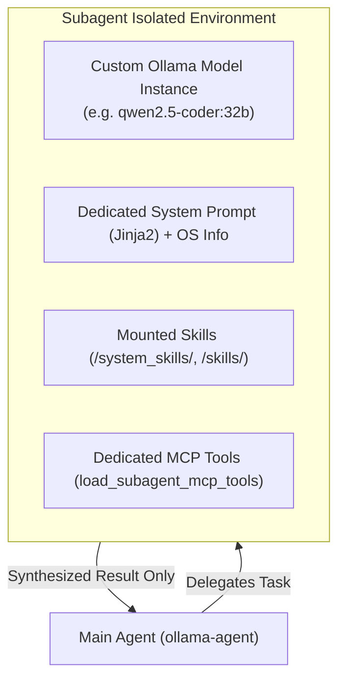

# Specialized Custom Subagents

**Subagents** are auxiliary AI agents configured to handle specialized tasks (such as code review, database analysis, web research, or technical writing) with complete **context isolation**. Powered by DeepAgents' `create_deep_agent(subagents=...)` framework, subagents can utilize different Ollama models, maintain independent context windows, and execute tools from dedicated MCP servers without polluting the primary conversation history.



---

## 1. Context Isolation Architecture

In traditional agent workflows, executing multi-step tasks or processing large tool outputs fills the main context window rapidly, leading to forgotten user instructions or context overflow.

`ollama-agent` eliminates this issue through structural isolation:

1. **Independent Graph Nodes**: Subagents execute within their own graph lifecycle. Multi-turn reasoning loops, file inspections, and intermediate tool responses remain strictly isolated within the subagent.
2. **Context Preservation**: Only the final synthesized result produced by the subagent is passed back to the primary agent's conversation thread as a tool response.
3. **Autonomous Delegation (`task`)**: The primary orchestrator delegates work to subagents using the built-in `task(description: str, subagent_type: str)` tool based on the user's intent and subagent descriptions.
4. **Built-in Filesystem Tools**: All subagents automatically receive standard filesystem tools (`read_file`, `write_file`, `edit_file`, `ls`, `glob`, `grep`, `execute`) mounted via `FilesystemMiddleware`.
5. **Dedicated vs. Inherited MCP Tools**:
   - If `mcp_servers` is defined for a subagent, tool execution is strictly isolated to those dedicated MCP servers and filesystem tools.
   - If `mcp_servers` is omitted or empty, the subagent inherits the primary agent's tools (including global `mcp.json` servers and `rag_search`).
6. **Skills Access**: All subagents automatically inherit read-access to both `/system_skills/` and `/skills/`.

---

## 2. Configuration in `settings.yaml`

Subagents are defined under the `subagents` array in `~/.ollama-agent/settings.yaml`:

```yaml
model:
  name: "gemma4:26b"
  temperature: 0.7

subagents:
  - name: "code-reviewer"
    description: "Specialist in analyzing code quality, architecture patterns, and potential security bugs."
    system_prompt: |
      You are {{ subagent.name }}, a {{ subagent.description }}.
      Main model: {{ model_settings.name }}.
      
      Perform deep, exhaustive analysis and examine subtle security edge cases.
      
      Focus on critical defects, clarity, and immediate architectural concerns.
      
    model: "qwen2.5-coder:32b"
    context_window: 32768
    mcp_servers:
      - name: "git"
        command: "uvx"
        args: ["mcp-server-git"]
        env:
          GIT_PYTHON_REFRESH: "quiet"

  - name: "db-analyst"
    description: "Specialist for querying customer databases, executing migrations, and generating SQL analytics."
    system_prompt: "You are an expert database administrator. Analyze schema designs and optimize queries."
    mcp_servers:
      - name: "postgres"
        command: "npx"
        args: ["-y", "@modelcontextprotocol/server-postgres", "postgresql://localhost/prod_db"]
```

---

## 3. Subagent Configuration Fields

| Field | Type | Required | Description |
| :--- | :--- | :--- | :--- |
| `name` | `string` | **Yes** | Unique identifier used by the main agent to delegate tasks. |
| `description` | `string` | **Yes** | Clear explanation of the subagent's domain expertise and when the orchestrator should invoke it. |
| `system_prompt` | `string` | **Yes** | Specialized instructions for the subagent. Supports Jinja2 templating. OS environment info is appended automatically. |
| `model` | `string` | No | Custom Ollama model for this subagent. If omitted, inherits the main agent's configured model. |
| `context_window` | `integer` \| `string` | No | Context window size (`num_ctx`) or `'max'`. If omitted or `0`, inherits from main settings. |
| `mcp_servers` | `array` | No | List of dedicated MCP servers attached exclusively to this subagent. |

### Jinja2 Subagent Prompt Context

Subagent system prompt templates are rendered with strict variable evaluation (`StrictUndefined`) before initialization:

| Variable | Type | Description | Key Attributes |
| :--- | :--- | :--- | :--- |
| `subagent` | `SubAgentSettings` | Current subagent configuration object | `name`, `description`, `model`, `context_window`, `mcp_servers` |
| `model_settings` | `ModelSettings` | Main agent configuration object | `name`, `base_url`, `context_window`, `reasoning_effort`, `temperature` |

### Subagent MCP Server Configuration

Each entry in `mcp_servers` defines a dedicated subprocess server:

* **`name`** (*string*, required): Unique server identifier.
* **`command`** (*string*, required): Subprocess binary executable (e.g. `npx`, `uvx`, `python`).
* **`args`** (*array of strings*, optional): Arguments passed to the command.
* **`env`** (*object*, optional): Subprocess environment variables with dynamic `${VAR}` and `%VAR%` expansion.

---

## 4. Subagent Inspection (`/agents` / CLI)

You can view all registered subagents, their model assignments, context limits, and attached MCP servers at any time:

In the interactive REPL:
```text
/agents
/agents list
```

From the command line:
```bash
ollama-agent agents list
```

### Live UI Execution Attribution

When a delegated subagent runs a tool, the execution middleware captures the subagent's name and renders an explicit visual tag in the terminal interface:

```text
  ⚙ [code-reviewer] git_diff
  ✓ [code-reviewer] output received (342 chars)
```

This makes it clear which agent is currently acting and which tool was invoked.
