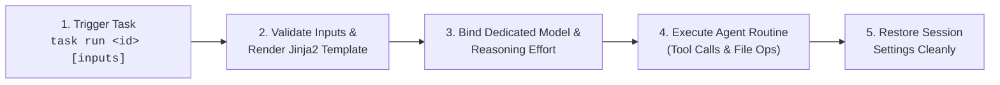

# Saved Tasks & Automation

**Saved Tasks** transform repetitive, multi-step agent interactions into reusable, one-command automation routines. With pre-configured prompt templates, dynamic input parameters, designated local models, and customized reasoning effort levels, tasks eliminate prompt fatigue and deliver consistent, deterministic results across your development workflows.

Whether auditing pull requests, generating release notes from git history, standardizing documentation, or translating content, tasks turn your local AI models into dependable command-line utilities.

---

## 30-Second Quickstart

Execute a pre-configured code review task against any file with a single command:

```bash
ollama-agent task run code-review target_file=src/main.py -y
```

Or run it directly from within the interactive REPL:

```text
/task run code-review target_file=src/main.py -y
```

Ollama Agent validates your inputs, injects the file contents into the task prompt, switches to the task's designated model and reasoning effort, executes the review autonomously, and restores your session settings when finished.

---

## How Tasks Work



1. **Storage & Access**: Tasks are saved as clean YAML files in `~/.ollama-agent/tasks/<task_id>.yaml`. During agent sessions, they are also accessible within the virtual filesystem at `/tasks/<task_id>.yaml`.
2. **Template Rendering**: Prompt templates leverage standard **Jinja2** syntax (`{{ variable }}`). When a task executes, supplied arguments are validated and merged into the template.
3. **Dynamic Context Expansion (`@{{ var }}`)**: Using an `@-mention` with a variable (e.g. `@{{ target_file }}`) resolves the variable path first, then automatically expands into the full content of the file with binary safety checks.
4. **Model & Effort Isolation**: Each task defines its own optimal model (e.g. a heavy reasoning model for deep audits or a lightweight model for quick summaries) and reasoning effort level (e.g. `default`, `low`, `high`, `max`, `true`, `false`). These settings apply during the task execution and revert automatically once completed.
5. **Type Safety & Coercion**: Input parameters are strictly validated against their declared schema (`string`, `boolean`, or `number`) before any model inference begins.

---

## Creating Tasks via YAML (The Best Way)

The recommended way to author tasks is by placing a YAML file directly in `~/.ollama-agent/tasks/<task_id>.yaml`.

### Annotated Task Structure

Here is an example task saved at `~/.ollama-agent/tasks/code-review.yaml`:

```yaml
# Human-readable title displayed in task listings
title: "Single File Code Review"

# Specific Ollama model dedicated to this task
model: "qwen3.8:27b"

# Desired reasoning effort (e.g. default, low, high, max, true, false)
reasoning_effort: "high"

# Parameterized prompt template supporting full Jinja2 syntax
prompt: |
  Review the source code in @{{ target_file }}.
  Identify potential runtime bugs, security vulnerabilities, and logic defects.
  
  Enforce strict styling conventions, type annotations, and architectural consistency.
  
  Focus primarily on correctness, critical performance issues, and error handling.
  

# Dynamic input parameter definitions
inputs:
  target_file:
    description: "Relative path of the source file to review"
    type: "string"
    required: true
  strict:
    description: "Enable strict architectural and style audit"
    type: "boolean"
    default: false
```

### Schema Reference

| Field | Type | Required | Description |
| :--- | :--- | :--- | :--- |
| `title` | `string` | **Yes** | Clear name displayed in `/task list` and terminal logs. |
| `prompt` | `string` | **Yes** | Multi-line instruction template evaluated with Jinja2. |
| `model` | `string` | **Yes** | Designated Ollama model (e.g. `qwen3.8:27b`, `gemma4:26b`). |
| `reasoning_effort` | `string` | **Yes** (YAML) / Optional (CLI) | Reasoning intensity supported by the model (e.g., `default`, `low`, `high`, `max`, `true`, `false`). Optional when creating tasks via CLI, but always saved in YAML (defaults to `"default"`). |
| `inputs` | `mapping` | No | Map of expected input variables, their types, requirements, and defaults. |

### Input Parameter Schema (`inputs.<name>`)

| Property | Type | Default | Description |
| :--- | :--- | :--- | :--- |
| `type` | `string` | `"string"` | Data type: `"string"`, `"boolean"`, or `"number"`. |
| `description` | `string` | `""` | User-facing explanation of the parameter. |
| `required` | `boolean` | `false` | When `true`, task execution terminates immediately if the variable is omitted. |
| `default` | `any` | `null` | Fallback value used when the parameter is not provided. |

### Input Type Validation & Coercion Rules

Inputs provided via the CLI or REPL are automatically converted and verified:

| Declared Type | Accepted Values | Coerced Result |
| :--- | :--- | :--- |
| **`string`** | Any text value | Preserved as string (`str`). |
| **`boolean`** | `true`, `1`, `yes` (case-insensitive) | `True` |
| | `false`, `0`, `no` (case-insensitive) | `False` |
| | Any other value | Fails immediately with `Invalid boolean value`. |
| **`number`** | Integer or floating-point text (`"42"`, `"3.14"`) | Coerced to `int` or `float`. |
| | Non-numeric text | Fails immediately with `Invalid number value`. |

!!! note "Fail-Fast Validation"
    If a variable marked as `required: true` is missing and has no `default`, execution halts immediately with a clear error: `Missing required input: <name>`. Your model will not run, saving time and compute.

---

## Managing Tasks (CLI & REPL)

You can manage and execute tasks seamlessly from both the non-interactive terminal interface and the interactive REPL:

| Action | CLI Command | REPL Slash Command | Description |
| :--- | :--- | :--- | :--- |
| **List Tasks** | `ollama-agent task list` | `/task list` (or `/task`) | List all saved tasks, titles, models, and effort levels. |
| **Run Task** | `ollama-agent task run <id> [var=val] [-y]` | `/task run <id> [var=val] [-y]` | Execute a saved task with dynamic variable bindings. |
| **View Task** | `/task view <id>` *(or inspect YAML)* | `/task view <id>` | Inspect the task configuration and prompt template. |
| **Delete Task** | `ollama-agent task delete <id>` | `/task delete <id>` | Permanently remove a task YAML file. |
| **Create Task** | `ollama-agent task create <id> [options]` | `/task create [<id>]` | Save a new task via flags or conversational interview. |

### 1. Listing Tasks

View all available tasks registered in `~/.ollama-agent/tasks/`:

```bash
ollama-agent task list
```

In the interactive REPL:
```text
/task list
```

### 2. Running Tasks

Pass parameters as positional `key=value` assignments or with `--var` flags:

```bash
# Positional assignments with YOLO mode for unattended execution
ollama-agent task run code-review target_file=src/api.py strict=true -y

# Using explicit --var flags
ollama-agent task run code-review --var target_file=src/api.py --var strict=true

# Running in the interactive REPL
/task run code-review target_file=src/api.py strict=true
```

!!! tip "Unique Prefix Resolution"
    You do not need to type the full task ID. As long as the prefix is unique, Ollama Agent resolves it automatically. For example, `ollama-agent task run code-rev target_file=src/main.py` matches `code-review`.

### 3. Creating Tasks via CLI

To quickly scaffold a task without manually writing a YAML file:

```bash
ollama-agent task create bug-audit \
  --title "Bug & Security Audit" \
  --task-prompt "Analyze @{{ file }} for concurrency issues and security flaws." \
  --task-model "qwen3.8:27b" \
  --task-effort "high"
```

Use `--force` to overwrite an existing task with the same identifier.

### 4. Interactive Conversational Creation

Inside the interactive REPL, simply run:

```text
/task create
```

This activates the built-in `task-creator` skill. The agent interviews you about what workflow you want to automate, determines the best model and reasoning parameters, identifies dynamic variables, and writes the validated YAML definition to `~/.ollama-agent/tasks/` for you.

---

## 3 Ready-to-Use Real-World Task Templates

Copy and save these ready-to-use recipes into your `~/.ollama-agent/tasks/` directory to instantly automate your everyday development workflows.

### Recipe 1: Pull Request / Git Diff Code Review

Save as `~/.ollama-agent/tasks/pr-review.yaml`:

```yaml
title: "Pull Request & Git Diff Code Review"
model: "qwen3.8:27b"
reasoning_effort: "high"
prompt: |
  Perform a structured code review on the changes in the current Git branch compared to {{ base_branch }}.
  Use your shell tool to run `git diff {{ base_branch }}` and inspect the changes.

  Evaluation Criteria:
  1. Correctness: Spot logic bugs, off-by-one errors, and unhandled null/exception paths.
  2. Security: Identify injection vulnerabilities, unvalidated inputs, or credential leakage.
  3. Performance: Flag redundant database queries, unbounded collections, or expensive operations.
  
  4. Code Quality: Check for adherence to clean architecture, test coverage, and documentation.
  

  Provide a clean summary with:
  - 🔍 **Overview**: Brief summary of the changes.
  - 🚨 **Critical Findings**: Bugs or security risks requiring immediate fixes.
  - 💡 **Suggestions**: Optional optimizations and refactoring ideas.
inputs:
  base_branch:
    description: "Base branch to compare against (e.g. main or origin/main)"
    type: "string"
    default: "main"
    required: false
  strict:
    description: "Enable comprehensive code quality and test coverage audit"
    type: "boolean"
    default: false
    required: false
```

**Run it:**
```bash
ollama-agent task run pr-review base_branch=origin/main strict=true -y
```

---

### Recipe 2: Release Notes Generator from Git History

Save as `~/.ollama-agent/tasks/release-notes.yaml`:

```yaml
title: "Release Notes Generator"
model: "gemma4:26b"
reasoning_effort: "default"
prompt: |
  Generate professional, user-facing release notes for version {{ version }}.
  Run `git log {{ since_tag }}..HEAD --oneline` using the shell tool to review all commit messages since the previous tag.

  Format the output as follows:
  # Release {{ version }}

  ## 🚀 What's New
  - Highlight key features and enhancements in clear, user-focused language.

  ## 🐛 Bug Fixes
  - List resolved defects and stability improvements.

  
  ## 🔧 Maintenance & Chores
  - Internal refactoring, dependency updates, and build pipeline changes.
  

  
  ## ⚠️ Breaking Changes & Migration
  - Explicit steps for users upgrading from {{ since_tag }}.
  

  Ensure all bullet points use active, concise phrasing. Do not include raw commit hashes.
inputs:
  version:
    description: "Target version string (e.g. v1.2.0)"
    type: "string"
    required: true
  since_tag:
    description: "Previous release tag or reference (e.g. v1.1.0)"
    type: "string"
    required: true
  include_internal:
    description: "Include internal chores and dependency updates"
    type: "boolean"
    default: false
    required: false
  breaking_changes:
    description: "Add a dedicated section for breaking changes"
    type: "boolean"
    default: false
    required: false
```

**Run it:**
```bash
ollama-agent task run release-notes version=v2.0.0 since_tag=v1.9.0 breaking_changes=true -y
```

---

### Recipe 3: Multi-Language Document Translator

Save as `~/.ollama-agent/tasks/translate-doc.yaml`:

```yaml
title: "Technical Document Translator"
model: "qwen3.8:27b"
reasoning_effort: "default"
prompt: |
  Translate the Markdown document located at @{{ source_file }} into {{ target_language }}.

  Translation Guidelines:
  1. Maintain exact Markdown syntax: headings, admonitions, lists, and tables must remain intact.
  2. DO NOT translate code blocks, inline code spans (`like this`), file paths, URLs, or variable names.
  3. Keep the technical terminology standard and industry-accepted in {{ target_language }}.
  4. Style: {{ style }}.

  
  Write the completed translation to `{{ output_file }}` using your filesystem tools.
  
  Stream the translated document directly to standard output.
  
inputs:
  source_file:
    description: "Relative path to the source markdown file"
    type: "string"
    required: true
  target_language:
    description: "Target language (e.g. Spanish, German, Japanese, French)"
    type: "string"
    required: true
  style:
    description: "Tone and documentation style"
    type: "string"
    default: "Clear, concise, and professional technical documentation"
    required: false
  write_output:
    description: "Save translation directly to disk"
    type: "boolean"
    default: true
    required: false
  output_file:
    description: "Destination file path if write_output is true"
    type: "string"
    default: "translated_doc.md"
    required: false
```

**Run it:**
```bash
ollama-agent task run translate-doc \
  source_file=docs/index.md \
  target_language="Spanish" \
  output_file=docs/index.es.md \
  -y
```

---

## Pro Tips & Automation

### 1. Scripting & CI/CD Pipelines with YOLO Mode (`-y`)

By default, Ollama Agent prompts for confirmation before executing shell commands or editing files. In headless environments, automated shell scripts, or CI/CD pipelines, pass `-y` (or `--yolo`) to bypass prompts:

```bash
#!/usr/bin/env bash
set -euo pipefail

# Automated daily dependency audit script
echo "Running automated security & dependency audit..."
ollama-agent task run pr-review base_branch=origin/main strict=true -y > audit-report.md
```

### 2. Git Pre-Commit Hook Integration

You can integrate a task directly into a Git hook to automatically review staged changes before every commit:

```bash
#!/usr/bin/env bash
# .git/hooks/pre-commit

echo "🤖 Ollama Agent is auditing staged changes..."
ollama-agent -y -p "Run 'git diff --cached' and verify there are no leaked secrets, debug print statements, or syntax regressions. Fail with an error if issues exist."
```

### 3. Model Matching for Speed and Accuracy

Because each task specifies its own model, you can optimize resource usage and inference latency:

- **Heavy Reasoning Tasks** (e.g. complex architectural reviews, bug audits): Assign a high-capacity model with `reasoning_effort: "high"` (e.g. `qwen3.8:27b`).
- **Fast Generation Tasks** (e.g. release notes, changelog generation, commit message formatting): Assign a smaller, faster model with `reasoning_effort: "false"` or `"low"` (e.g. `gemma4:9b`).

When the task completes, your default model set in `settings.yaml` or your active REPL session remains untouched.

---

## Related Guides

- [CLI & REPL Guide](cli_repl.md) — Master interactive terminal commands, prompt queueing, and single-shot CLI flags.
- [Agent Skills](skills.md) — Equip your agent with specialized procedural knowledge and multi-step tool scripts.
- [Model Context Protocol (MCP)](mcp.md) — Extend your tasks with external services, databases, and third-party APIs.
- [Configuration](configuration.md) — Configure global defaults, context window settings, and Ollama connection parameters.
